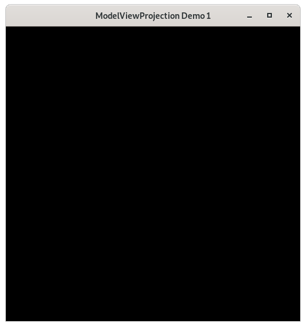
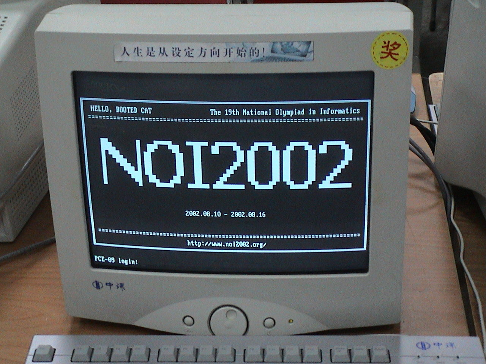
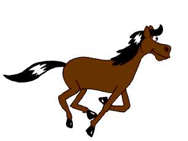
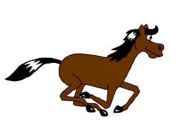
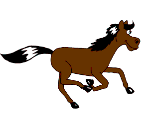
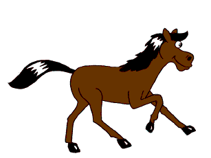
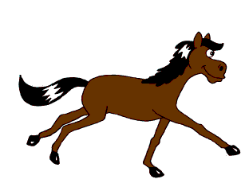
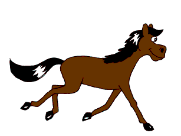

..
   Copyright (c) 2018-2024 William Emerison Six

   Permission is hereby granted, free of charge, to any person obtaining a copy
   of this software and associated documentation files (the "Software"), to deal
   in the Software without restriction, including without limitation the rights
   to use, copy, modify, merge, publish, distribute, sublicense, and/or sell
   copies of the Software, and to permit persons to whom the Software is
   furnished to do so, subject to the following conditions:

   The above copyright notice and this permission notice shall be included in all
   copies or substantial portions of the Software.

   THE SOFTWARE IS PROVIDED "AS IS", WITHOUT WARRANTY OF ANY KIND, EXPRESS OR
   IMPLIED, INCLUDING BUT NOT LIMITED TO THE WARRANTIES OF MERCHANTABILITY,
   FITNESS FOR A PARTICULAR PURPOSE AND NONINFRINGEMENT. IN NO EVENT SHALL THE
   AUTHORS OR COPYRIGHT HOLDERS BE LIABLE FOR ANY CLAIM, DAMAGES OR OTHER
   LIABILITY, WHETHER IN AN ACTION OF CONTRACT, TORT OR OTHERWISE, ARISING FROM,
   OUT OF OR IN CONNECTION WITH THE SOFTWARE OR THE USE OR OTHER DEALINGS IN THE
   SOFTWARE.

Opening a Window - Demo 01
==========================

Purpose
^^^^^^^

Learn how to open a window, make a black screen, and close
the window.

    Demo 01

How to Execute
^^^^^^^^^^^^^^

On Linux or on MacOS, in a shell, type "python src/demo01/demo.py".
On Windows, in a command prompt, type "python src\\demo01\\demo.py".

Terminology
^^^^^^^^^^^

The device attached to a computer which displays information to the user is called a *monitor*.

    Computer Monitor

The monitor is composed of a two-dimensional array of light-emitting elements, each called a *pixel*, typically
composed of 3 components, red, green, and blue.

.. figure:: _static/ccbysa3.0/wikipedia-Kprateek88/Closeup_of_pixels.JPG
    :align: center
    :alt: Picture of Pixel
    :figclass: align-center

    Pixels

At a given time, each individual pixel is instructed by the computer to display
one specific color, represented within the computer as a number.
The aggregate of the colors at each pixel at one moment in time, called a *frame*,
provides a picture that has some meaning to the human user.
In OpenGL, the bottom left pixel of a window is pixel coordinate (0,0).
The top right is pixel coordinate (window_width,window_height).

.. figure:: _static/monitor.png
    :align: center
    :alt: 1024x768 monitor
    :figclass: align-center

    1024x768 monitor

.. figure:: _static/monitor2.png
    :align: center
    :alt: 1920x1200 monitor
    :figclass: align-center

    1920x1200 monitor

Frames are created within the computer and sent to the monitor
at a rate over time, called the *frame-rate*,
measured in *Hertz*.  By updating frames quickly and at a constant rate, the computer
provides the end-user with the illusion of motion.

.. figure:: _static/ccbysa2.5/wikipedia-Janke/Animhorse.gif
    :align: center
    :alt: Motion
    :figclass: align-center

    14 Hertz Motion

.. figure:: _static/ccbysa2.5/wikipedia-Janke/GIF_Frame-4.png
    :align: center
    :alt: Motion
    :figclass: align-center

Code
^^^^

That's enough terms for now, let's get on to a working program!

Importing Libraries
~~~~~~~~~~~~~~~~~~~

Import Python modules, which are Python programmer's main form of libraries.

.. literalinclude:: ../../src/demo01/demo.py
   :language: python
   :start-after: doc-region-begin 20134134fb054ac6764edfb4764935b86f20a795
   :end-before: doc-region-end 20134134fb054ac6764edfb4764935b86f20a795

*  The "sys" module is imported.  To call functions from this module, the syntax is sys.function

.. literalinclude:: ../../src/demo01/demo.py
   :language: python
   :start-after: doc-region-begin 6901922753dbf8df496fd46ae4a0eeb4e6243ef4
   :end-before: doc-region-end 6901922753dbf8df496fd46ae4a0eeb4e6243ef4

* GL is a submodule of the OpenGL module, and we are directly importing a
  subset of the modules function into our current module.  This is because
  we don't want to have to write "OpenGL.GL.function" every time, as we use
  these functions frequently

.. literalinclude:: ../../src/demo01/demo.py
   :language: python
   :start-after: doc-region-begin 4b5a486083da608751701fa7e42e37bbc4cfd06e
   :end-before: doc-region-end 4b5a486083da608751701fa7e42e37bbc4cfd06e

* GLFW is a library which allows us to create windows, get input both from a
  keyboard from mouse input, on Linux, Windows, and MacOS

On a Python prompt, you can use tab-complete to see which functions
are defined on a module.  you can also type help(modulename) (q is
used to quit out of the pager).  help works on any object, including modules.

Opening A Window
~~~~~~~~~~~~~~~~

Desktop operating systems allow the user to run more than one
program at a time, where each program draws into a subsection of
the monitor called a window.

.. figure:: _static/ccbysa3.0/wikipedia-Shmuel\ Csaba\ Otto\ Traian/1920px-Window_(windowing_system).svg.png
    :align: center
    :alt: Window
    :figclass: align-center

    Window

To create and to open a window in a cross-platform manner, this
book will call procedures provided by the widely-ported GLFW library (supporting Windows, MacOS, Linux).
GLFW also provides procedures for receiving
input both from a keyboard input and from game controllers.

GLFW/OpenGL Initialization
~~~~~~~~~~~~~~~~~~~~~~~~~~

Initialize GLFW.
&&&&&&&&&&&&&&&&

.. literalinclude:: ../../src/demo01/demo.py
   :language: python
   :start-after: doc-region-begin 0c30d0c1c7c793e097bcfb46208f14998d77dd0a
   :end-before: doc-region-end 0c30d0c1c7c793e097bcfb46208f14998d77dd0a

Initialize GLFW.  If initialization fails, the program should terminate.
What does the initialization do?  Doesn't matter.  Think of it like
a constructor for a class; it initializes some state that it needs
for later function calls.

Set the version of OpenGL
&&&&&&&&&&&&&&&&&&&&&&&&&

OpenGL has been around a long time, and has multiple, possibly incompatible versions.
For this demo, we use OpenGL 1.4.  By the end of this book, we will be using OpenGL 3.3.

.. literalinclude:: ../../src/demo01/demo.py
   :language: python
   :start-after: doc-region-begin cbb5da55f24c88b41c195f36bbbf99969e95765c
   :end-before: doc-region-end cbb5da55f24c88b41c195f36bbbf99969e95765c

Create a Window
&&&&&&&&&&&&&&&

.. literalinclude:: ../../src/demo01/demo.py
   :language: python
   :start-after: doc-region-begin d1e099847a03149e01d2ec4dc42bb261524b2a95
   :end-before: doc-region-end d1e099847a03149e01d2ec4dc42bb261524b2a95

.. literalinclude:: ../../src/demo01/demo.py
   :language: python
   :start-after: doc-region-begin a9948cba6a31fd1774c1a0e1ae634bbad8c6c7f3
   :end-before: doc-region-end a9948cba6a31fd1774c1a0e1ae634bbad8c6c7f3

*  If GLFW cannot open the window, quit.  Unlike MC Hammer, we are quite legit, yet still
   able to quit.

.. literalinclude:: ../../src/demo01/demo.py
   :language: python
   :start-after: doc-region-begin 7ddbe862d3ff7b6ee489ac7ac565b8a5e72f7f9f
   :end-before: doc-region-end 7ddbe862d3ff7b6ee489ac7ac565b8a5e72f7f9f

* Make the window's context current.  The details of this do not matter
  for this book.

.. literalinclude:: ../../src/demo01/demo.py
   :language: python
   :start-after: doc-region-begin 63277c9f3b6e8071722b93baf8e77bb8ee6c677d
   :end-before: doc-region-end 63277c9f3b6e8071722b93baf8e77bb8ee6c677d

* Define an register a key handler.

If the user presses the escape key while the program is running, inform
GLFW that the user wants to quit.  We will handle this later in the event
loop.

Functions are first class values in Python, and are objects just
like anything else.  The can be passed as arguments, stored in variables,
and applied later zero, 1, or more times.

.. code:: Python

      >>> def doubler(x):
      ...     return x * 2
      ...
      >>> def add_five_to_result_of(f, x):
      ...     return 5 + f(x)
      ...
      >>> add_five_to_result_of(doubler, 3)
      11

.. literalinclude:: ../../src/demo01/demo.py
   :language: python
   :start-after: doc-region-begin 788fae9aeb2ebe9e911e2c3f6399f1b51a0bd956
   :end-before: doc-region-end 788fae9aeb2ebe9e911e2c3f6399f1b51a0bd956

* Before a frame is drawn, it is first turned into a blank slate,
  where the color of each pixel is set to some value representing a
  color.  We are not clearing the framebuffer right now, but setting what
  color will be used for a later clear.  Calling "glClearColor" "0,0,0,1", means black "0,0,0", without
  transparency (the "1").

.. literalinclude:: ../../src/demo01/demo.py
   :language: python
   :start-after: doc-region-begin a3fdb44a76cc8a6b843c780a68e00366176eadab
   :end-before: doc-region-end a3fdb44a76cc8a6b843c780a68e00366176eadab

* Don't worry about the 4 lines here.  Although they are necessary,
  we will cover them in depth later.  After all, this
  book is called ModelViewProjection. :-)

The Event Loop
~~~~~~~~~~~~~~

When you pause a movie, motion stops and you see one picture.
Movies are composed of sequence of pictures, when
rendered in quick succession, provide the illusion of motion.
Interactive computer graphics are rendered the same way,
one "frame" at a time.

Render a frame, flush the complete framebuffer to the monitor.
Repeat indefinitely
until the user closes the window, or the program needs
to terminate.

.. literalinclude:: ../../src/demo01/demo.py
   :language: python
   :start-after: doc-region-begin b203706b4d71815e8490a9a65ff9fe1fe1db38cd
   :end-before: doc-region-end b203706b4d71815e8490a9a65ff9fe1fe1db38cd

* Poll the operating system for any events, such as mouse movements,
  keyboard input, etc.  This does not handle them, just registers
  them as having happened.

* Get the size of the framebuffer.  The *framebuffer*
  contains data representing all the pixels in a complete video frame.
  Python
  allows the returning of multiple values
  in the form of a tuple.  Assigning
  to the variables this way is a form of "destructuring"

* Tell OpenGL that we wish to draw in the entire
  framebuffer, from the bottom left corner to the upper
  right corner.

* Make the framebuffer a blank slate by setting all of the pixels
  to have the same color.
  The color of each pixel will be the clear color.
  If we hadn't cleared the framebuffer, then frame number n+1 would be drawing
  on top of whatever was drawn on frame number n.
  Programming in OpenGL is a bit different than normal programming in
  a normal language,
  in that individual function calls do not complete self-contained tasks,
  as subroutines typically do.
  Instead, the procedure calls to OpenGL functions only make sense based off of the context
  in which they are evaluated, and the sequence of OpenGL calls
  to complete a task.

* We have colored every pixel to be black, so flush the framebuffer to
  the monitor, and swap the back and front buffers.

Exercise
^^^^^^^^

* Run the program, close it by hitting Escape.

* Before the call to glClear, enter two new lines.
  On the first, type "import pdb".
  On the second type "pdb.set_trace()".
  Now run the program again and observe what is different.
  (pdb.set_trace() sets a breakpoint, meaning that the program
  pauses execution, although the GLFW window is still on screen
  over time)

One frame is created incrementally at a time on the CPU, but the frame
is sent to the monitor
only when frame is completely drawn, and each pixel has a color.
The act of sending the frame to the monitor is called *flushing*
the frame.

OpenGL has two *frame-buffers* (regions of memory which will eventually
contain the full data for a frame),
only one of which is "active", or writable, at a given time.
"glfwSwapBuffers" initiates the flushing
the current buffer, and which switches the current writable framebuffer to the
other one.

Black Screen
^^^^^^^^^^^^

Type "python src/demo01/demo.py", or "python3 src/demo01/demo.py" to run.

The first demo is the least interesting graphical program possible.

#. Sets the color at every pixel black.  (A constant color is better than whatever
   color happened to be the previous time it was drawn.)

#. If the user resized the window, reset OpenGL's mappings from *normalized-device-coordinates*
   to *screen-coordinates*.

#. Cleared the color buffer and the depth buffer (don't worry about this for now).

When this code returns, the event loop flushes (i.e) sends the frame to the monitor.  Since
no geometry was drawn, the color value for each pixel is still black.

Each color is represented by a number, so the frame is something like this, where 'b' represents black ::

    bbbbbbbbbbbbbbbbbbbbbbbbbbbbbbbbbbbbb
    bbbbbbbbbbbbbbbbbbbbbbbbbbbbbbbbbbbbb
    bbbbbbbbbbbbbbbbbbbbbbbbbbbbbbbbbbbbb
    bbbbbbbbbbbbbbbbbbbbbbbbbbbbbbbbbbbbb
    bbbbbbbbbbbbbbbbbbbbbbbbbbbbbbbbbbbbb
    bbbbbbbbbbbbbbbbbbbbbbbbbbbbbbbbbbbbb
    bbbbbbbbbbbbbbbbbbbbbbbbbbbbbbbbbbbbb
    bbbbbbbbbbbbbbbbbbbbbbbbbbbbbbbbbbbbb
    bbbbbbbbbbbbbbbbbbbbbbbbbbbbbbbbbbbbb
    bbbbbbbbbbbbbbbbbbbbbbbbbbbbbbbbbbbbb
    bbbbbbbbbbbbbbbbbbbbbbbbbbbbbbbbbbbbb
    bbbbbbbbbbbbbbbbbbbbbbbbbbbbbbbbbbbbb

The event loop then calls this code over and over again, and since we retain no state and
we draw nothing, a black screen will be displayed every frame until the user
closes the window, and says to himself, "why did I buy Doom 3"?

Questions
^^^^^^^^^

* In the following ASCII-art diagram of the framebuffer,
  where 'b' represents black, 'R' represents red, and "G"
  represents green, what is width and height of the framebuffer?

::

    bbbbbbbbbbbbbbbbbbbbbbbbbbbbbbbbbbbbb
    bbbbbbbbbbbbbbbbbbbbbbbbbbbbbbbbbbbbb
    bbbbbbbbbbbbbbbbbbbbbbbbbbbbbbbbbbbbb
    bbbbbbbbbbbbbbbbbbbbbbbbbbbbbbbbbbbbb
    bbbbbbbbbbbbbbbbbbbbbbbbbbbbbbbbbbbbb
    bbbbbbbbbbbbbbbbbbbbbbbbbbbbbbbbbbbbb
    bbbbbbbbbbbbbbbbbbbbbbbbbbbbbbbbbbbbb
    bbbbbbbbbbbbbbbbbbbbbbbbbbbbbbbbbbbbb
    bbbbbbbbbbbbbbbbbbbbbbbbbbbbbbbbbbbbb
    bbbbbbbbbbbbbbbbbbbbbbbbbbbbbbbbbbbbb
    bbbbbbbbbbbbbbbbbbbbbbbbbbbbbbbbbbbbb
    bbbbbbbbbbbbbbbbbbbbbbbbbbbbbbbbbbbbb

* In the above ASCII-art diagram of the framebuffer, where 'b' represents black, 'R' represents red, and "G" represents green,
  what is the color at pixel (1,1)?

* In the below ASCII-art diagram of the framebuffer, where 'b' represents black, 'R' represents red, and "G" represents green, what is the color at pixel (2,3)? At (36,2)?

::

    bbbbbbbbbbbbbbbbbbbbbbbbbbbbbbbbbbbbb
    bbbbbbbbbbbbbbbbbbbbbbbbbbbbbbbbbbbbb
    bbbbbbbbbbbbbbbbbbbbbbbbbbbbbbbbbbbbb
    GGGGGbbbbbbbbbbbbbbbbbbbbbbbbbRRRRRRR
    GGGGGbbbbbbbbbbbbbbbbbbbbbbbbbRRRRRRR
    GGGGGbbbbbbbbbbbbbbbbbbbbbbbbbRRRRRRR
    GGGGGbbbbbbbbbbbbbbbbbbbbbbbbbRRRRRRR
    GGGGGbbbbbbbbbbbbbbbbbbbbbbbbbRRRRRRR
    GGGGGbbbbbbbbbbbbbbbbbbbbbbbbbRRRRRRR
    bbbbbbbbbbbbbbbbbbbbbbbbbbbbbbRRRRRRR
    bbbbbbbbbbbbbbbbbbbbbbbbbbbbbbbbbbbbb
    bbbbbbbbbbbbbbbbbbbbbbbbbbbbbbbbbbbbb

*

Answers
^^^^^^^

* width - 37, column 0-36.  Height - 12, rows 0 - 11
* 'b', for the color black
* 'G' for Green, 'R' for red
