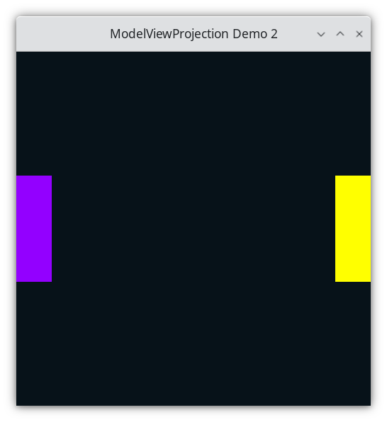

..
   Copyright (c) 2018-2024 William Emerison Six

   Permission is hereby granted, free of charge, to any person obtaining a copy
   of this software and associated documentation files (the "Software"), to deal
   in the Software without restriction, including without limitation the rights
   to use, copy, modify, merge, publish, distribute, sublicense, and/or sell
   copies of the Software, and to permit persons to whom the Software is
   furnished to do so, subject to the following conditions:

   The above copyright notice and this permission notice shall be included in all
   copies or substantial portions of the Software.

   THE SOFTWARE IS PROVIDED "AS IS", WITHOUT WARRANTY OF ANY KIND, EXPRESS OR
   IMPLIED, INCLUDING BUT NOT LIMITED TO THE WARRANTIES OF MERCHANTABILITY,
   FITNESS FOR A PARTICULAR PURPOSE AND NONINFRINGEMENT. IN NO EVENT SHALL THE
   AUTHORS OR COPYRIGHT HOLDERS BE LIABLE FOR ANY CLAIM, DAMAGES OR OTHER
   LIABILITY, WHETHER IN AN ACTION OF CONTRACT, TORT OR OTHERWISE, ARISING FROM,
   OUT OF OR IN CONNECTION WITH THE SOFTWARE OR THE USE OR OTHER DEALINGS IN THE
   SOFTWARE.

Draw A Rectange - Demo 02
=========================

Purpose
^^^^^^^

Learn how to plot a rectangle.  Learn about OpenGL's coordinate system, normalized-device coordinates,
which are from -1.0 to 1.0, in the X, Y, and Z directions.  Anything drawn entirely outside
of this region will not be displayed on the screen.

    Demo 02

How to Execute
^^^^^^^^^^^^^^

On Linux or on MacOS, in a shell, type "python src/demo02/demo.py".
On Windows, in a command prompt, type "python src\\demo02\\demo.py".

Code
^^^^

GLFW/OpenGL Initialization
~~~~~~~~~~~~~~~~~~~~~~~~~~

The setup code is the same.  Initialize GLFW.  Set the OpenGL version.
Create the window.  Set a key handler for closing.  Set the background to be black.
Execute the event/drawing loop.

The Event Loop
~~~~~~~~~~~~~~

Within the event loop, demo02/demo.py draws 2 rectangles, as one might see in
a game of Pong.

Draw Paddles
&&&&&&&&&&&&

A black screen is not particularly interesting, so
let's draw something, say, two rectangles.

We need to figure out what colors to use, and the positions of the rectangles, defined
below.

To set the color, we will use "glColor3f".
"glColor3f" sets a global variable, which makes it the color to be used
for the subsequently-drawn graphical shape(s).  Given that the background will be black,
lets make the first paddle purple, and a second paddle red.

To specify the corners of the rectangle,
"glBegin(GL_QUADS)" tells OpenGL that we will soon specify 4 *vertices*,
(i.e. points) which define the
quadrilateral.  The vertices will be specified by calling "glVertex2f" 4 times.

"glEnd()" tells OpenGL that we have finished providing vertices for
the begun quadrilateral.

Draw Paddle 1
^^^^^^^^^^^^^

.. literalinclude:: ../src/demo02/demo.py
   :language: python
   :start-after: doc-region-begin 1f8e965ae06faf5ab530a2df89117ac04c0cc8e4
   :end-before: doc-region-end 1f8e965ae06faf5ab530a2df89117ac04c0cc8e4

The paddle looks like this relative to normalized device coordinates (NDC):

.. figure:: _static/plot1.png
    :align: center
    :alt: Rectangle
    :figclass: align-center

    Rectangle

Draw Paddle 2
^^^^^^^^^^^^^

.. literalinclude:: ../src/demo02/demo.py
   :language: python
   :start-after: doc-region-begin 8c6c98d43b93df8ab7baffa3fc7aa3e073c15456
   :end-before: doc-region-end 8c6c98d43b93df8ab7baffa3fc7aa3e073c15456

The 2 paddles looks like this relative to normalized device coordinates (NDC):

.. figure:: _static/plot2.png
    :align: center
    :alt: Rectangle
    :figclass: align-center

    Rectangle

.. literalinclude:: ../src/demo02/demo.py
   :language: python
   :start-after: doc-region-begin eb903e85756eb879f8371c3ed61c4de85801c970
   :end-before: doc-region-end eb903e85756eb879f8371c3ed61c4de85801c970

* done with frame, flush the current buffer to the monitor
* Swap front and back buffers

The frame sent to the monitor is a set of values like this ::

    bbbbbbbbbbbbbbbbbbbbbbbbbbbbbbbbbbbbb
    bbbbbbbbbbbbbbbbbbbbbbbbbbbbbbbbbbbbb
    bbbbbbbbbbbbbbbbbbbbbbbbbbbbbbbbbbbbb
    PPPPPbbbbbbbbbbbbbbbbbbbbbbbbbbbRRRRR
    PPPPPbbbbbbbbbbbbbbbbbbbbbbbbbbbRRRRR
    PPPPPbbbbbbbbbbbbbbbbbbbbbbbbbbbRRRRR
    PPPPPbbbbbbbbbbbbbbbbbbbbbbbbbbbRRRRR
    PPPPPbbbbbbbbbbbbbbbbbbbbbbbbbbbRRRRR
    PPPPPbbbbbbbbbbbbbbbbbbbbbbbbbbbbbbbb
    bbbbbbbbbbbbbbbbbbbbbbbbbbbbbbbbbbbbb
    bbbbbbbbbbbbbbbbbbbbbbbbbbbbbbbbbbbbb
    bbbbbbbbbbbbbbbbbbbbbbbbbbbbbbbbbbbbb

What do we have to do to convert from normalized-device-coordinates (i.e. (1.0, .8))
into pixel coordinates (i.e. pixel (10,15))?  Nothing, OpenGL does that for us automatically; therefore
we never have to think in terms of pixels coordinates, only in terms of vertices of shapes,
specified by normalized-device-coordinates. OpenGL also automatically colors all of the pixels
which are inside of the quadrilateral.

Why do we use normalized-device coordinates instead of pixel coordinates?

Normalized-Device-Coordinates
^^^^^^^^^^^^^^^^^^^^^^^^^^^^^

The author owns two monitors, one which has 1024x768 pixels, and one which has
1920x1200 pixels.  When he purchases a game from Steam, he expects that his game
will run correctly on either monitor, in full-screen mode.  If a graphics programmer
had to explictly set the color of individual pixels using the pixel's coordinates, the the programmer would have to
program using "screen-space" (Any space_ means a system of numbers which you're using.
Screen-space means you're specifically using pixel coordinates, i.e, set pixel (5,10) to be red).

.. _space: https://en.wikipedia.org/wiki/Space_(mathematics)

What looks alright in screen-space on a large monitor...

.. figure:: _static/screenspace2.png
    :align: center
    :alt: Screenspace
    :figclass: align-center

    Screenspace

Isn't the same picture on a smaller monitor.

.. figure:: _static/screenspace.png
    :align: center
    :alt: Screenspace
    :figclass: align-center

    Screenspace

Like any good program or library, OpenGL creates an abstraction.
In this case, it abstracts over screen-space, thus freeing the
programmer from caring about screen size.  If a programmer does not want to program
in discrete (discrete means integer values, not continuous) screen-space,
what type of numbers should he use?  Firstly, it should be a continuous space, meaning
that it should be in decimal numbers.  Because if a real-world object is 1.3 meters long, a programmer
should be able to enter "float foo = 1.3".  Secondly, it should be a fixed range vertically
and an fixed range horizontally.  OpenGL will have to convert points from some space to screen-space,
and since this is done in hardware (i.e. you can't programmatically change how the conversion
happens), it should be a fixed size.

OpenGL uses what's called *normalized-device-coordinates*,
which is a continous space from -1.0 to 1.0 horizontally,
-1.0 to 1.0 vertically, and from -1.0 to 1.0 depthally.  (Is there an
actual word for that???)

The programmer specifies geometry using normalized-device-coordinates, and
OpenGL will convert from a continuous, -1.0 to 1.0 space,
to discrete pixel-space, and the programmer cannot change this.

.. figure:: _static/ndcSpace.png
    :align: center
    :alt: NDC space
    :figclass: align-center

    NDC space

Whether we own a small monitor

.. figure:: _static/ndcSpace1.png
    :align: center
    :alt: NDC space
    :figclass: align-center

    NDC space

Or a large monitor.

.. figure:: _static/screenspace2.png
    :align: center
    :alt: NDC space
    :figclass: align-center

    NDC space

Graph of Spaces
^^^^^^^^^^^^^^^

The following is a graph_, specifically
a Cayley_ Graph, of the two spaces
shown so far.  The nodes represent a coordinate system (i.e. origin and axes),
and the directed edge represents a function that converts coordinates from one
coordinate system to another.  If this isn't clear to the reader, look
above at the 3 pictures of the 2 quadrilaterals.  They look the same, but
if you label each vertex on all three graphs, and look at the axes to find
their plotted values, you will find that they differ.  Changing between
coordinate systems means to take vertices from one coordinate system and
changing them to another, like converting from Celcius to Farenheit,
meters to feet, etc.

.. _graph: https://en.wikipedia.org/wiki/Graph_theory
.. _Cayley:  https://en.wikipedia.org/wiki/Cayley_graph

.. figure:: _static/demo02.png
    :align: center
    :alt: Demo 02
    :figclass: align-center

    Demo 02

The function that converts from NDC to Screen space is
arbitrarily named f, subscripted by "NDC", superscripted
by "S".  This is a common notation when creating
functions that change basis, i.e. coordinate conversion.
A definition of this function is not provided right now, because we can't change it in software.
But we must recognize that it exists.

Introduction to Cayley Graphs
~~~~~~~~~~~~~~~~~~~~~~~~~~~~~

The wikipedia article for Cayley graphs (https://en.wikipedia.org/wiki/Cayley_graph) is intimidating,
but for our purposes, it's use is very simple.

An univariate example use of Cayley graphs is exchanging coins with
a bank.

.. figure:: _static/currency.png
    :align: center
    :alt: Demo 02
    :figclass: align-center

    Cayley graph of univariate coordinate conversion for money.

.. math::
    f_{nickel}^{penny}(x) = 5 * x

.. math::
    f_{dime}^{penny}(x) = 10 * x

.. math::
    f_{quarter}^{penny}(x) = 25 * x

.. math::
    f_{dollar}^{penny}(x) = 100 * x

The directed edges in the Cayley graph show the direction that
the function, i.e. transformation, applies.

To convert 20 nickels into pennies, start at nickel,
move to penny, while applying the appropriate function
along the way.

.. math::
    f_{nickel}^{penny}(x) = 5 * x

.. math::
    f_{nickel}^{penny}(20)  & = 5 * 20 \\
                     & = 100

To convert those 100 penny into quarters, move from
penny to quarter, but since we are moving in the opposite
direction of the edge, we must apply the multiplicative inverse
of that function.  These functions are invertible by
taking the reciprical of the coefficient

.. math::
    f_{quarter}^{penny}(x) = 25 * x

.. math::
    f_{penny}^{quarter}(x) & = {f_{quarter}^{penny}}^{-1}(x) \\
    & =  1/25 * x

.. math::
    {f_{penny}^{quarter}}(100)  & = 1/25 * x\\
                     & = 4

By taking the inverse of the coefficient, we satisfy a definition
of an inverse

.. math::
   (f \circ f^{-1})(x)  = x

To convert between any denomination, say dimes to dollars,
just compose the functions, remembering to take the inverse
of any directed edge that you against.

.. math::
    f_{dime}^{dollar}(x)  & = f_{penny}^{dollar}(f_{dime}^{penny}(x)) \\
                              & = {f_{dollar}^{penny}}^{-1}(f_{dime}^{penny}(x)) \\

.. math::
    f_{dime}^{dollar}   = {f_{dollar}^{penny}}^{-1} \circ f_{dime}^{penny}

Notice in the last equation that we defined the function via function composition_,
and didn't specify any arguments.  We just focus on the types of units in and the units
out, but the details of those functions are not relevant when traversing the Cayley graph.

.. _composition: https://en.wikipedia.org/wiki/Function_composition

Learning what to ignore
~~~~~~~~~~~~~~~~~~~~~~~

A big part of being able to understand graphics well is being able
to figure out what to ignore.  So how would we convert coordinates from space
D to space B (defined below)?  What do those names mean?  It doesn't matter.
What is the definition of all of the functions?  It doesn't matter. All that
matters

* is that the function exists

* the definition of the function is provided to us

* the function is invertible

* and that we can call a procedure to invert a function.

.. figure:: _static/cayleygraph.png
    :align: center
    :alt: Generic Cayley Graph
    :figclass: align-center

    Generic Cayley Graph

Well to convert data fram space D to space B,
we know that D is defined relative to C, C is defined relative to A, and B is defined
relative to A.  Because of the arrows, we know that we are given a function from
D to C, a function from C to A, and a function from B to A.  We are not directly
given their inverses, but we can calculate them easily enough, or have a computer do it
for us.

In tracing out the graph, we are going with the first two directed edges,
and against the last one.  So we compose the functions and take
the appropriate inverse(s).

.. math::
    \vec{f}_{d}^{b}(\vec{x})  & = \vec{f}_{a}^{b}(\vec{f}_{c}^{a}(\vec{f}_{d}^{c}(\vec{x}))) \\
                              & = {\vec{{f}_{b}^{a}}}^{-1}(\vec{f}_{c}^{a}(\vec{f}_{d}^{c}(\vec{x})))

A function from A to B is not provided to us, but we wrote it in the equation as an idea of a function
that we wish to have, even though we don't currently have it.
However, we can create this function by invoking inverse on the provide function from A to B.

Since we're dealing with function composition mainly, we don't even need to specify the argument

.. math::
    \vec{f}_{d}^{b}  = {\vec{{f}_{b}^{a}}}^{-1} \circ {\vec{f}_{c}^{a}} \circ \vec{f}_{d}^{c}

If this seems to abstract for now, don't worry.  By the end of the course, it should be clear.
The goal of this book is to make it clear, and then, obvious.

Exercise
^^^^^^^^

* Run Demo 2.  Resize the window using the GUI controls provided
  by the Operating system. first make it skinny, and then wide.
  Observe at what happens to the rectangles.
