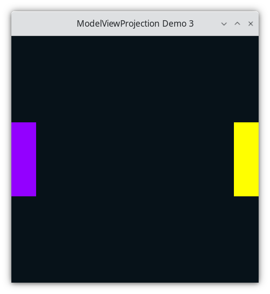
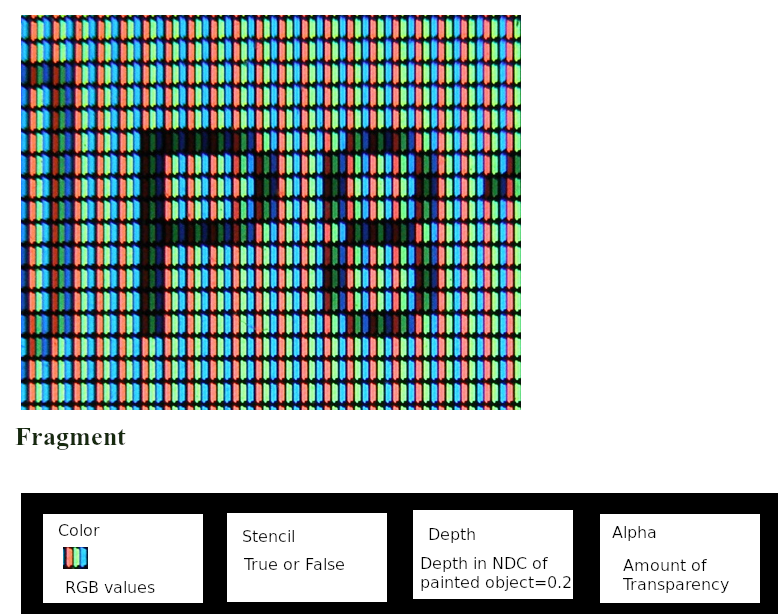

..
   Copyright (c) 2018-2025 William Emerison Six

   Permission is granted to copy, distribute and/or modify this document
   under the terms of the GNU Free Documentation License, Version 1.3
   or any later version published by the Free Software Foundation;
   with no Invariant Sections, no Front-Cover Texts, and no Back-Cover Texts.

   A copy of the license is available at
   https://www.gnu.org/licenses/fdl-1.3.html.

Window Resizing and Proportionality - Demo 03
=============================================

    Demo 03

Problem With Previous Demo
^^^^^^^^^^^^^^^^^^^^^^^^^^

When running Demo02, if the user resizes the windows,
then the paddles lose their proportionality, as NDC
no longer is mapped to a square screen-space.

How to Execute
^^^^^^^^^^^^^^

Load src/demo03.py in Spyder and hit the play button

Purpose
^^^^^^^

Modify the previous demo, so that if the user resizes the window
of the OpenGL program, that the picture does not become distorted.

Create procedure to ensure proportionality.

Keeping the Paddles Proportional
^^^^^^^^^^^^^^^^^^^^^^^^^^^^^^^^

In the previous demo, if the user resized the window, the paddles appear distorted,
as they were shrunk in one direction if the window became too thin or too fat.

.. figure:: _static/disproportionate1.svg
    :class: no-scale
    :align: center
    :alt: Yuck
    :figclass: align-center

    Yuck

.. figure:: _static/disproportionate2.svg
    :class: no-scale
    :align: center
    :alt: Yuck
    :figclass: align-center

    Yuck

Assume that this is a problem for the application we are making, how could
we solve it and keep proportionality regardless of the dimensions of the window?
Ideally, we would like to draw our paddles with
a black background within a square region in the center of the window, regardless of the dimensions
of the window.

OpenGL has a solution for us.  The *viewport* is a rectangular region contained
within the window into which OpenGL will render.  By specifying a viewport, OpenGL
will convert the normalized-device-coordinates
to the sub-window space of the viewport, instead of the whole
window.

.. figure:: _static/viewport.svg
    :class: no-scale
    :align: center
    :alt: Nice
    :figclass: align-center

    Nice

.. figure:: _static/demo03.png
    :class: no-scale
    :align: center
    :alt: Demo 03
    :figclass: align-center

    Demo 03

Because we will only draw in a subset of the window, and because all subsequent
chapters will use this functionality, I have created a procedure for use
in all chapters named "draw_in_square_viewport".

Code
^^^^

GLFW/OpenGL Initialization
~~~~~~~~~~~~~~~~~~~~~~~~~~

The setup code is the same as the previous demo's setup.  Initialize GLFW.  Set the OpenGL version.
Create the window.  Set a key handler for closing.
Execute the event/drawing loop.  The only code showed in this book will be the relevant parts.
Consult the python source for the full, working code.

Set to Draw in Square Subsection Of Window
&&&&&&&&&&&&&&&&&&&&&&&&&&&&&&&&&&&&&&&&&&

.. literalinclude:: ../../src/demo03.py
   :language: python
   :start-after: doc-region-begin square viewport
   :end-before: doc-region-end square viewport
   :linenos:
   :lineno-match:
   :caption: src/demo03.py

* declare a function to configure OpenGL to draw only in a square subset of the monitor, i.e. the viewport

.. literalinclude:: ../../src/demo03.py
   :language: python
   :start-after: doc-region-begin set to gray
   :end-before: doc-region-end set to gray
   :linenos:
   :lineno-match:
   :caption: src/demo03.py

* set the clear color to be gray.
* glClear clear the color of every pixel in the whole frame buffer, independent of viewport.
  So now the entire frame-buffer is gray.

.. literalinclude:: ../../src/demo03.py
   :language: python
   :start-after: doc-region-begin get framebuffer size
   :end-before: doc-region-end get framebuffer size
   :linenos:
   :lineno-match:
   :caption: src/demo03.py

* figure out the minimum dimension of the window.  In the image above, the "square_size" is 1200,
  as the monitor's vertical screen-space is only 1200 pixels tall.
* To make a square sub-region, we need a number for the distance between vertices of the square.
  By using the minimum of the width and height, we can at least fill up the screen in one dimension.

.. literalinclude:: ../../src/demo03.py
   :language: python
   :start-after: doc-region-begin enable scissor test
   :end-before: doc-region-end enable scissor test
   :linenos:
   :lineno-match:
   :caption: src/demo03.py

* Enable the scissor test.  Internally, OpenGL drivers likely have global variables
  that we set by calling functions.  Every OpenGL feature isn't used by every OpenGL
  program.  For instance, we are not using lighting to add realism.  We aren't using
  texturing.  We are using the scissor test, so we must enable it.  We only enable
  the features that we need so that the OpenGL driver doesn't waste time doing
  unnecessary computations.
* Note that it's not clear what the arguments mean, so the author added comments
  after each argument.  Another way to make this more clear is to use Python's keyword
  arguments, discussed later.
* the scissor test allows us to specify a region
  of the frame-buffer into which the OpenGL operations
  will apply.  In this case, the color in every pixel in the frame-buffer is currently gray
  because of the existing class to glClearColor.
  By calling glScissor, we are setting a value in each fragment (i.e., pixel) on a square
  region of pixels to be true (and false everywhere else) which means "only do the OpenGL call on these fragments,
  ignore the others".
  As we will learn later, OpenGL stores much more information
  per fragment (i.e. pixel) than just its current color.

* Look at the image above of NDC superimposed on Screen Space.  From this,
  the arguments sent to glScissor should be clear.

.. literalinclude:: ../../src/demo03.py
   :language: python
   :start-after: doc-region-begin set background to be close to black
   :end-before: doc-region-end set background to be close to black
   :linenos:
   :lineno-match:
   :caption: src/demo03.py

*  glClear will only update the square to black values.

.. literalinclude:: ../../src/demo03.py
   :language: python
   :start-after: doc-region-begin disable scissor test
   :end-before: doc-region-end disable scissor test
   :linenos:
   :lineno-match:
   :caption: src/demo03.py

* disable the scissor test, so now any OpenGL calls will
  happen as usual.

So we've drawn black into a square, and disabled the scissor test,
so any subsequent OpenGL calls will still be drawn into the full frame-buffer.
But, we only want to draw within the black square, and the scissor
test does not modify the NDC to screen-space transformations.
To modify the NDC to screen-space transformations, we set the viewport again,
so that the NDC coordinates
will be mapped the the region of screen coordinates
that we care about, which is the black square.

.. literalinclude:: ../../src/demo03.py
   :language: python
   :start-after: doc-region-begin set square viewport
   :end-before: doc-region-end set square viewport
   :linenos:
   :lineno-match:
   :caption: src/demo03.py

The Event Loop
&&&&&&&&&&&&&&

This demo's event loop is just like the previous demo,
but this time we call the procedure to
ensure that we only draw in a square subset of
the window.

.. literalinclude:: ../../src/demo03.py
   :language: python
   :start-after: doc-region-begin event loop begin
   :end-before: doc-region-end event loop begin
   :linenos:
   :lineno-match:
   :caption: src/demo03.py

.. literalinclude:: ../../src/demo03.py
   :language: python
   :start-after: doc-region-begin call draw in square viewport
   :end-before: doc-region-end call draw in square viewport
   :linenos:
   :lineno-match:
   :caption: src/demo03.py

* The event loop is the same as the previous demo, except
  that we call draw_in_square_viewport every frame at the beginning.

.. literalinclude:: ../../src/demo03.py
   :language: python
   :start-after: doc-region-begin draw both paddles
   :end-before: doc-region-end draw both paddles
   :linenos:
   :lineno-match:
   :caption: src/demo03.py
