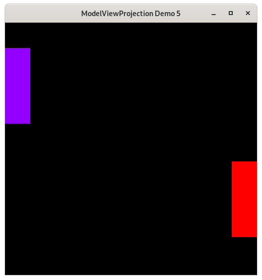

..
   Copyright (c) 2018-2024 William Emerison Six

   Permission is hereby granted, free of charge, to any person obtaining a copy
   of this software and associated documentation files (the "Software"), to deal
   in the Software without restriction, including without limitation the rights
   to use, copy, modify, merge, publish, distribute, sublicense, and/or sell
   copies of the Software, and to permit persons to whom the Software is
   furnished to do so, subject to the following conditions:

   The above copyright notice and this permission notice shall be included in all
   copies or substantial portions of the Software.

   THE SOFTWARE IS PROVIDED "AS IS", WITHOUT WARRANTY OF ANY KIND, EXPRESS OR
   IMPLIED, INCLUDING BUT NOT LIMITED TO THE WARRANTIES OF MERCHANTABILITY,
   FITNESS FOR A PARTICULAR PURPOSE AND NONINFRINGEMENT. IN NO EVENT SHALL THE
   AUTHORS OR COPYRIGHT HOLDERS BE LIABLE FOR ANY CLAIM, DAMAGES OR OTHER
   LIABILITY, WHETHER IN AN ACTION OF CONTRACT, TORT OR OTHERWISE, ARISING FROM,
   OUT OF OR IN CONNECTION WITH THE SOFTWARE OR THE USE OR OTHER DEALINGS IN THE
   SOFTWARE.

Add Translate Method to Vertex - Demo 05
========================================

Purpose
^^^^^^^
Restructure the code towards the model view projection
pipeline.

Transforming vertices, such as translating, is the core concept
of computer graphics.

    Demo 05

How to Execute
^^^^^^^^^^^^^^

On Linux or on MacOS, in a shell, type "python src/demo05/demo.py".
On Windows, in a command prompt, type "python src\\demo05\\demo.py".

Move the Paddles using the Keyboard
^^^^^^^^^^^^^^^^^^^^^^^^^^^^^^^^^^^

==============  ======================
Keyboard Input  Action
==============  ======================
*w*             Move Left Paddle Up
*s*             Move Left Paddle Down
*k*             Move Right Paddle Down
*i*             Move Right Paddle Up
==============  ======================

Translation
^^^^^^^^^^^

Dealing with the two Paddles the way we did before is not
ideal.  Both Paddles have the same size, although they are placed
in different spots of the screen.  We should be able to
a set of vertices for the Paddle, relative to the paddle's center,
that is independent of its
placement in NDC.

Rather than using values for each vertex relative to NDC, in the
Paddle data structure, each vertex will be an offset from
the center of the Paddle.  The center of the paddle will be considered x=0, y=0.
Before rendering, each Paddle's
vertices will need to be translated to its center relative to NDC.

.. figure:: _static/demo05.png
    :align: center
    :alt:
    :figclass: align-center

    Paddle space

All methods on vertices will be returning new vertices,
rather than mutating the instance variables.  The author
does this on purpose to enable method-chaining the Python
methods, which will be useful later on.

Method-chaining is the equivalent of function composition in math.

Code
^^^^

Data Structures
~~~~~~~~~~~~~~~

.. literalinclude:: ../../src/demo05/demo.py
   :language: python
   :start-after: doc-region-begin define vertex class
   :end-before: doc-region-end define vertex class
   :linenos:
   :lineno-match:
   :caption: src/demo05/demo.py

We added a translate method to the Vertex class.  Given a translation amount, the vertex
will be shifted by that amount.  This is a primitive that we will be using to transform
from one space to another.

If the reader wishes to use the data structures to test them out,
import them and try the methods

.. code:: Python

       >>> import src.demo05.demo as demo
       >>> a = demo.Vertex(x=1,y=2)
       >>> a.translate(demo.Vertex(x=3,y=4))
       Vertex(x=4, y=6)

Note the use of "keyword arguments".  Without using keyword
arguments, the code might look like this:

.. code:: Python

       >>> import src.demo05.demo as demo
       >>> a = demo.Vertex(1,2)
       >>> a.translate(demo.Vertex(x=3,y=4))
       Vertex(x=4, y=6)

Keyword arguments allow the reader to understand the purpose of the
parameters are, at the call-site of the function.

.. literalinclude:: ../../src/demo05/demo.py
   :language: python
   :start-after: doc-region-begin define paddle class
   :end-before: doc-region-end define paddle class
   :linenos:
   :lineno-match:
   :caption: src/demo05/demo.py

Add a position instance variable to the Paddle class.  This position is the center of
the paddle, defined relative to NDC.  The vertices of the paddle will be defined
relative to the center of the paddle.

Instantiation of the Paddles
~~~~~~~~~~~~~~~~~~~~~~~~~~~~

.. literalinclude:: ../../src/demo05/demo.py
   :language: python
   :start-after: doc-region-begin instantiate paddles
   :end-before: doc-region-end instantiate paddles
   :linenos:
   :lineno-match:
   :caption: src/demo05/demo.py

* The vertices are now defined as relative distances from the center of the paddle.  The centers
  of each paddle are placed in positions relative to NDC that preserve the positions of the
  paddles, as they were in the previous demo.

Handling User Input
~~~~~~~~~~~~~~~~~~~

.. literalinclude:: ../../src/demo05/demo.py
   :language: python
   :start-after: doc-region-begin define handle movement of paddles
   :end-before: doc-region-end define handle movement of paddles
   :linenos:
   :lineno-match:
   :caption: src/demo05/demo.py

* We put the transformation on the center of the paddle, instead
  of directly on each vertex.  This is because the vertices are
  defined relative to the center of the paddle.

The Event Loop
~~~~~~~~~~~~~~

.. literalinclude:: ../../src/demo05/demo.py
   :language: python
   :start-after: doc-region-begin begin event loop
   :end-before: doc-region-end begin event loop
   :linenos:
   :lineno-match:
   :caption: src/demo05/demo.py

.. literalinclude:: ../../src/demo05/demo.py
   :language: python
   :start-after: doc-region-begin draw paddle 1
   :end-before: doc-region-end draw paddle 1
   :linenos:
   :lineno-match:
   :caption: src/demo05/demo.py

Here each of paddle 1's vertices, which are in their "model-space",
are converted to NDC by calling the translate method on the vertex.
This function corresponds to the Cayley graph below, the function
from Paddle 1 space to NDC.

.. literalinclude:: ../../src/demo05/demo.py
   :language: python
   :start-after: doc-region-begin draw paddle 2
   :end-before: doc-region-end draw paddle 2
   :linenos:
   :lineno-match:
   :caption: src/demo05/demo.py

.. figure:: _static/demo05.png
    :align: center
    :alt:
    :figclass: align-center

    Paddle space

The only part of the diagram that we need to think about right now is the function
that converts from paddle1's space to NDC, and from paddle2's space to NDC.

These functions in the Python code are the translation of the paddle's center (i.e. paddle1.position)
by the vertex's offset from the center.

N.B.  In the code, I name the vertices by their space.  I.e. "modelSpace" instead of "vertex_relative_to_modelspace".
I do this to emphasize that you should view the transformation as happening to the "graph paper", instead of to each
of the points.  This will be explained more clearly later.
