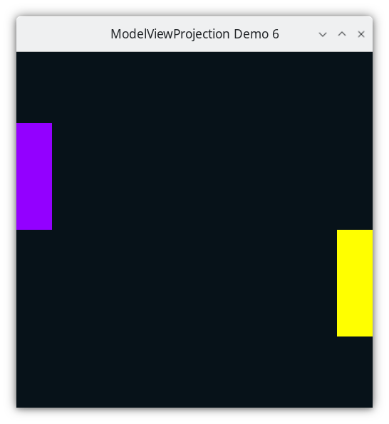

..
   Copyright (c) 2018-2025 William Emerison Six

   Permission is granted to copy, distribute and/or modify this document
   under the terms of the GNU Free Documentation License, Version 1.3
   or any later version published by the Free Software Foundation;
   with no Invariant Sections, no Front-Cover Texts, and no Back-Cover Texts.

   A copy of the license is available at
   https://www.gnu.org/licenses/fdl-1.3.html.

********************
Modelspace - Demo 06
********************

Objective
^^^^^^^^^

Learn about :term:`modelspace<Modelspace>` :index:`Modelspace`.

    Demo 06

How to Execute
^^^^^^^^^^^^^^

Load src/modelviewprojection/demo06.py in Spyder and hit the play button.

Move the Paddles using the Keyboard
^^^^^^^^^^^^^^^^^^^^^^^^^^^^^^^^^^^

==============  ======================
Keyboard Input  Action
==============  ======================
*w*             Move Left Paddle Up
*s*             Move Left Paddle Down
*k*             Move Right Paddle Down
*i*             Move Right Paddle Up
==============  ======================

Modelspace
^^^^^^^^^^

:term:`NDC<Normalized Device Coordinates>` are not a natural system of
numbers for use by humans.  Imagine that the paddles in the previous
chapters exist in real life, and are 2 meters wide and 6 meters tall.
The graphics programmer should be able to use those numbers directly;
they shouldn't have to manually transform the distances into :term:`NDC<Normalized Device Coordinates>`.

Whatever a convenient numbering system is (i.e. coordinate system) for modeling objects
is called :term:`modelspace<Modelspace>`.  Since a paddle has four corners, which corner should be at
the origin (0,0)?  If you don't already know what you want at the origin, then
none of the corners should be; instead put the center of the object
at the origin (Because by putting the center of the object at the origin,
scaling and rotating the object are trivial, as shown in later chapters).

.. figure:: _static/modelspace.svg
    :class: no-scale
    :align: center
    :alt: Representing a Paddle using Modelspace
    :figclass: align-center

    Representing a Paddle using Modelspace

:term:`modelspace<Modelspace>` - the coordinate system (origin plus axes), in which some object's
vertices are defined.

WorldSpace
^^^^^^^^^^

WorldSpace is a top-level space, independent of NDC, that we choose to use.  It is arbitrary.
If you were to model a racetrack for a racing game, the origin of WorldSpace may be the center of that racetrack.
If you were modeling our solar system, the center of the sun could be the origin of "WorldSpace".
I personally would put the center of our flat earth at the origin, but reasonable people
can disagree.

For our demo with paddles, the author arbitrarily defines the WorldSpace to be 20 units wide, 20 units tall, with the origin at the center.

.. figure:: _static/demo06.png
    :class: no-scale
    :align: center
    :alt: Demo 06
    :figclass: align-center

    Demo 06

Modelspace to WorldSpace
^^^^^^^^^^^^^^^^^^^^^^^^

The author prefers to view transformations as changes to the graph paper,
as compared to view transformations as changes to points.

As such, for placing paddle1, we can view the translation as a change
to the graph paper relative to world space coordinates (only incidentally
bringing the vertices
along with it) and then resetting the graph paper (i.e. both origin and axes)
back to its original position and orientation.
Although we will think of the paddle's vertices as relative to its own space
(i.e. -1 to 1 horizontally, -3 to 3 vertically),
we will not look at the numbers of what they are in world space coordinates,
as doing so

* Will not give us any insight

* Will distract us from thinking clearly about what's happening

* As an example, figure out the world space coordinate of the upper rights
  corner of the paddle after it has been translated, and ask yourself what
  that means and what insight did you gain?

The animation above shows multiple steps, shown now without animation.

Modelspace of Paddle 1
~~~~~~~~~~~~~~~~~~~~~~

.. figure:: _static/translation-forwards-0.svg
    :class: no-scale
    :align: center
    :alt: Paddle 1's Modelspace
    :figclass: align-center

    Paddle 1's Modelspace

==============  ======================
Vector          Coordinates
==============  ======================
a               (1,3)
b               (-1,3)
c               (-1,-3)
d               (1,-3)
==============  ======================

Modelspace of Paddle 1 Superimposed on Worldspace after the translation
~~~~~~~~~~~~~~~~~~~~~~~~~~~~~~~~~~~~~~~~~~~~~~~~~~~~~~~~~~~~~~~~~~~~~~~

Paddle 1's graph paper gets translated -9 units in the x direction, and some
number of units in the y direction, 0 during the first frame, based off of user input.  The origin
is translated, and the graph paper comes with it, onto which you can
plot the vertices.  Notice that the coordinate system labels below the plot and to the left of the plot
is unchanged.  That is world space, which has not changed.

.. figure:: _static/translation-forwards-2.svg
    :class: no-scale
    :align: center
    :alt: Paddle 1's Modelspace Superimposed on World Space
    :figclass: align-center

    Paddle 1's Modelspace Superimposed on World Space

==============  ========================  ===========================
Vector          Coordinates (modelspace)  Coordinates (worldspace)
==============  ========================  ===========================
a               (1,3)                     (1,3) + (9,3)  = (-8,5)
b               (-1,3)                    (-1,3) + (9,3)  = (-10,5)
c               (-1,-3)                   (-1,-3) + (9,3)  = (-10,-1)
d               (1,-3)                    (1,-3) + (9,3) = (-8,-1)
==============  ========================  ===========================

Paddle 1's vertices in WorldSpace Coordinates
~~~~~~~~~~~~~~~~~~~~~~~~~~~~~~~~~~~~~~~~~~~~~

.. figure:: _static/translation-forwards-3.svg
    :class: no-scale
    :align: center
    :alt: Paddle 1's Vertices in World Space
    :figclass: align-center

    Paddle 1's Vertices in World Space.

==============  ========================
Vector          Coordinates (worldspace)
==============  ========================
a               (-8,5)
b               (-10,5)
c               (-10,-1)
d               (-8,-1)
==============  ========================

Now that the transformation has happened, the vertices are all in world space.
You could calculate their values in world space, but that will not give you any insight.  The only numbers
that matter for insight as that the entire graph paper of :term:`modelspace<Modelspace>`, which originally
was the same as world space, has changed, bringing the vertices along with it.

Same goes for Paddle 2's :term:`modelspace<Modelspace>`, relative to its translation, which
are different values.

Modelspace of Paddle 2
~~~~~~~~~~~~~~~~~~~~~~

.. figure:: _static/translation2-forwards-0.svg
    :class: no-scale
    :align: center
    :alt: Paddle 1's Modelspace
    :figclass: align-center

    Paddle 2's Modelspace

==============  ======================
Vector          Coordinates
==============  ======================
a               (1,3)
b               (-1,3)
c               (-1,-3)
d               (1,-3)
==============  ======================

Modelspace of Paddle 2 Superimposed on Worldspace after the translation
~~~~~~~~~~~~~~~~~~~~~~~~~~~~~~~~~~~~~~~~~~~~~~~~~~~~~~~~~~~~~~~~~~~~~~~

.. figure:: _static/translation2-forwards-2.svg
    :class: no-scale
    :align: center
    :alt: Paddle 1's Modelspace Superimposed on World Space
    :figclass: align-center

    Paddle 2's Modelspace Superimposed on World Space

==============  ========================  =========================
Vector          Coordinates (modelspace)  Coordinates (worldspace)
==============  ========================  =========================
a               (1,3)                     (1,3) + (9,-4) = (10,-1)
b               (-1,3)                    (-1,3) + (9,-4) = (8,-1)
c               (-1,-3)                   (-1,-3) + (9,-4) = (8,-7)
d               (1,-3)                    (1,-3) + (9,-4) = (10,-7)
==============  ========================  =========================

Paddle 2's vertices in WorldSpace Coordinates
~~~~~~~~~~~~~~~~~~~~~~~~~~~~~~~~~~~~~~~~~~~~~

.. figure:: _static/translation2-forwards-3.svg
    :class: no-scale
    :align: center
    :alt: Paddle 1's Vertices in World Space
    :figclass: align-center

    Paddle 2's Vertices in World Space.

==============  ========================
Vector          Coordinates (worldspace)
==============  ========================
a               (10,-1)
b               (8,-1)
c               (8,-7)
d               (10,-7)
==============  ========================

..
   Instead, for model-space to world-space transformations,
   it is easier to read the transformations backwards, where the transformations
   aren't relative to the global origin, instead its from the local frame of reference.

   When reading the transformations backwards, I think it is best to think of it
   as moving the axes, and the plotting the data once the axes are in
   their final place.

   Why do the two different views of the transformations matter?  In model-space
   to world-space transformations, especially once rotation and scaling of model-space
   is used, it allows the programmer to forget about most details, just specify
   where new objects are relative to that which you are already drawing.

   With that said, that doesn't mean that reading the transformations front to back
   has no value.  Front to back can useful when dealing with camera-space transformations,
   introduced later.

   This will make more sense once rotation is involved.

Scaling
~~~~~~~

Our paddles are now well outside of NDC, and as such, they would not
be displayed, as they would be *clipped* out.  Their values are outside
of -1.0 to 1.0.  All we will need to do to convert them from
world space to NDC is divide each component, x and y, by 10.

As a demonstration of how scaling works, let's make an
object's width twice as large, and height three times as large. (The author
tried doing the actual scaling of 1/10 in an animated gif, and it looked awful,
therefore a different scaling gif is showed here, but the concept
is the same).

We can expand or shrink the size of an object
by "scale"ing each component of the vertices by some coefficient.

.. figure:: _static/scale-0.svg
    :class: no-scale
    :align: center
    :alt: Modelspace
    :figclass: align-center

    Modelspace

.. figure:: _static/scale-2.svg
    :class: no-scale
    :align: center
    :alt: Modelspace Superimposed on World Space
    :figclass: align-center

    Modelspace Superimposed on World Space

.. figure:: _static/scale-4.svg
    :class: no-scale
    :align: center
    :alt: Worldspace
    :figclass: align-center

    Worldspace.  Don't concern yourself with what the numbers are.

Our global space is -10 to 10 in both dimensions,
and to get it into NDC, we need to scale by dividing by 10

.. figure:: _static/demo06.png
    :class: no-scale
    :align: center
    :alt: Demo 06
    :figclass: align-center

    Demo 06

..
   .. math::
       \vec{f}_{p1}^{w}
       \begin{bmatrix}
       x_{p1} \\
       y_{p1} \\
       z_{p1}
       \end{bmatrix} =
       \begin{bmatrix}
       1 & 2 & 3 \\
       4 & 5 & 6 \\
       7 & 8 & 9
       \end{bmatrix} *
       \begin{bmatrix}
       x_{p1} \\
       y_{p1} \\
       z_{p1}
       \end{bmatrix} =
       \begin{bmatrix}
       x_{w} \\
       y_{w} \\
       z_{w}
       \end{bmatrix}

.. math::
    \begin{bmatrix}
    x_{w} \\
    y_{w}
    \end{bmatrix}  =
    \vec{f}_{p1}^{w}(
    \begin{bmatrix}
    x_{p1} \\
    y_{p1}
    \end{bmatrix})  =
    \begin{bmatrix}
    x_{p1} \\
    y_{p1}
    \end{bmatrix} +
    \begin{bmatrix}
    {p1}_{x} \\
    {p1}_{y}
    \end{bmatrix}

where x_p1, y_p1  are the :term:`modelspace<Modelspace>` coordinates of the paddle's vertices,
and where p1_center_x_worldspace, p1_center_y_worldspace,
are the offset from the world space's origin to the center of the paddle, i.e. the translation.

.. math::
    \begin{bmatrix}
    x_{w} \\
    y_{w}
    \end{bmatrix}  =
    \vec{f}_{p2}^{w} (
    \begin{bmatrix}
    x_{p2} \\
    y_{p2}
    \end{bmatrix}) =
    \begin{bmatrix}
    x_{p2} \\
    y_{p2}
    \end{bmatrix} +
    \begin{bmatrix}
    {p2}_{x} \\
    {p2}_{y}
    \end{bmatrix}

Now, the coordinates for paddle 1 and for paddle 2 are in world
space, and we need the match to take any world space coordinates
and convert them to NDC.

.. math::
    \begin{bmatrix}
    x_{ndc} \\
    y_{ndc}
    \end{bmatrix} =
    \vec{f}_{w}^{ndc} (
    \begin{bmatrix}
    x_{w} \\
    y_{w}
    \end{bmatrix})  = 1/10 *
    \begin{bmatrix}
    x_{w} \\
    y_{w}
    \end{bmatrix}

Modelviewprojection comes with a math library, the 2D version is
named "mathutils2d.py".  The main class in this module is "Vector2D",
which has two components: and x value, and a y value.  To add a vector2d
to another one on the right hand side of the '+' symbol, we just add
the respective components together, and create a new Vector2D.

.. literalinclude:: ../../src/modelviewprojection/mathutils2d.py
   :language: python
   :start-after: doc-region-begin define vector class
   :end-before: doc-region-end define vector class
   :linenos:
   :lineno-match:
   :caption: src/modelviewprojection/mathutils2d.py

In a Python class, we can overload the '+' symbol, to make
objects addable, by implementing the :py:meth:`modelviewprojection.mathutils1d.Vector1D.__add__`
method.

.. literalinclude:: ../../src/modelviewprojection/mathutils.py
   :language: python
   :start-after: doc-region-begin begin define add
   :end-before: doc-region-end begin define add
   :linenos:
   :lineno-match:
   :caption: src/modelviewprojection/mathutils.py

.. literalinclude:: ../../src/modelviewprojection/mathutils.py
   :language: python
   :start-after: doc-region-begin define add
   :end-before: doc-region-end define add
   :linenos:
   :lineno-match:
   :caption: src/modelviewprojection/mathutils.py

We can also model the opposite procedure, subtraction,
by implementing the :py:meth:`modelviewprojection.mathutils.Vector.__sub__`
method.

.. literalinclude:: ../../src/modelviewprojection/mathutils.py
   :language: python
   :start-after: doc-region-begin begin define subtract
   :end-before: doc-region-end begin define subtract
   :linenos:
   :lineno-match:
   :caption: src/modelviewprojection/mathutils.py

.. literalinclude:: ../../src/modelviewprojection/mathutils.py
   :language: python
   :start-after: doc-region-begin define subtract
   :end-before: doc-region-end define subtract
   :linenos:
   :lineno-match:
   :caption: src/modelviewprojection/mathutils.py

In our graphics code, instead of using "a+b", we'll use a more descriptive
name: "translate", which is implemented using the addition symbol.  But a few
things to note, :py:meth:`modelviewprojection.mathutils.translate`
is a function on the mathutils module, not a method
on Vector2D class, and it's wrapped in a class named "InvertibleFunction"

.. literalinclude:: ../../src/modelviewprojection/mathutils.py
   :language: python
   :start-after: doc-region-begin define translate
   :end-before: doc-region-end define translate
   :linenos:
   :lineno-match:
   :caption: src/modelviewprojection/mathutils.py

Notice in particular that the "b" parameter
is passed as an argument to "translate",
but the function for translating, named "f", and the inverse of "f" named "f_inv", take a Vector2D.
This is because we will be translating many Vector2Ds using the same amount.

Invertible functions are stored in pairs, with the "active" function
being the first one passed to the constructor.  So for translate above,
the adding of the Vector2Ds will be the function, but InvertibleFunction
holds onto the second function, for later use to be able to undo the function's
application.

.. literalinclude:: ../../tests/test_mathutils2d.py
   :language: python
   :start-after: doc-region-begin translate test
   :end-before: doc-region-end translate test
   :linenos:
   :lineno-match:
   :caption: tests/test_mathutils2d.py

The above is a unit test that shows how the translate function can be used.
We call "translate", a function which takes a translate amount, both in the x
direction and the y direction, but we have not yet specified what needs to be translated
by that amount.  "translate" returns an InvertibleFunction, which is
Callable[Vector2D, Vector2D].  Callable[Vector2D, Vector2D] is a type which
is a function that takes a Vector2D as input, and returns a Vector2D (in this case,
the output is the input, translated by Vector2D(x=2.0, y=3.0).

On the next 3 lines, we call the function t, passing in a Vector2D to be translated, and
we test if the result is equal to the specified amount.  ("approx", is a function from the
pytest module, which when tested for equality, returns true if the two floating point
numbers under comparison are "close enough").

We then define a function t_inv, by calling "inverse" on function "t".  We then see that
composing t_inv and t results in no transformation.

Here's how InvertibleFunction is implemented:

.. literalinclude:: ../../src/modelviewprojection/mathutils.py
   :language: python
   :start-after: doc-region-begin define invertible function
   :end-before: doc-region-end define invertible function
   :linenos:
   :lineno-match:
   :caption: src/modelviewprojection/mathutils.py

Just as Python allows an object to override the '+' and '-' syntax,
in Python, any object can be treated as a function, by implementing the
"__call__" method

Back to method's on the Vector2D class.  We can also define scaling of a Vector2D,
by implementing multiplication of Vector2D's by a scalar, meaning a real number
that scaled the Vector2D by the same amount in all directions.  We do this
by implementing the '__mul__' and '__rmul__' methods, where __rmul__ just means
that this object is on the right hand side of the multiplication.

.. literalinclude:: ../../src/modelviewprojection/mathutils.py
   :language: python
   :start-after: doc-region-begin define mul
   :end-before: doc-region-end define mul
   :linenos:
   :lineno-match:
   :caption: src/modelviewprojection/mathutils.py

Just like we made a top level invertible function called "translate" for addition,
we are going to do the same for multiplication, and call it "uniform_scale".
Notice in particular that the scalar is passed as an argument to
:py:meth:`modelviewprojection.mathutils.uniform_scale`,
but the function for scaling "f", and the inverse of "f" named "f_inv", take a Vector2D.
This is because we will be scaling many Vector2Ds using the same scaling factor.

.. literalinclude:: ../../src/modelviewprojection/mathutils.py
   :language: python
   :start-after: doc-region-begin define uniform scale
   :end-before: doc-region-end define uniform scale
   :linenos:
   :lineno-match:
   :caption: src/modelviewprojection/mathutils.py

* NEW -- Add the ability to scale a vector, to stretch or to shrink

.. literalinclude:: ../../src/modelviewprojection/demo06.py
   :language: python
   :start-after: doc-region-begin instantiate paddles
   :end-before: doc-region-end instantiate paddles
   :linenos:
   :lineno-match:
   :caption: src/modelviewprojection/demo06.py

* paddles are using :term:`modelspace<Modelspace>` coordinates instead of NDC

.. literalinclude:: ../../src/modelviewprojection/demo06.py
   :language: python
   :start-after: doc-region-begin define handle movement of paddles
   :end-before: doc-region-end define handle movement of paddles
   :linenos:
   :lineno-match:
   :caption: src/modelviewprojection/demo06.py

* Movement code needs to happen in :term:`modelspace<Modelspace>`'s units.

Code
^^^^

The Event Loop
~~~~~~~~~~~~~~

.. literalinclude:: ../../src/modelviewprojection/demo06.py
   :language: python
   :start-after: doc-region-begin begin event loop
   :end-before: doc-region-end begin event loop
   :linenos:
   :lineno-match:
   :caption: src/modelviewprojection/demo06.py

Rendering Paddle 1
&&&&&&&&&&&&&&&&&&

.. literalinclude:: ../../src/modelviewprojection/demo06.py
   :language: python
   :start-after: doc-region-begin draw paddle 1
   :end-before: doc-region-end draw paddle 1
   :linenos:
   :lineno-match:
   :caption: src/modelviewprojection/demo06.py

.. figure:: _static/translation-forwards-0.svg
    :class: no-scale
    :align: center
    :alt: Paddle 1's Modelspace
    :figclass: align-center

    Paddle 1's Modelspace

.. figure:: _static/translation-forwards-2.svg
    :class: no-scale
    :align: center
    :alt: Paddle 1's Modelspace Superimposed on World Space
    :figclass: align-center

    Paddle 1's Modelspace Superimposed on World Space

.. figure:: _static/translation-forwards-3.svg
    :class: no-scale
    :align: center
    :alt: Paddle 1's Modelspace Superimposed on World Space
    :figclass: align-center

    Reset coordinate system.

The coordinate system now resets back to the coordinate system specified
on the left and below.
Now, we must scale everything by 1/10.  I have
not included a picture of that here.  Scaling happens relative to
the origin, so the picture would be the same, just with different labels
on the bottom and on the left.

Rendering Paddle 2
&&&&&&&&&&&&&&&&&&

.. literalinclude:: ../../src/modelviewprojection/demo06.py
   :language: python
   :start-after: doc-region-begin draw paddle 2
   :end-before: doc-region-end draw paddle 2
   :linenos:
   :lineno-match:
   :caption: src/modelviewprojection/demo06.py

.. figure:: _static/translation2-forwards-0.svg
    :class: no-scale
    :align: center
    :alt: Paddle 2's Modelspace
    :figclass: align-center

    Paddle 2's Modelspace

.. figure:: _static/translation2-forwards-2.svg
    :class: no-scale
    :align: center
    :alt: Paddle 2's Modelspace Superimposed on World Space
    :figclass: align-center

    Paddle 2's Modelspace Superimposed on World Space

.. figure:: _static/translation2-forwards-3.svg
    :class: no-scale
    :align: center
    :alt: Paddle 2's Modelspace Superimposed on World Space
    :figclass: align-center

    Reset coordinate system.

The coordinate system is reset.  Now scale everything by 1/10.  I have
not included a picture of that here.  Scaling happens relative to
the origin, so the picture would be the same, just with different labels
on the bottom and on the left.

.. literalinclude:: ../../src/modelviewprojection/demo06.py
   :language: python
   :start-after: doc-region-begin flush framebuffer
   :end-before: doc-region-end flush framebuffer
   :linenos:
   :lineno-match:
   :caption: src/modelviewprojection/demo06.py
