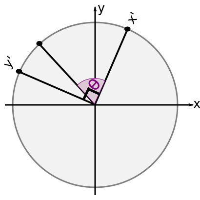

..
   Copyright (c) 2018-2024 William Emerison Six

   Permission is hereby granted, free of charge, to any person obtaining a copy
   of this software and associated documentation files (the "Software"), to deal
   in the Software without restriction, including without limitation the rights
   to use, copy, modify, merge, publish, distribute, sublicense, and/or sell
   copies of the Software, and to permit persons to whom the Software is
   furnished to do so, subject to the following conditions:

   The above copyright notice and this permission notice shall be included in all
   copies or substantial portions of the Software.

   THE SOFTWARE IS PROVIDED "AS IS", WITHOUT WARRANTY OF ANY KIND, EXPRESS OR
   IMPLIED, INCLUDING BUT NOT LIMITED TO THE WARRANTIES OF MERCHANTABILITY,
   FITNESS FOR A PARTICULAR PURPOSE AND NONINFRINGEMENT. IN NO EVENT SHALL THE
   AUTHORS OR COPYRIGHT HOLDERS BE LIABLE FOR ANY CLAIM, DAMAGES OR OTHER
   LIABILITY, WHETHER IN AN ACTION OF CONTRACT, TORT OR OTHERWISE, ARISING FROM,
   OUT OF OR IN CONNECTION WITH THE SOFTWARE OR THE USE OR OTHER DEALINGS IN THE
   SOFTWARE.

Rotations - Demo 07
===================

Purpose
^^^^^^^

Attempt to rotate the paddles around their center.
Learn about rotations.  This demo does not
work correctly, because of a misunderstanding
of how to interpret a sequence of transformations.

    Demo 07

How to Execute
^^^^^^^^^^^^^^

On Linux or on MacOS, in a shell, type "python src/demo07/demo.py".
On Windows, in a command prompt, type "python src\\demo07\\demo.py".

Move the Paddles using the Keyboard
^^^^^^^^^^^^^^^^^^^^^^^^^^^^^^^^^^^

==============  ================================
Keyboard Input  Action
==============  ================================
*w*             Move Left Paddle Up
*s*             Move Left Paddle Down
*k*             Move Right Paddle Down
*i*             Move Right Paddle Up

*d*             Increase Left Paddle's Rotation
*a*             Decrease Left Paddle's Rotation
*l*             Increase Right Paddle's Rotation
*j*             Decrease Right Paddle's Rotation
==============  ================================

..
   TODO -- discuss method chaining

For another person's explanation of the trigonometry_ of rotating in 2D,
see

.. _trigonometry: https://www.alanzucconi.com/2016/02/03/2d-rotations/

Rotate the Paddles About their Center
^^^^^^^^^^^^^^^^^^^^^^^^^^^^^^^^^^^^^

Besides translate and scale, the third main operation in computer
graphics is to rotate an object.

Rotation Around Origin (0,0)
^^^^^^^^^^^^^^^^^^^^^^^^^^^^

We can rotate an object around (0,0) by rotating
all of the object's vertices around (0,0).

.. figure:: _static/rotate0.gif
    :align: center
    :alt: Rotate
    :figclass: align-center

    Rotate

In high school math, you will have learned about sin, cos, and tangent.
Typically the angles are described on the unit circle, where a rotation
starts from the positive x axis.

.. figure:: _static/cc0/Stephan_Kulla/Sinus_und_Kosinus_am_Einheitskreis_1.svg
    :align: center
    :alt: Demo 07
    :figclass: align-center

We can expand on this knowledge, allowing
us to rotate a given vertex, wherever it is, around the origin (0,0).  This is done
by separating the x and y value, rotating each component separately,
and then adding the results together.

That might not have been fully clear.  Let me try again.
The vertex (0.5,0.4) can be separated into two vertices, (0.5,0) and (0,0.4).

.. figure:: _static/rotate3.png
    :align: center
    :alt: Rotate
    :figclass: align-center

    Rotate

.. figure:: _static/rotate4.png
    :align: center
    :alt: Rotate
    :figclass: align-center

    Rotate

These vertices can be added together to create the original vertex.
But, before we do that, let's rotate each of the vertices.

(0.5,0) is on the x-axis, so rotating it by "angle" degrees, results
in vertex (0.5*cos(angle), 0.5*sin(angle)).  This is high school
geometry, and won't be explained here in detail.

.. figure:: _static/rotate.png
    :align: center
    :alt: Rotate
    :figclass: align-center

    Rotate the x component.

.. figure:: _static/cc0/Stephan_Kulla/Sinus_und_Kosinus_am_Einheitskreis_2.svg
    :align: center
    :alt: Demo 07
    :figclass: align-center

But what may not be obvious, is what happens to the y component?
Turns out, it's easy.  Just rotate your point of view, and it's
the same thing, with one minor difference, in that the x value
is negated.

.. figure:: _static/rotate2.png
    :align: center
    :alt: Rotate
    :figclass: align-center

    Rotate the y component

(0,0.4) is on the y-axis, so rotating it by "angle" degrees, results
in vertex (0.4*-sin(angle), 0.4*cos(angle)).

Wait.  Why is negative sin applied to the angle to make the x value,
and cos applied to angle to make the y value?  It's because positive
1 unit on the x axis goes downwards.  The top of the plot is in
units of -1.

After the rotations have been applied, sum the results to
get your vertex rotated around the origin!

(0.5*cos(angle), 0.5*sin(angle)) + (0.4*-sin(angle), 0.4*cos(angle)) =
(0.5*cos(angle) + 0.4*-sin(angle), 0.5*sin(angle) + 0.4*cos(angle))

.. literalinclude:: ../../src/demo07/demo.py
   :language: python
   :start-after: doc-region-begin define vertex class
   :end-before: doc-region-end define vertex class
   :linenos:
   :lineno-match:
   :caption: src/demo07/demo.py

* Note the definition of rotate, from the description above.
  cos and sin are defined in the math module.

.. literalinclude:: ../../src/demo07/demo.py
   :language: python
   :start-after: doc-region-begin define paddle class
   :end-before: doc-region-end define paddle class
   :linenos:
   :lineno-match:
   :caption: src/demo07/demo.py

* a rotation instance variable is defined, with a default value of 0

.. literalinclude:: ../../src/demo07/demo.py
   :language: python
   :start-after: doc-region-begin define handle movement of paddles
   :end-before: doc-region-end define handle movement of paddles
   :linenos:
   :lineno-match:
   :caption: src/demo07/demo.py

Cayley Graph
^^^^^^^^^^^^

.. figure:: _static/demo06.png
    :align: center
    :alt: Demo 06
    :figclass: align-center

Code
^^^^

The Event Loop
~~~~~~~~~~~~~~

.. literalinclude:: ../../src/demo07/demo.py
   :language: python
   :start-after: doc-region-begin begin  event loop
   :end-before: doc-region-end begin  event loop
   :linenos:
   :lineno-match:
   :caption: src/demo07/demo.py

So to rotate paddle 1 about its center,
we should translate to its position, and then rotate
around the paddle's center.

.. literalinclude:: ../../src/demo07/demo.py
   :language: python
   :start-after: doc-region-begin draw paddle 1
   :end-before: doc-region-end draw paddle 1
   :linenos:
   :lineno-match:
   :caption: src/demo07/demo.py

.. math::

    \vec{f}_{p1}^{w}

.. literalinclude:: ../../src/demo07/demo.py
   :language: python
   :start-after: doc-region-begin compose transformations on paddle 12
   :end-before: doc-region-end compose transformations on paddle 12
   :linenos:
   :lineno-match:
   :caption: src/demo07/demo.py

.. math::

    \vec{f}_{w}^{ndc}

.. literalinclude:: ../../src/demo07/demo.py
   :language: python
   :start-after: doc-region-begin scale paddle 1
   :end-before: doc-region-end scale paddle 1
   :linenos:
   :lineno-match:
   :caption: src/demo07/demo.py

.. literalinclude:: ../../src/demo07/demo.py
   :language: python
   :start-after: doc-region-begin glvertex on paddle 1
   :end-before: doc-region-end glvertex on paddle 1
   :linenos:
   :lineno-match:
   :caption: src/demo07/demo.py

::

    ...

Likewise, to rotate paddle 2 about its center,
we should translate to its position, and then rotate
around the paddle's center.

.. literalinclude:: ../../src/demo07/demo.py
   :language: python
   :start-after: doc-region-begin draw paddle 2
   :end-before: doc-region-end draw paddle 2
   :linenos:
   :lineno-match:
   :caption: src/demo07/demo.py

.. math::

    \vec{f}_{p2}^{w}

.. literalinclude:: ../../src/demo07/demo.py
   :language: python
   :start-after: doc-region-begin compose transformations on paddle 2
   :end-before: doc-region-end compose transformations on paddle 2
   :linenos:
   :lineno-match:
   :caption: src/demo07/demo.py

.. math::

    \vec{f}_{w}^{ndc}

.. literalinclude:: ../../src/demo07/demo.py
   :language: python
   :start-after: doc-region-begin scale paddle 2
   :end-before: doc-region-end scale paddle 2
   :linenos:
   :lineno-match:
   :caption: src/demo07/demo.py

.. literalinclude:: ../../src/demo07/demo.py
   :language: python
   :start-after: doc-region-begin glvertex on paddle 2
   :end-before: doc-region-end glvertex on paddle 2
   :linenos:
   :lineno-match:
   :caption: src/demo07/demo.py

Why it's Wrong
^^^^^^^^^^^^^^

Turns out, our program doesn't work as predicted, even though
translate, scale, and rotate are all defined correctly.  The paddles
are not rotating around their center.

Let's take a look in detail about what our paddle-space to
world space transformations are doing.

.. literalinclude:: ../../src/demo07/demo.py
   :language: python
   :start-after: doc-region-begin compose transformations on paddle 12
   :end-before: doc-region-end compose transformations on paddle 12
   :linenos:
   :lineno-match:
   :caption: src/demo07/demo.py

.. figure:: _static/incorrectrotate-forwards.gif
    :align: center
    :alt:
    :figclass: align-center

    Not what we wanted

* Modelspace vertices

.. figure:: _static/incorrectrotate-forwards-1.png
    :align: center
    :alt:
    :figclass: align-center

* Translate

.. figure:: _static/incorrectrotate-forwards-2.png
    :align: center
    :alt:
    :figclass: align-center

* Reset the coordinate system

.. figure:: _static/incorrectrotate-forwards-3.png
    :align: center
    :alt:
    :figclass: align-center

    Modelspace

* Rotate around World Spaces's origin

.. figure:: _static/incorrectrotate-forwards-4.png
    :align: center
    :alt:
    :figclass: align-center

    Modelspace

* Reset the coordinate system

.. figure:: _static/incorrectrotate-forwards-5.png
    :align: center
    :alt:
    :figclass: align-center

    Modelspace

* Final world space coordinates

.. figure:: _static/incorrectrotate-forwards-6.png
    :align: center
    :alt:
    :figclass: align-center

    Modelspace

So then what the heck are we supposed to do in order to
rotate around an object's center?  The next section
provides a solution.

Updated explanation
^^^^^^^^^^^^^^^^^^^

We can expand on this knowledge, allowing
us to rotate all vertices, wherever they are, around the origin (0,0), by some
angle theta.

Let's take any arbitrary point

.. math::

    \vec{a}

.. math::

    \vec{r}(\vec{a}; \theta)

.. figure:: _static/cc0/williamesix/rotate-goal.svg
    :align: center
    :alt: rotate-goal
    :figclass: align-center

From high school geometry, remember that we can describe a
Cartesian (x,y) point by it's length r, and it's cosine and sine
of it's angle theta.

.. figure:: _static/cc0/williamesix/rotate1.svg
    :align: center
    :alt: rotate1
    :figclass: align-center

Also remember that when calculating sine and cosine, because right
triangles are proportional, that sine and cosine are preserved
for a right triangle, even if the length sides are scaled up or down.

So we'll make a right triangle on the unit circle, but we will remember
the length of (x,y), which we'll call "r", and we'll call the angle
of (x,y) to be "beta".  As a reminder, we want to rotate by a different
angle, called "theta".

.. figure:: _static/cc0/williamesix/rotate2.svg
    :align: center
    :alt: rotate2
    :figclass: align-center

Before we can rotate by "theta", first we need to be able to rotate by
90 degrees, or pi/2.  So to rotate (cos(beta), sin(beta)) by pi/2,
we get (cos(beta+pi/2), sin(beta+pi/2)).

.. figure:: _static/cc0/williamesix/rotate3.svg
    :align: center
    :alt: rotate3
    :figclass: align-center

Now let's give each of those vertices new names, x' and y', for the
purpose of ignoring details for now that we'll return to later,
just let we did for length "r" above.

Now forget about "beta", and remember that our goal is to rotate by angle
"theta".  Look at the picture below, while turning your head slightly to the
left.  x' and y' look just like our normal Cartesian plane and unit circle,
combined with the "theta"; it looks like what we already know from high
school geometry.

So with this new frame of reference, we can rotate x' by "theta",
and draw a right triangle on the unit circle using this new
frame of reference.

.. figure:: _static/cc0/williamesix/rotate6.svg
    :align: center
    :alt: rotate6
    :figclass: align-center

So the rotated point can be constructed by the following

.. math::

    \vec{r}(\vec{a}; theta) =  cos(\theta)*\vec{x'} + sin(\theta)*\vec{y'}

.. figure:: _static/cc0/williamesix/rotate7.svg
    :align: center
    :alt: rotate7
    :figclass: align-center

Now that we've found the direction on the unit circle, we remember to make
it length "r".

.. figure:: _static/cc0/williamesix/rotate8.svg
    :align: center
    :alt: rotate8
    :figclass: align-center

Ok, we are now going to stop thinking about geometry, and we will only be thinking
about algebra.  Please don't try to look at the formula and try to draw any diagrams.

Ok, now it's time to remember what the values that x' and y' are defined as.

.. math::

    \vec{r}(\vec{a}; \theta) & = r*(cos(\theta)*\vec{x'} + sin(\theta)*\vec{y'}) \\
                                 & = r*(cos(\theta)*\begin{bmatrix}
                                                       cos(\beta) \\
                                                       sin(\beta) \\
                                                    \end{bmatrix} + sin(\theta)*\begin{bmatrix}
                                                       cos(\beta + \pi/2) \\
                                                       sin(\beta + \pi/2) \\
                                                    \end{bmatrix})

A problem we have now is how to calculate cosine and sine of beta + pi/2,
because we haven't actually calculated beta; we've calculated sine
and cosine of beta by dividing the x value by the magnitude of the a, and the sine of beta
by dividing the y value by the magnitude of a.

.. math::

      cos(\theta) = \vec{a}_{x} / r

      sine(\theta) = \vec{a}_{y} / r

We could try to take the inverse sine or inverse cosine of theta, but there is no need
given properties of trigonometry.

.. math::

      cos(\theta + \pi/2) = -sin(\theta)

      sin(\theta + \pi/2) = cos(\theta)

Therefore

.. math::

      cos(\theta) = \vec{a}_{x} / r

      sin(\theta) = \vec{a}_{y} / r

.. math::

   \vec{r}(\vec{a}; \theta) & = r*(cos(\theta)*\vec{x'} + sin(\theta)*\vec{y'}) \\
                                 & = r*(cos(\theta)*\begin{bmatrix}
                                                       cos(\beta) \\
                                                       sin(\beta) \\
                                                    \end{bmatrix} + sin(\theta)*\begin{bmatrix}
                                                       cos(\beta + \pi/2) \\
                                                       sin(\beta + \pi/2) \\
                                                    \end{bmatrix}) \\
                                 & = r*(cos(\theta)*\begin{bmatrix}
                                                       \vec{a}_{x} / r \\
                                                       \vec{a}_{y} / r \\
                                                    \end{bmatrix} + sin(\theta)*\begin{bmatrix}
                                                       -\vec{a}_{y} / r \\
                                                       \vec{a}_{x} / r\\
                                                    \end{bmatrix}) \\
                                 & =   (cos(\theta)*\begin{bmatrix}
                                                       \vec{a}_{x}  \\
                                                       \vec{a}_{y}  \\
                                                    \end{bmatrix} + sin(\theta)*\begin{bmatrix}
                                                       -\vec{a}_{y} \\
                                                       \vec{a}_{x} \\
                                                    \end{bmatrix}) \\
                                 & =   (cos(\theta)*\vec{a}_{x} +
                                                    sin(\theta)*\begin{bmatrix}
                                                       -\vec{a}_{y} \\
                                                       \vec{a}_{x} \\
                                                    \end{bmatrix})

   \vec{r}(\vec{a}; \theta) & = \begin{bmatrix}
                                                       -\vec{a}_{y} \\
                                                       \vec{a}_{x} \\
                                                    \end{bmatrix} \text{ if } (\theta = \pi/2) \\
                                 & =   (cos(\theta)*\vec{a} +
                                                    sin(\theta)*\vec{r}(\vec{a}; \pi/2 ) \text{ if } (\theta \ne \pi/2)
