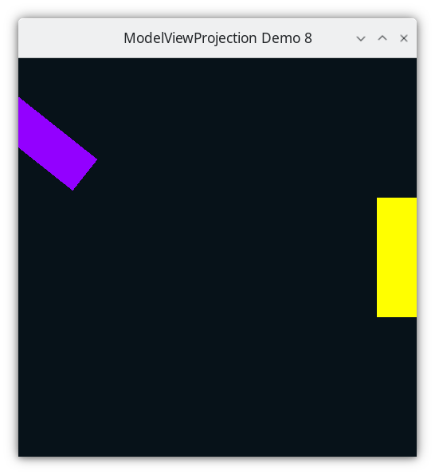

..
   Copyright (c) 2018-2025 William Emerison Six

   Permission is granted to copy, distribute and/or modify this document
   under the terms of the GNU Free Documentation License, Version 1.3
   or any later version published by the Free Software Foundation;
   with no Invariant Sections, no Front-Cover Texts, and no Back-Cover Texts.

   A copy of the license is available at
   https://www.gnu.org/licenses/fdl-1.3.html.

Rotation Fix Attempt 1 - Demo 08
================================

Purpose
^^^^^^^

Fix the rotation problem from the previous demo in a seemingly intuitive
way, but do it inelegantly.

    Demo 08

How to Execute
^^^^^^^^^^^^^^

Load src/modelviewprojection/demo08.py in Spyder and hit the play button.

Move the Paddles using the Keyboard
^^^^^^^^^^^^^^^^^^^^^^^^^^^^^^^^^^^

==============  ================================
Keyboard Input  Action
==============  ================================
*w*             Move Left Paddle Up
*s*             Move Left Paddle Down
*k*             Move Right Paddle Down
*i*             Move Right Paddle Up

*d*             Increase Left Paddle's Rotation
*a*             Decrease Left Paddle's Rotation
*l*             Increase Right Paddle's Rotation
*j*             Decrease Right Paddle's Rotation
==============  ================================

Description
^^^^^^^^^^^

The problem in the last demo is that all rotations happen relative
to World Space's (0,0) and axes.  By translating our paddles to their position
before rotating, they are rotated around World Space's origin, instead
of being rotated around their :term:`modelspace<Modelspace>`'s center.

In this demo, we try to solve the problem by making a method to rotate
around a given point in world space, in this case, the paddle's center.

.. literalinclude:: ../../src/modelviewprojection/mathutils2d.py
   :language: python
   :start-after: doc-region-begin define vector class
   :end-before: doc-region-end define vector class
   :linenos:
   :lineno-match:
   :caption: src/modelviewprojection/mathutils2d.py

.. literalinclude:: ../../src/modelviewprojection/mathutils2d.py
   :language: python
   :start-after: doc-region-begin define rotate around
   :end-before: doc-region-end define rotate around
   :linenos:
   :lineno-match:
   :caption: src/modelviewprojection/mathutils2d.py

Within the event loop, this seems quite reasonable

.. literalinclude:: ../../src/modelviewprojection/demo08.py
   :language: python
   :start-after: doc-region-begin begin event loop
   :end-before: doc-region-end begin event loop
   :linenos:
   :lineno-match:
   :caption: src/modelviewprojection/demo08.py

.. literalinclude:: ../../src/modelviewprojection/demo08.py
   :language: python
   :start-after: doc-region-begin draw paddle 1
   :end-before: doc-region-end draw paddle 1
   :linenos:
   :lineno-match:
   :caption: src/modelviewprojection/demo08.py

.. literalinclude:: ../../src/modelviewprojection/demo08.py
   :language: python
   :start-after: doc-region-begin draw paddle 2
   :end-before: doc-region-end draw paddle 2
   :linenos:
   :lineno-match:
   :caption: src/modelviewprojection/demo08.py

All we did was add a rotate around method, and call it, with the
paddle's center as the rotate point.

Although this works for now and looks like decent code, this is extremely sloppy, and
not thought out well at all.  We apply a transformation
from paddle space to world space, then do the inverse, then rotate,
and then do the first transformation from paddle space to world space again.

The images of the transformation sequence below should show how brain-dead it is,
and the Cayley graph is gross.

But from this we will learn something important.

.. figure:: _static/rotate-sloppy-forwards-3.svg
    :class: no-scale
    :align: center
    :alt: Demo 08
    :figclass: align-center

translating back to the origin

.. figure:: _static/rotate-sloppy-forwards-4.svg
    :class: no-scale
    :align: center
    :alt: Demo 08
    :figclass: align-center

resetting the coordinate system

.. figure:: _static/rotate-sloppy-forwards-5.svg
    :class: no-scale
    :align: center
    :alt: Demo 08
    :figclass: align-center

rotating

.. figure:: _static/rotate-sloppy-forwards-6.svg
    :class: no-scale
    :align: center
    :alt: Demo 08
    :figclass: align-center

resetting the coordinate system

.. figure:: _static/rotate-sloppy-forwards-7.svg
    :class: no-scale
    :align: center
    :alt: Demo 08
    :figclass: align-center

and them translating them back to the paddle space origin

.. figure:: _static/rotate-sloppy-forwards-8.svg
    :class: no-scale
    :align: center
    :alt: Demo 08
    :figclass: align-center

Cayley Graph
^^^^^^^^^^^^

Note, this is gross, and the edge from the paddlespace to itself doesn't even
make any sense, but the author did not know how else to represent
this code.

.. figure:: _static/demo08.png
    :class: no-scale
    :align: center
    :alt: Demo 08
    :figclass: align-center
