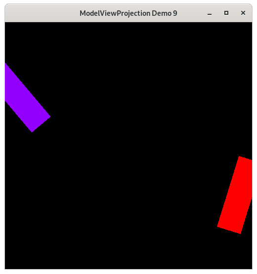

..
   Copyright (c) 2018-2025 William Emerison Six

   Permission is hereby granted, free of charge, to any person obtaining a copy
   of this software and associated documentation files (the "Software"), to deal
   in the Software without restriction, including without limitation the rights
   to use, copy, modify, merge, publish, distribute, sublicense, and/or sell
   copies of the Software, and to permit persons to whom the Software is
   furnished to do so, subject to the following conditions:

   The above copyright notice and this permission notice shall be included in all
   copies or substantial portions of the Software.

   THE SOFTWARE IS PROVIDED "AS IS", WITHOUT WARRANTY OF ANY KIND, EXPRESS OR
   IMPLIED, INCLUDING BUT NOT LIMITED TO THE WARRANTIES OF MERCHANTABILITY,
   FITNESS FOR A PARTICULAR PURPOSE AND NONINFRINGEMENT. IN NO EVENT SHALL THE
   AUTHORS OR COPYRIGHT HOLDERS BE LIABLE FOR ANY CLAIM, DAMAGES OR OTHER
   LIABILITY, WHETHER IN AN ACTION OF CONTRACT, TORT OR OTHERWISE, ARISING FROM,
   OUT OF OR IN CONNECTION WITH THE SOFTWARE OR THE USE OR OTHER DEALINGS IN THE
   SOFTWARE.

Rotation Fixed - Sequence of Transformations - Demo 09
======================================================

Purpose
^^^^^^^

Make the rotations work correctly by thinking about the problem
more clearly.

We do this by the following:

* Read sequence of transformations from modelspace to worldspace in the reverse order, from bottom to top.
* Each subsequent transformation is relative to the current local coordinate system.

    Demo 09

How to Execute
^^^^^^^^^^^^^^

Load src/demo09.py in Spyder and hit the play button

Move the Paddles using the Keyboard
^^^^^^^^^^^^^^^^^^^^^^^^^^^^^^^^^^^

==============  ================================
Keyboard Input  Action
==============  ================================
*w*             Move Left Paddle Up
*s*             Move Left Paddle Down
*k*             Move Right Paddle Down
*i*             Move Right Paddle Up

*d*             Increase Left Paddle's Rotation
*a*             Decrease Left Paddle's Rotation
*l*             Increase Right Paddle's Rotation
*j*             Decrease Right Paddle's Rotation
==============  ================================

Description
^^^^^^^^^^^

In Demo 07 we tried to represent the translation and then rotation
around the paddle's center by code that worked as follows

.. math::
    \vec{f}_{p}^{w}   = \vec{r} \circ \vec{t}

where t and r are the translate and rotate functions for a paddle, and
we read the functions from right to left.  (In code, we were reading
the method chaining from top-down, as that is the order in which the
function calls are evaluated.)

But that caused erratic behavior of the paddle over time, as it was
not rotating around its own origin.  It was not working.

So in Demo 08 we fixed it by writing a "rotate_around" method, in
which we translated the paddle to its position, then in order to
rotate around its center, we re-centered the paddle, did the rotation,
and then re-translated to the paddle's position.

.. math::
    \begin{split}
    \vec{f}_{p}^{w}  & = (\vec{t} \circ \vec{r} \circ {\vec{t}}^{-1}) \circ \vec{t} \\
                     & = \vec{t} \circ \vec{r} \circ {\vec{t}}^{-1} \circ \vec{t} \\
                     & = \vec{t} \circ \vec{r} \circ ({\vec{t}}^{-1} \circ \vec{t}) \\
                     & = \vec{t} \circ \vec{r}
    \end{split}

So translate and inverse translate cancel out, and demonstrate to us
that the rotate function actually needs to be applied first, then the
translate function.  Which means that we were actually reading the
function applications in the wrong order!  Intuition can lead us astray!

To understand why the code in this demo works, you can think
about it in one of two ways, forwards or backwards.

Reading transformations top-down
~~~~~~~~~~~~~~~~~~~~~~~~~~~~~~~~

When reading a composition of function calls top down,
all the transformations happen relative to the global
origin and axes, i.e. the natural *basis*.  After each function call, the basis
is set back to the origin basis.

.. literalinclude:: ../../src/demo09.py
   :language: python
   :start-after: doc-region-begin paddle 1 transformations
   :end-before: doc-region-end paddle 1 transformations
   :linenos:
   :lineno-match:
   :caption: src/demo09.py

Reading transformations bottom-up
~~~~~~~~~~~~~~~~~~~~~~~~~~~~~~~~~

Alternatively, you can read the transformations backwards,
where the operations
all cumulatively modify the current axes and origin, i.e. basis, to a new basis.
All subsequent functions move that relative basis to a new relative basis.

.. literalinclude:: ../../src/demo09.py
   :language: python
   :start-after: doc-region-begin paddle 1 transformations
   :end-before: doc-region-end paddle 1 transformations
   :linenos:
   :lineno-match:
   :caption: src/demo09.py

Suggested Order
~~~~~~~~~~~~~~~

The author has a strong opinion on the matter for computer graphics.

Start at world space node.  As a reminder, this is the top-level coordinate
system that we choose to use.  It is whatever you want it to be.

.. figure:: _static/demo06.png
    :class: no-scale
    :align: center
    :alt: Demo 06
    :figclass: align-center

    Demo 06

Think of world space's origin, x and y axes.  On the Cayley graph, move towards each modelspace node,
which is against the direction of the edge,  Look at that edge's corresponding
sequence of function calls in the graphics code.  Read the transformations
from the bottom up, imagining a transformed local coordinate system against which
each function in the sequence operates.

The data you plot that is in its own modelspace will actually be plotted relative to that transformed coordinate
system.

For the linear-algebra inclined reader, we've used

.. math::
    L * (M * \vec{x})     = (L * M) * \vec{x}

to understand a complicated sequence of matrix multiplications, modifying
L by a right-multiplication of M.

.. literalinclude:: ../../src/demo09.py
   :language: python
   :start-after: doc-region-begin paddle 1 transformations
   :end-before: doc-region-end paddle 1 transformations
   :linenos:
   :lineno-match:
   :caption: src/demo09.py

Now go back to world space.  Think
of all modelspace data as having already been "plotted".  So now follow
the edges to screen space,
reading the transformations
from top down, and resetting the coordinate system after every transformation.

.. literalinclude:: ../../src/demo09.py
   :language: python
   :start-after: doc-region-begin paddle 1 scale
   :end-before: doc-region-end paddle 1 scale
   :linenos:
   :lineno-match:
   :caption: src/demo09.py

As a side note,	the computer has no notion of coordinate systems.  It just has a sequence of procedures
to apply on a sequence of numbers.  For us humans to make sense of what we are modeling,
and to implement it correctly, we need to be able to reason and compose our thoughts clearly.

Code
^^^^

The Event Loop
~~~~~~~~~~~~~~

.. literalinclude:: ../../src/demo09.py
   :language: python
   :start-after: doc-region-begin begin event loop
   :end-before: doc-region-end begin event loop
   :linenos:
   :lineno-match:
   :caption: src/demo09.py

.. literalinclude:: ../../src/demo09.py
   :language: python
   :start-after: doc-region-begin draw paddle 1
   :end-before: doc-region-end draw paddle 1
   :linenos:
   :lineno-match:
   :caption: src/demo09.py

* Read the modelspace to world space, starting from the bottom, up.  Translate, then rotate
* Reset the coordinate system
* Read the worldspace to NDC

.. literalinclude:: ../../src/demo09.py
   :language: python
   :start-after: doc-region-begin draw paddle 2
   :end-before: doc-region-end draw paddle 2
   :linenos:
   :lineno-match:
   :caption: src/demo09.py

* Read the modelspace to world space, starting from the bottom, up.  Translate, then rotate
* Reset the coordinate system
* Read the worldspace to NDC
