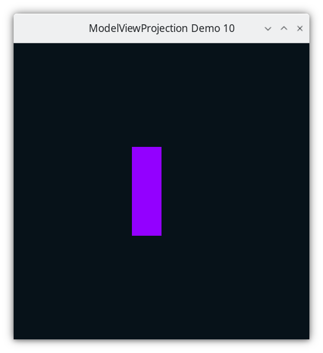
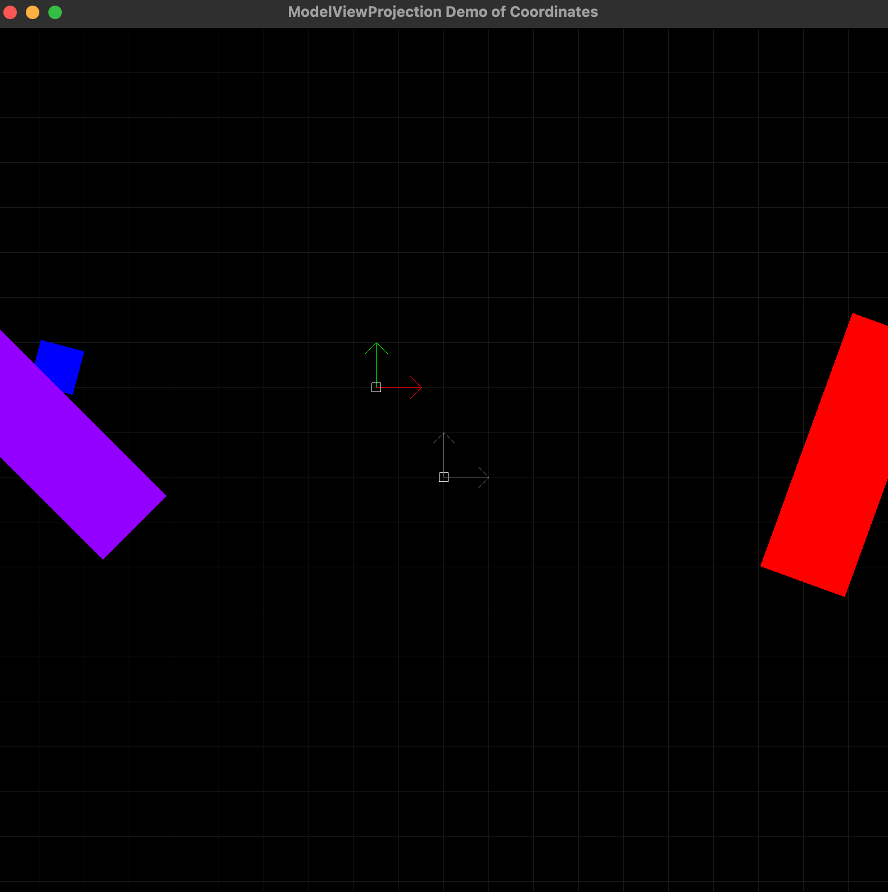

..
   Copyright (c) 2018-2025 William Emerison Six

   Permission is granted to copy, distribute and/or modify this document
   under the terms of the GNU Free Documentation License, Version 1.3
   or any later version published by the Free Software Foundation;
   with no Invariant Sections, no Front-Cover Texts, and no Back-Cover Texts.

   A copy of the license is available at
   https://www.gnu.org/licenses/fdl-1.3.html.

**********************
Camera Space - Demo 10
**********************

Objective
^^^^^^^^^

Graphical programs in which the viewer never "moves" are boring.
Model a virtual "camera", and let the user move the camera around
in the scene.  In this picture, notice that the purple paddle
is no longer on the left side of the screen, but towards the right,
horizontally.

    Demo 10

How to Execute
^^^^^^^^^^^^^^

Load src/modelviewprojection/demo10.py in Spyder and hit the play button.

Move the Paddles using the Keyboard
^^^^^^^^^^^^^^^^^^^^^^^^^^^^^^^^^^^

==============  ==============================================
Keyboard Input  Action
==============  ==============================================
*w*             Move Left Paddle Up
*s*             Move Left Paddle Down
*k*             Move Right Paddle Down
*i*             Move Right Paddle Up

*d*             Increase Left Paddle's Rotation
*a*             Decrease Left Paddle's Rotation
*l*             Increase Right Paddle's Rotation
*j*             Decrease Right Paddle's Rotation

*UP*            Move the camera up, moving the objects down
*DOWN*          Move the camera down, moving the objects up
*LEFT*          Move the camera left, moving the objects right
*RIGHT*         Move the camera right, moving the objects left

==============  ==============================================

Description
^^^^^^^^^^^

"Camera space" means the coordinates of everything relative
to a camera, not relative to world space.

    Camera space

In the picture above, NDC is the square in the center
of the screen, and its coordinate system is defined by its two axes X
and Y. The square to the to the left and up is the position of the
camera; which has its own X axis and Y axis.

The coordinates of the paddle can be described
in world space, or in camera space, and that we can create functions
to convert coordinates between the two spaces.

Towards that, in the Cayley graph, camera space will be between world
space and NDC, but which way should the direction of the edge be?

It could be

* From world space to camera space.

.. figure:: _static/demo10.png
    :class: no-scale
    :align: center
    :alt: Demo 10
    :figclass: align-center

    Demo 10

* From camera space to world space.

.. figure:: _static/demo10-2.png
    :class: no-scale
    :align: center
    :alt: Demo 10
    :figclass: align-center

    Demo 10

Since the camera's position will be described relative to world space in world space coordinates,
just like the paddles are,
it makes more sense to use the latter, in which the directed edge
goes from camera space to world space.

Think about it this way.  Imagine you a driving.  Are you staying
in a constant position, and the wheels of your car rotate the entire
earth and solar system around yourself?  That's one way to look at
it, and the earth revolves around me too, but the mathematical
descriptions of everything else that's not you breaks down.

The math is easier in the aggregate if you describe your position as moving relative
to earth.

But this introduces a new problem.  Follow from the paddle's :term:`modelspace<Modelspace>`
to screen space.  Up until this demo, we've always been
following the the direction of each edges.  In our new Cayley graph, when going from world
space to camera space, we're moving in the opposite direction
of the edge.

Going against the direction
of an edge in a Cayley Graph means that we don't apply the function itself;
instead we apply the inverse of the function.  This concept
comes from Group Theory in Abstract Algebra, the details of which won't
be discussed here, but we will use it to help us reason about the transformations.

Inverses
~~~~~~~~

Inverse Of Translate
&&&&&&&&&&&&&&&&&&&&

The inverse of

.. code:: Python

      >>> v.translate(x,y)

is

.. code:: Python

      >>> v.translate(-x,-y)

Inverse Of Rotate
&&&&&&&&&&&&&&&&&

The inverse of

.. code:: Python

      >>> v.rotate(theta)

is

.. code:: Python

      >>> v.rotate(-theta)

Inverse Of Scale
&&&&&&&&&&&&&&&&

The inverse of

.. code:: Python

      >>> v.scale(x,y)

is

.. code:: Python

      >>> v.scale(1.0/x,1.0/y)

Inverse Of Sequence Of Functions
&&&&&&&&&&&&&&&&&&&&&&&&&&&&&&&&

The inverse of a sequence of functions is the inverse of each function, applied in reverse order.

For the linear-algebra inclined reader,

.. math::
    {(A * B)}^{-1}     = {B}^{-1}*{A}^{-1}

The inverse of

.. code:: Python

      >>> v.scale(x,y).translate(Vector(x,y))

is

.. code:: Python

      >>> v.translate(-Vector(x,y).scale(1.0/x,1.0/y)

Think of the inverses this way.  Stand up.  Make sure that nothing
is close around you that you could trip on or that you would walk into.
Look forward.
Keeping your eyes straight ahead, sidestep a few steps to the
left.  From your perspective, the objects in your room all moved
to the right.  Now, rotate your head to your right, keeping your eyes
looking directly in front of your head.  Which way did the room move?
Towards the left.

    Camera is 3D space

Looking at the graph paper on the ground there, that's world space.
The camera gets placed in world space just like any other :term:`modelspace<Modelspace>` data.
In order to render from the camera's point of view, we need to move and orient the -1.0 to 1.0
box relative to the camera to match the -1.0 to 1.0 box in world space.

Run "python mvpVisualization/modelviewperspectiveprojection/modelviewperspectiveprojection.py", and follow along with the Cayley
graph.  The camera will be placed like any other :term:`modelspace<Modelspace>` data, but then
the inverse of the transformations will be applied to all of the vertices.

For the attentive reader
~~~~~~~~~~~~~~~~~~~~~~~~

The purpose of watching that animation was to see how the camera was placed just like
the :term:`modelspace<Modelspace>` data was placed, while not modifying the modelspace data,
but then the inverse was applied, moving the :term:`modelspace<Modelspace>` data.

The attentive reader may notice: "Bill, you said the the inverse causes the operations
to be run in opposite order, yet I saw them run in the same order.  For camera
placement, I saw translate,
then rotate sideways, then rotate up.  For the inverse, I saw inverse translate, then
inverse rotate sideways, then inverse rotate up.  What gives?"

Well, the answer, which we talk about later in more detail, is that we change the
order in which we read the sequence of transformations.

Let's say we read the following from left to right

.. math::
    \begin{split}
    \vec{f}  & = \vec{a} \circ \vec{b} \circ \vec{c}
    \end{split}

So we imagine the a transformation, then the b transformation, then the c.

To take the inverse, we reverse the order of the transformations, and invert them.

.. math::
    \begin{split}
    \vec{f}^{-1}  & = \vec{c}^{-1} \circ \vec{b}^{-1} \circ \vec{a}^{-1}
    \end{split}

But now we read the transformations from right to left.

So we imagine the a inverse transformation, then the b inverse
transformation, then the c inverse.

The author understands that this may be confusing to the reader, and
seems illogical.  Camera placement is, in the author's opinion,
the most difficult concept for a novice to grasp, and the author
is unaware of a better explanation.  Bear with the author, by the end of this book,
it should make more sense to the reader.

Code
^^^^

.. literalinclude:: ../../src/modelviewprojection/demo10.py
   :language: python
   :start-after: doc-region-begin define camera class
   :end-before: doc-region-end define camera class
   :linenos:
   :lineno-match:
   :caption: src/modelviewprojection/demo10.py

.. literalinclude:: ../../src/modelviewprojection/demo10.py
   :language: python
   :start-after: doc-region-begin handle inputs
   :end-before: doc-region-end handle inputs
   :linenos:
   :lineno-match:
   :caption: src/modelviewprojection/demo10.py

::

    ...

The Event Loop
~~~~~~~~~~~~~~

.. literalinclude:: ../../src/modelviewprojection/demo10.py
   :language: python
   :start-after: doc-region-begin begin event loop
   :end-before: doc-region-end begin event loop
   :linenos:
   :lineno-match:
   :caption: src/modelviewprojection/demo10.py

.. literalinclude:: ../../src/modelviewprojection/demo10.py
   :language: python
   :start-after: doc-region-begin draw paddle 1
   :end-before: doc-region-end draw paddle 1
   :linenos:
   :lineno-match:
   :caption: src/modelviewprojection/demo10.py

The camera's position is at camera.x, camera.y.  So
apply the inverse of the camera's transformations
to paddle 1's vertices, i.e. translate with the negative
values.

.. literalinclude:: ../../src/modelviewprojection/demo10.py
   :language: python
   :start-after: doc-region-begin paddle 1 camera translate
   :end-before: doc-region-end paddle 1 camera translate
   :linenos:
   :lineno-match:
   :caption: src/modelviewprojection/demo10.py

.. literalinclude:: ../../src/modelviewprojection/demo10.py
   :language: python
   :start-after: doc-region-begin paddle 1 scale
   :end-before: doc-region-end paddle 1 scale
   :linenos:
   :lineno-match:
   :caption: src/modelviewprojection/demo10.py

.. literalinclude:: ../../src/modelviewprojection/demo10.py
   :language: python
   :start-after: doc-region-begin draw paddle 2
   :end-before: doc-region-end draw paddle 2
   :linenos:
   :lineno-match:
   :caption: src/modelviewprojection/demo10.py

The camera's position is at camera.x, camera.y.  So
apply the inverse of the camera's  transformations
to paddle 2's vertices, i.e. translate with the negative
values.

.. literalinclude:: ../../src/modelviewprojection/demo10.py
   :language: python
   :start-after: doc-region-begin paddle 2 camera transformations
   :end-before: doc-region-end paddle 2 camera transformations
   :linenos:
   :lineno-match:
   :caption: src/modelviewprojection/demo10.py

.. literalinclude:: ../../src/modelviewprojection/demo10.py
   :language: python
   :start-after: doc-region-begin paddle 2 glvector2f
   :end-before: doc-region-end paddle 2 glvector2f
   :linenos:
   :lineno-match:
   :caption: src/modelviewprojection/demo10.py
