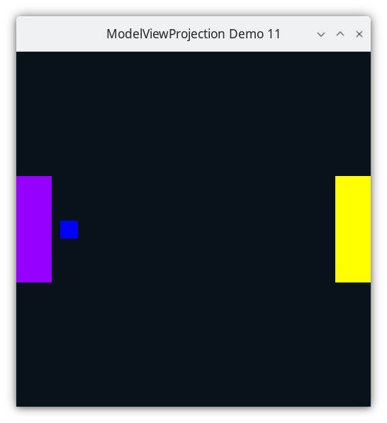
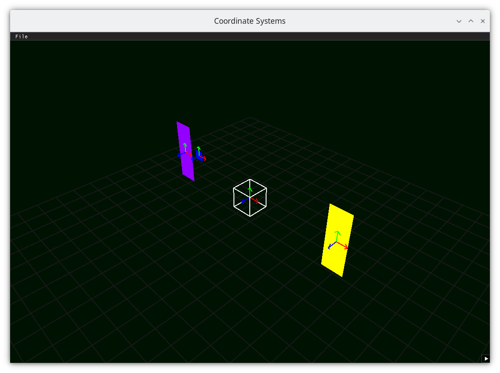

..
   Copyright (c) 2018-2025 William Emerison Six

   Permission is granted to copy, distribute and/or modify this document
   under the terms of the GNU Free Documentation License, Version 1.3
   or any later version published by the Free Software Foundation;
   with no Invariant Sections, no Front-Cover Texts, and no Back-Cover Texts.

   A copy of the license is available at
   https://www.gnu.org/licenses/fdl-1.3.html.

Relative Objects - Demo 11
==========================

Purpose
^^^^^^^

Introduce relative objects, by making a small blue square
that is defined relative to the left paddle, but offset
some in the x direction.
When the paddle on the left moves or rotates, the blue square
moves with it, because it is defined relative to it.

    Demo 11

How to Execute
^^^^^^^^^^^^^^

Load src/modelviewprojection/demo11.py in Spyder and hit the play button.

Move the Paddles using the Keyboard
^^^^^^^^^^^^^^^^^^^^^^^^^^^^^^^^^^^

==============  ==============================================
Keyboard Input  Action
==============  ==============================================
*w*             Move Left Paddle Up
*s*             Move Left Paddle Down
*k*             Move Right Paddle Down
*i*             Move Right Paddle Up

*d*             Increase Left Paddle's Rotation
*a*             Decrease Left Paddle's Rotation
*l*             Increase Right Paddle's Rotation
*j*             Decrease Right Paddle's Rotation

*UP*            Move the camera up, moving the objects down
*DOWN*          Move the camera down, moving the objects up
*LEFT*          Move the camera left, moving the objects right
*RIGHT*         Move the camera right, moving the objects left

==============  ==============================================

Description
^^^^^^^^^^^

Cayley Graph
^^^^^^^^^^^^

In the graph below, all we have added is "Square space", relative
to paddle 1 space.

.. figure:: _static/demo11.png
    :class: no-scale
    :align: center
    :alt: Demo 11
    :figclass: align-center

    Demo 11

In the picture below, in 3D space, we see that the square has its
own :term:`modelspace<Modelspace>` (as evidenced by the 3 arrows), and we are going
to define its position and orientation relative to paddle 1.

    Coordinate Frames

Code
^^^^
..
   We in looking at the code for the three objects we are drawing
   you might notice that we are duplicating a lot of code, and
   that if we decide to change paddle1's transformations, that
   we would need to change the code in multiple places.
   Later demos will show how to handle this problem more gracefully.

Define the geometry of the square in its own modelspace.

.. literalinclude:: ../../src/modelviewprojection/demo11.py
   :language: python
   :start-after: doc-region-begin define square
   :end-before: doc-region-end define square
   :linenos:
   :lineno-match:
   :caption: src/modelviewprojection/demo11.py

Event Loop
~~~~~~~~~~

.. literalinclude:: ../../src/modelviewprojection/demo11.py
   :language: python
   :start-after: doc-region-begin begin event loop
   :end-before: doc-region-end begin event loop
   :linenos:
   :lineno-match:
   :caption: src/modelviewprojection/demo11.py

::

    ...

Draw paddle 1, just as before.

.. literalinclude:: ../../src/modelviewprojection/demo11.py
   :language: python
   :start-after: doc-region-begin draw paddle 1
   :end-before: doc-region-end draw paddle 1
   :linenos:
   :lineno-match:
   :caption: src/modelviewprojection/demo11.py

As a refresher, the author recommends reading the code from modelspace
to worldspace from the bottom up, and from worldspace to NDC from top down.

* Read from modelspace to world space, bottom up
* Reset the coordinate system
* Read from world space to camera space, knowing that camera transformations
  are implemented as the inverse of placing the camera space in world space.
* Reset the coordinate system
* Read camera-space to NDC

New part!  Draw the square relative to the first paddle!
Translate the square to the right by 2 units.
We are dealing with a -1 to 1 world space, which
later gets scaled down to NDC.

.. literalinclude:: ../../src/modelviewprojection/demo11.py
   :language: python
   :start-after: doc-region-begin draw square
   :end-before: doc-region-end draw square
   :linenos:
   :lineno-match:
   :caption: src/modelviewprojection/demo11.py

Towards that, we need to do all of the transformations to the square
that we would to the paddle, and then do any extra transformations
afterwards.

As such, read

* Read paddle1space to world space, from bottom up

If we were to plot the square now, it would be in paddle 1's space.  We don't want
that, we want in to be moved in the X direction some units.  Therefore

* Read modelspace to paddle1space, from bottom up
* Reset the coordinate system.

Now the square's geometry will be in its own space!

* Read from worldspace to camera-space, knowing that camera transformations
  are implemented as the inverse of placing the camera space in world space.

* Reset the coordinate system
* Read camera-space to NDC

Draw paddle 2 just like before.

.. literalinclude:: ../../src/modelviewprojection/demo11.py
   :language: python
   :start-after: doc-region-begin draw paddle 2
   :end-before: doc-region-end draw paddle 2
   :linenos:
   :lineno-match:
   :caption: src/modelviewprojection/demo11.py
