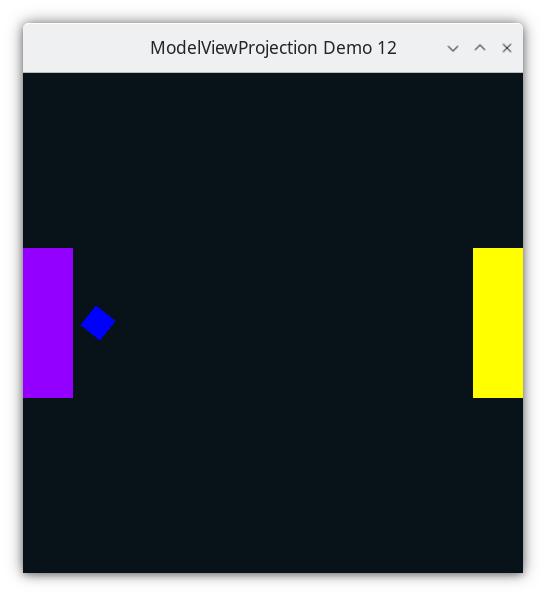

..
   Copyright (c) 2018-2024 William Emerison Six

   Permission is hereby granted, free of charge, to any person obtaining a copy
   of this software and associated documentation files (the "Software"), to deal
   in the Software without restriction, including without limitation the rights
   to use, copy, modify, merge, publish, distribute, sublicense, and/or sell
   copies of the Software, and to permit persons to whom the Software is
   furnished to do so, subject to the following conditions:

   The above copyright notice and this permission notice shall be included in all
   copies or substantial portions of the Software.

   THE SOFTWARE IS PROVIDED "AS IS", WITHOUT WARRANTY OF ANY KIND, EXPRESS OR
   IMPLIED, INCLUDING BUT NOT LIMITED TO THE WARRANTIES OF MERCHANTABILITY,
   FITNESS FOR A PARTICULAR PURPOSE AND NONINFRINGEMENT. IN NO EVENT SHALL THE
   AUTHORS OR COPYRIGHT HOLDERS BE LIABLE FOR ANY CLAIM, DAMAGES OR OTHER
   LIABILITY, WHETHER IN AN ACTION OF CONTRACT, TORT OR OTHERWISE, ARISING FROM,
   OUT OF OR IN CONNECTION WITH THE SOFTWARE OR THE USE OR OTHER DEALINGS IN THE
   SOFTWARE.

Rotate the Square - Demo 12
===========================

Purpose
^^^^^^^
Rotate the square around its origin.

    Demo 12

How to Execute
^^^^^^^^^^^^^^

On Linux or on MacOS, in a shell, type "python src/demo12/demo.py".
On Windows, in a command prompt, type "python src\\demo12\\demo.py".

Move the Paddles using the Keyboard
^^^^^^^^^^^^^^^^^^^^^^^^^^^^^^^^^^^

==============  ==============================================
Keyboard Input  Action
==============  ==============================================
*w*             Move Left Paddle Up
*s*             Move Left Paddle Down
*k*             Move Right Paddle Down
*i*             Move Right Paddle Up

*d*             Increase Left Paddle's Rotation
*a*             Decrease Left Paddle's Rotation
*l*             Increase Right Paddle's Rotation
*j*             Decrease Right Paddle's Rotation

*UP*            Move the camera up, moving the objects down
*DOWN*          Move the camera down, moving the objects up
*LEFT*          Move the camera left, moving the objects right
*RIGHT*         Move the camera right, moving the objects left

*q*             Rotate the square around its center
==============  ==============================================

Description
^^^^^^^^^^^

Cayley Graph
^^^^^^^^^^^^

.. figure:: _static/demo11.svg
    :align: center
    :alt: Demo 12
    :figclass: align-center

    Demo 12

Code
^^^^

Make a variable to determine the angle that the square will be rotated.

.. literalinclude:: ../../src/demo12/demo.py
   :language: python
   :start-after: doc-region-begin define square rotation
   :end-before: doc-region-end define square rotation
   :linenos:
   :lineno-match:
   :caption: src/demo12/demo.py

When 'q' is pressed, increase the angle.

.. literalinclude:: ../../src/demo12/demo.py
   :language: python
   :start-after: doc-region-begin define handle input
   :end-before: doc-region-end define handle input
   :linenos:
   :lineno-match:
   :caption: src/demo12/demo.py

::

    ...

Event Loop
~~~~~~~~~~

In the previous chapter, this was the rendering code for
the square.

.. literalinclude:: ../../src/demo11/demo.py
   :language: python
   :start-after: doc-region-begin draw square
   :end-before: doc-region-end draw square
   :linenos:
   :lineno-match:
   :caption: src/demo11/demo.py

Since we just want to add one rotation at the end of the sequence
of transformations from paddle 1 space to square space, just add
a rotate call at the top.

.. literalinclude:: ../../src/demo12/demo.py
   :language: python
   :start-after: doc-region-begin draw square
   :end-before: doc-region-end draw square
   :linenos:
   :lineno-match:
   :caption: src/demo12/demo.py

The author is getting really tired of having to look at all the different
transformation functions repeatedly defined for each object being drawn.
