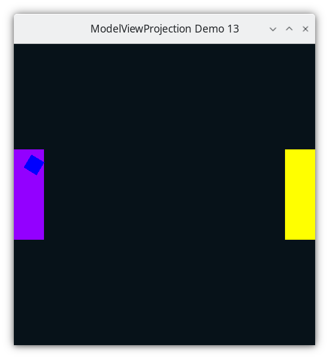

..
   Copyright (c) 2018-2025 William Emerison Six

   Permission is hereby granted, free of charge, to any person obtaining a copy
   of this software and associated documentation files (the "Software"), to deal
   in the Software without restriction, including without limitation the rights
   to use, copy, modify, merge, publish, distribute, sublicense, and/or sell
   copies of the Software, and to permit persons to whom the Software is
   furnished to do so, subject to the following conditions:

   The above copyright notice and this permission notice shall be included in all
   copies or substantial portions of the Software.

   THE SOFTWARE IS PROVIDED "AS IS", WITHOUT WARRANTY OF ANY KIND, EXPRESS OR
   IMPLIED, INCLUDING BUT NOT LIMITED TO THE WARRANTIES OF MERCHANTABILITY,
   FITNESS FOR A PARTICULAR PURPOSE AND NONINFRINGEMENT. IN NO EVENT SHALL THE
   AUTHORS OR COPYRIGHT HOLDERS BE LIABLE FOR ANY CLAIM, DAMAGES OR OTHER
   LIABILITY, WHETHER IN AN ACTION OF CONTRACT, TORT OR OTHERWISE, ARISING FROM,
   OUT OF OR IN CONNECTION WITH THE SOFTWARE OR THE USE OR OTHER DEALINGS IN THE
   SOFTWARE.

Rotate the Square Around Paddle 1 - Demo 13
===========================================

Purpose
^^^^^^^
Rotate the square around paddle1's center.

    Demo 13

Move the Paddles using the Keyboard
^^^^^^^^^^^^^^^^^^^^^^^^^^^^^^^^^^^

==============  ==============================================
Keyboard Input  Action
==============  ==============================================
*w*             Move Left Paddle Up
*s*             Move Left Paddle Down
*k*             Move Right Paddle Down
*i*             Move Right Paddle Up

*d*             Increase Left Paddle's Rotation
*a*             Decrease Left Paddle's Rotation
*l*             Increase Right Paddle's Rotation
*j*             Decrease Right Paddle's Rotation

*UP*            Move the camera up, moving the objects down
*DOWN*          Move the camera down, moving the objects up
*LEFT*          Move the camera left, moving the objects right
*RIGHT*         Move the camera right, moving the objects left

*q*             Rotate the square around its center
*e*             Rotate the square around paddle 1's center
==============  ==============================================

Description
^^^^^^^^^^^

Cayley Graph
^^^^^^^^^^^^

.. figure:: _static/demo11.png
    :class: no-scale
    :align: center
    :alt: Demo 13
    :figclass: align-center

    Demo 13

.. literalinclude:: ../../src/demo13/demo.py
   :language: python
   :start-after: doc-region-begin define variable for square rotation around paddle's center
   :end-before: doc-region-end define variable for square rotation around paddle's center
   :linenos:
   :lineno-match:
   :caption: src/demo13/demo.py

Event Loop
^^^^^^^^^^

.. literalinclude:: ../../src/demo13/demo.py
   :language: python
   :start-after: doc-region-begin begin event loop
   :end-before: doc-region-end begin event loop
   :linenos:
   :lineno-match:
   :caption: src/demo13/demo.py

::

    ...

.. literalinclude:: ../../src/demo13/demo.py
   :language: python
   :start-after: doc-region-begin draw square
   :end-before: doc-region-end draw square
   :linenos:
   :lineno-match:
   :caption: src/demo13/demo.py
