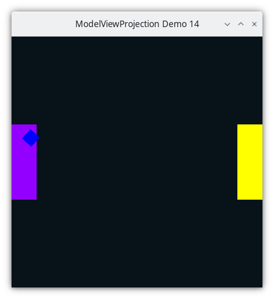
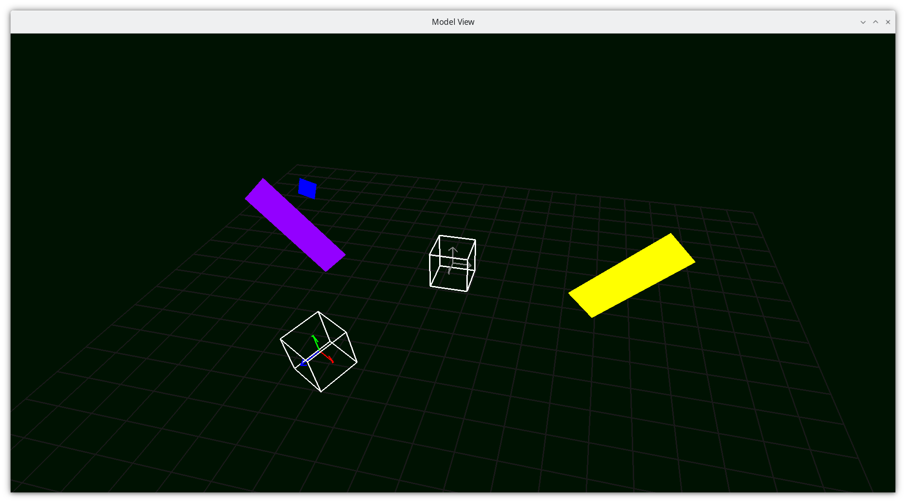
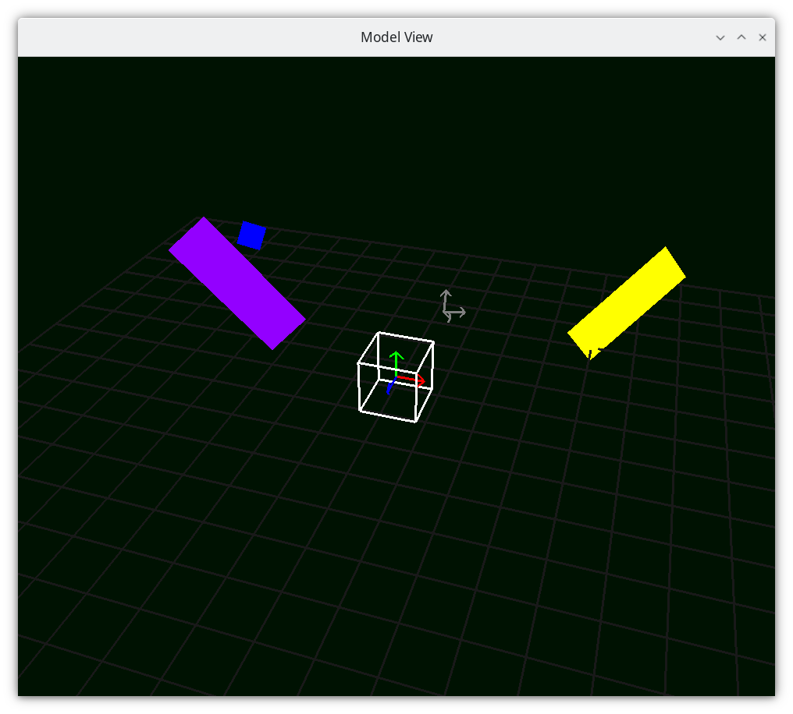
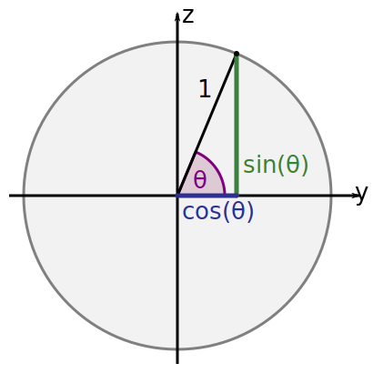

..
   Copyright (c) 2018-2024 William Emerison Six

   Permission is hereby granted, free of charge, to any person obtaining a copy
   of this software and associated documentation files (the "Software"), to deal
   in the Software without restriction, including without limitation the rights
   to use, copy, modify, merge, publish, distribute, sublicense, and/or sell
   copies of the Software, and to permit persons to whom the Software is
   furnished to do so, subject to the following conditions:

   The above copyright notice and this permission notice shall be included in all
   copies or substantial portions of the Software.

   THE SOFTWARE IS PROVIDED "AS IS", WITHOUT WARRANTY OF ANY KIND, EXPRESS OR
   IMPLIED, INCLUDING BUT NOT LIMITED TO THE WARRANTIES OF MERCHANTABILITY,
   FITNESS FOR A PARTICULAR PURPOSE AND NONINFRINGEMENT. IN NO EVENT SHALL THE
   AUTHORS OR COPYRIGHT HOLDERS BE LIABLE FOR ANY CLAIM, DAMAGES OR OTHER
   LIABILITY, WHETHER IN AN ACTION OF CONTRACT, TORT OR OTHERWISE, ARISING FROM,
   OUT OF OR IN CONNECTION WITH THE SOFTWARE OR THE USE OR OTHER DEALINGS IN THE
   SOFTWARE.

Adding Depth - Z axis Demo 14
=============================

Purpose
^^^^^^^
Do the same stuff as the previous demo, but use 3D coordinates,
where the negative z axis goes into the screen (because
of the right hand rule).  Positive z comes out of the monitor
towards your face.

Things that this demo doesn't end up doing correctly:

* The blue square is always drawn, even
  when its z-coordinate in world space is less than the paddle's.  The solution will be
  z-buffering https://en.wikipedia.org/wiki/Z-buffering,
  and it is implemented in the next demo.

    Demo 14

    Camera Space

    Camera Space

How to Execute
^^^^^^^^^^^^^^

On Linux or on MacOS, in a shell, type "python src/demo14/demo.py".
On Windows, in a command prompt, type "python src\\demo14\\demo.py".

Move the Paddles using the Keyboard
^^^^^^^^^^^^^^^^^^^^^^^^^^^^^^^^^^^

==============  ==============================================
Keyboard Input  Action
==============  ==============================================
*w*             Move Left Paddle Up
*s*             Move Left Paddle Down
*k*             Move Right Paddle Down
*i*             Move Right Paddle Up

*d*             Increase Left Paddle's Rotation
*a*             Decrease Left Paddle's Rotation
*l*             Increase Right Paddle's Rotation
*j*             Decrease Right Paddle's Rotation

*UP*            Move the camera up, moving the objects down
*DOWN*          Move the camera down, moving the objects up
*LEFT*          Move the camera left, moving the objects right
*RIGHT*         Move the camera right, moving the objects left

*q*             Rotate the square around it's center
*e*             Rotate the square around paddle 1's center
==============  ==============================================

Description
^^^^^^^^^^^

..
   TODO -- see if this text can fit.
   Other things added
   Added rotations around the x axis, y axis, and z axis.
   https://en.wikipedia.org/wiki/Rotation_matrix

   Added translate in 3D.  Added scale in 3D.  These are just like
   the 2D versions, just with the same process applied to the z axis.

   They direction of the rotation is defined by the right hand rule.

* Vertex data will now have an X, Y, and Z component.
* Rotations around an angle in 3D space follow the right hand rule_.  Here's a link to them
  in matrix_ form, which we have not yet covered.

.. _rule: https://en.wikipedia.org/wiki/Right-hand_rule
.. _matrix: https://en.wikipedia.org/wiki/Rotation_matrix

.. figure:: _static/ccbysa3.0/wikipedia-Acdx/220px-Right_hand_rule_cross_product.svg.png
    :align: center
    :alt: Right hand rule
    :figclass: align-center

* With open palm, fingers on the x axis, rotating the fingers to y axis,
  means that the positive z axis is in the direction of the thumb.  Positive Theta
  moves in the direction that your fingers did.
* starting on the y axis, rotating to z axis, thumb is on the positive x axis.
* starting on the z axis, rotating to x axis, thumb is on the positive y axis.

.. literalinclude:: ../src/demo14/demo.py
   :language: python
   :start-after: doc-region-begin d38e00f1c19bce775ae4216e4ed95a31a814eee0
   :end-before: doc-region-end d38e00f1c19bce775ae4216e4ed95a31a814eee0

Rotate Z
~~~~~~~~

Rotate Z is the same rotate that we've used so far, but doesn't affect
the z component at all.

.. figure:: _static/cc0/Stephan_Kulla/Sinus_und_Kosinus_am_Einheitskreis_2.svg
    :align: center
    :alt: Rotate Z
    :figclass: align-center

.. literalinclude:: ../src/demo14/demo.py
   :language: python
   :start-after: doc-region-begin 1b96b48e7e572197721cad2a7d082f167159f2d8
   :end-before: doc-region-end 1b96b48e7e572197721cad2a7d082f167159f2d8

Rotate X
~~~~~~~~

.. literalinclude:: ../src/demo14/demo.py
   :language: python
   :start-after: doc-region-begin 3e09ecd4a77c68066fe97bfa4f06e89afb583f9d
   :end-before: doc-region-end 3e09ecd4a77c68066fe97bfa4f06e89afb583f9d

Rotate Y
~~~~~~~~

.. literalinclude:: ../src/demo14/demo.py
   :language: python
   :start-after: doc-region-begin 256be1d4ab5b90068be656bb99ff1115268d8925
   :end-before: doc-region-end 256be1d4ab5b90068be656bb99ff1115268d8925

Scale
~~~~~

.. literalinclude:: ../src/demo14/demo.py
   :language: python
   :start-after: doc-region-begin dd45247963bb4a02bf2430d98a7f52e707c9e15a
   :end-before: doc-region-end dd45247963bb4a02bf2430d98a7f52e707c9e15a

Code
^^^^

The only new aspect of the code below is that the paddles have
a z-coordinate of 0 in their modelspace.

.. literalinclude:: ../src/demo14/demo.py
   :language: python
   :start-after: doc-region-begin d5bd9d04649181c42a65f8a7d52125a0ef86a928
   :end-before: doc-region-end d5bd9d04649181c42a65f8a7d52125a0ef86a928

The only new aspect of the square below is that the paddles have
a z-coordinate of 0 in their modelspace.  N.B that since we
do a sequence transformations to the modelspace data to get
to worldspace coordinates, the X, Y, and Z coordinates
are subject to be different.

.. literalinclude:: ../src/demo14/demo.py
   :language: python
   :start-after: doc-region-begin 89d28adbbb797e4128facc7ee1497e4f2d469eff
   :end-before: doc-region-end 89d28adbbb797e4128facc7ee1497e4f2d469eff

The camera now has a z-coordinate of 0 also.

.. literalinclude:: ../src/demo14/demo.py
   :language: python
   :start-after: doc-region-begin 603eda05b403ac6bd756d050f26d9e6497bf748a
   :end-before: doc-region-end 603eda05b403ac6bd756d050f26d9e6497bf748a

Event Loop
~~~~~~~~~~

.. literalinclude:: ../src/demo14/demo.py
   :language: python
   :start-after: doc-region-begin ee882a76ee2962c327841e2a952998acce07cc2a
   :end-before: doc-region-end ee882a76ee2962c327841e2a952998acce07cc2a

::

    ...

* Draw Paddle 1

.. literalinclude:: ../src/demo14/demo.py
   :language: python
   :start-after: doc-region-begin 2f5cb93361c42475b16dec8246c81c711b1a2db3
   :end-before: doc-region-end 2f5cb93361c42475b16dec8246c81c711b1a2db3

The square should not be visible when hidden behind the paddle1,
as we do a translate by -10.  But in running the demo, you see
that the square is always drawn over the paddle.

* Draw the Square

.. literalinclude:: ../src/demo14/demo.py
   :language: python
   :start-after: doc-region-begin 485064c9e30f4471b74d11b8cca3c8f0d142b552
   :end-before: doc-region-end 485064c9e30f4471b74d11b8cca3c8f0d142b552

This is because without depth_ buffering, the object drawn last
clobbers the color of any previously drawn object at the pixel.
Try moving the square drawing code to the beginning, and you will
see that the square can be hidden behind the paddle.

.. _depth:  https://en.wikipedia.org/wiki/Fragment_(computer_graphics)

* Draw Paddle 2

.. literalinclude:: ../src/demo14/demo.py
   :language: python
   :start-after: doc-region-begin 79bca06683ced2f641ea47f14d22bc330f75979f
   :end-before: doc-region-end 79bca06683ced2f641ea47f14d22bc330f75979f

Added translate in 3D.  Added scale in 3D.  These are just like
the 2D versions, just with the same process applied to the z axis.

They direction of the rotation is defined by the right hand rule.

https://en.wikipedia.org/wiki/Right-hand_rule
