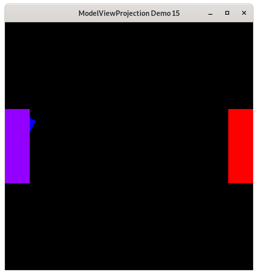
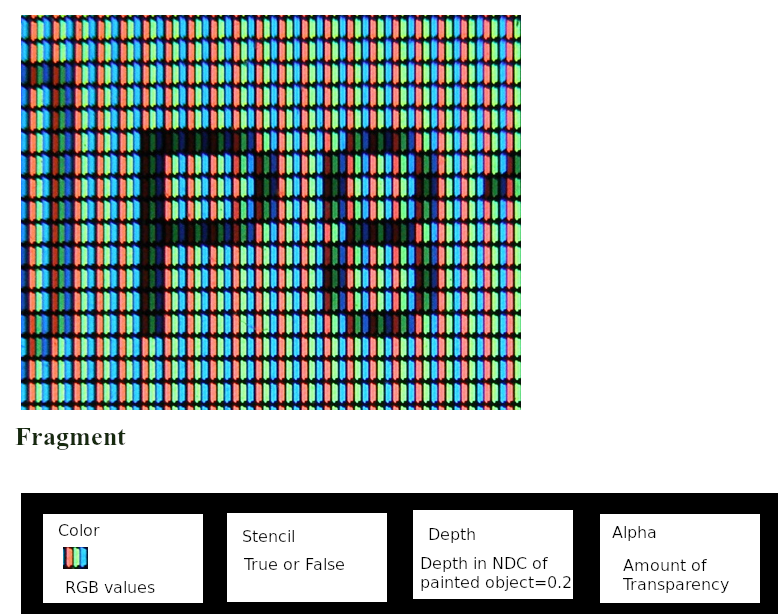
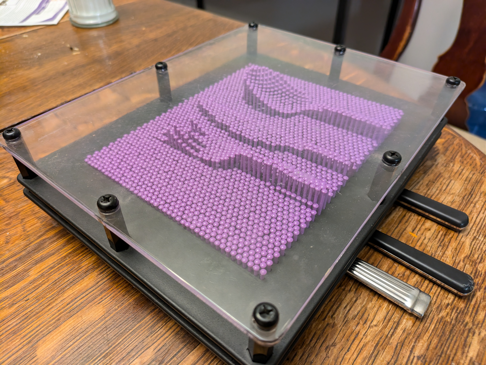

..
   Copyright (c) 2018-2026 William Emerison Six

   Permission is granted to copy, distribute and/or modify this document
   under the terms of the GNU Free Documentation License, Version 1.3
   or any later version published by the Free Software Foundation;
   with no Invariant Sections, no Front-Cover Texts, and no Back-Cover Texts.

   A copy of the license is available at
   https://www.gnu.org/licenses/fdl-1.3.html.

********************************************
Adding Depth - Enable Depth Buffer - Demo 15
********************************************

Objective
^^^^^^^^^
Fix the issue from the last demo, in which the square
was drawn over Paddle 1, even though the square
is further away from the camera.

    Demo 15

How to Execute
^^^^^^^^^^^^^^

Load src/modelviewprojection/demos/demo15.py in Spyder and hit the play button.

Move the Paddles using the Keyboard
^^^^^^^^^^^^^^^^^^^^^^^^^^^^^^^^^^^

==============  ==============================================
Keyboard Input  Action
==============  ==============================================
*w*             Move Left Paddle Up
*s*             Move Left Paddle Down
*k*             Move Right Paddle Down
*i*             Move Right Paddle Up

*d*             Increase Left Paddle's Rotation
*a*             Decrease Left Paddle's Rotation
*l*             Increase Right Paddle's Rotation
*j*             Decrease Right Paddle's Rotation

*UP*            Move the camera up, moving the objects down
*DOWN*          Move the camera down, moving the objects up
*LEFT*          Move the camera left, moving the objects right
*RIGHT*         Move the camera right, moving the objects left

*q*             Rotate the square around its center
*e*             Rotate the square around paddle 1's center
==============  ==============================================

Description
^^^^^^^^^^^

Early in this book we used the :term:`stencil buffer <Stencil Buffer>`, but didn't go into
much detail about it.  Each :term:`pixel <Pixel>` in the :term:`framebuffer <Frame Buffer>` is a :term:`fragment <Fragment>`,
which is more information than just the color to be drawn.

Besides the color, there is also

* :term:`Stencil buffer <Stencil Buffer>`, being true or false, to specify whether subsequent OpenGL calls
  should affect this :term:`fragment <Fragment>` or leave it alone
* Depth - When an object in :term:`NDC <Normalized Device Coordinates>` is drawn, the color is updated to the new
  value, but the z-component of the NDC is placed into the :term:`depth buffer <Depth Buffer>`.
  When a new object is drawn at this pixel later, its Z value will
  be compared to the existing Z value, to determine which object is in
  front.  If the new object is farther away from the camera than the
  already-draw object, then the :term:`fragment <Fragment>` will not be updated.
* Alpha, for transparency, which we have not yet covered.

For a history of what 3D programming for game systems was like
without having a :term:`z-buffer <Z-buffering>`, take a look at some history of
the Nintendo_ 64, and comments on hacker_ news about it.

.. _Nintendo: http://shmuplations.com/mario64/
.. _hacker: https://news.ycombinator.com/item?id=12558589

Use the :term:`depth buffer <Depth Buffer>` to make further objects hidden
if nearer objects are drawn in front

#. Set the clear depth to -1 (just like clearcolor, it is the default depth on a given :term:`fragment <Fragment>` (pixel).

#. Set the depth func, i.e. the test to see if the newly drawn object should overwrite the color in the current :term:`fragment <Fragment>` or not.

#. Enable the :term:`depth test <Depth Test>`.

..
   TODO
   Show what the color buffer and depth buffer would look like

.. literalinclude:: ../../src/modelviewprojection/demos/demo15.py
   :language: python
   :start-after: doc-region-begin enable depth buffer
   :end-before: doc-region-end enable depth buffer
   :linenos:
   :lineno-match:
   :caption: src/modelviewprojection/demos/demo15.py

With the :term:`depth test <Depth Test>` enabled, the square is now correctly hidden behind
paddle1 — even though it is still drawn *after* the paddle.  In the previous
chapter the square (translated by -1, so behind paddle1) was wrongly drawn
over it, because without a :term:`depth buffer <Depth Buffer>` the object drawn last clobbers the
color of whatever was already at that pixel.  Now each :term:`fragment <Fragment>` also carries
its depth, and ``GL_GREATER`` keeps a newly drawn fragment only when it is
nearer than the value already in the :term:`depth buffer <Depth Buffer>`, so the farther square no
longer overwrites the nearer paddle.  The previous chapter's manual workaround
of reordering the draw calls is no longer needed.
