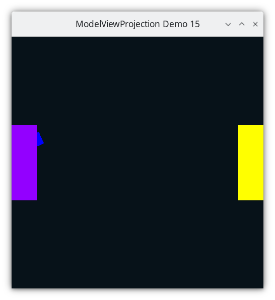

..
   Copyright (c) 2018-2025 William Emerison Six

   Permission is granted to copy, distribute and/or modify this document
   under the terms of the GNU Free Documentation License, Version 1.3
   or any later version published by the Free Software Foundation;
   with no Invariant Sections, no Front-Cover Texts, and no Back-Cover Texts.

   A copy of the license is available at
   https://www.gnu.org/licenses/fdl-1.3.html.

********************************************
Adding Depth - Enable Depth Buffer - Demo 15
********************************************

Objective
^^^^^^^^^
Fix the issue from the last demo, in which the square
was drawn over Paddle 1, even though the square
is further away from the camera.

    Demo 15

How to Execute
^^^^^^^^^^^^^^

Load src/modelviewprojection/demo15.py in Spyder and hit the play button.

Move the Paddles using the Keyboard
^^^^^^^^^^^^^^^^^^^^^^^^^^^^^^^^^^^

==============  ==============================================
Keyboard Input  Action
==============  ==============================================
*w*             Move Left Paddle Up
*s*             Move Left Paddle Down
*k*             Move Right Paddle Down
*i*             Move Right Paddle Up

*d*             Increase Left Paddle's Rotation
*a*             Decrease Left Paddle's Rotation
*l*             Increase Right Paddle's Rotation
*j*             Decrease Right Paddle's Rotation

*UP*            Move the camera up, moving the objects down
*DOWN*          Move the camera down, moving the objects up
*LEFT*          Move the camera left, moving the objects right
*RIGHT*         Move the camera right, moving the objects left

*q*             Rotate the square around its center
*e*             Rotate the square around paddle 1's center
==============  ==============================================

Description
^^^^^^^^^^^

Early in this book we used the stencil buffer, but didn't go into
much detail about it.  Each pixel in the frame-buffer is a fragment,
which is more information than just the color to be drawn.

.. figure:: _static/ccbysa3.0/williamsix/fragment.png
    :class: no-scale
    :align: center
    :alt: Fragment
    :figclass: align-center

Besides the color, there is also

* Stencil buffer, being true or false, to specify whether subsequent OpenGL calls
  should affect this fragment or leave it alone
* Depth - When an object in NDC is drawn, the color is updated to the new
  value, but the z-component of the NDC is placed into the depth buffer.
  When a new object is drawn at this pixel later, its Z value will
  be compared to the existing Z value, to determine which object is in
  front.  If the new object is farther away from the camera than the
  already-draw object, then the fragment will not be updated.
* Alpha, for transparency, which we have not yet covered.

For a history of what 3D programming for game systems was like
without having a z-buffer, take a look at some history of
the Nintendo_ 64, and comments on hacker_ news about it.

.. _Nintendo: http://shmuplations.com/mario64/
.. _hacker: https://news.ycombinator.com/item?id=12558589

Use the depth buffer to make further objects hidden
if nearer objects are drawn in front

#. Set the clear depth to -1 (just like clearcolor, it is the default depth on a given fragment (pixel).

#. Set the depth func, i.e. the test to see if the newly drawn object should overwrite the color in the current fragment or not.

#. Enable the depth test.

..
   TODO
   Show what the color buffer and depth buffer would look like

.. literalinclude:: ../../src/modelviewprojection/demo15.py
   :language: python
   :start-after: doc-region-begin enable depth buffer
   :end-before: doc-region-end enable depth buffer
   :linenos:
   :lineno-match:
   :caption: src/modelviewprojection/demo15.py

the square should not be visible when hidden behind the paddle1,
as we did a translate by -1.
this is because without depth buffering, the object drawn last
clobbers the color of any previously drawn object at the pixel.
Try moving the square drawing code to the beginning, and you will
see that the square can be hidden behind the paddle.
