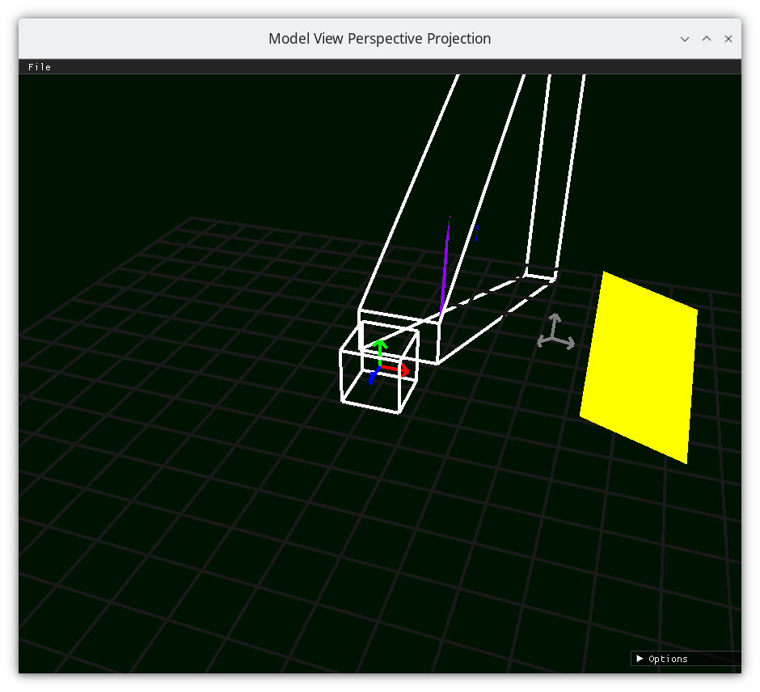
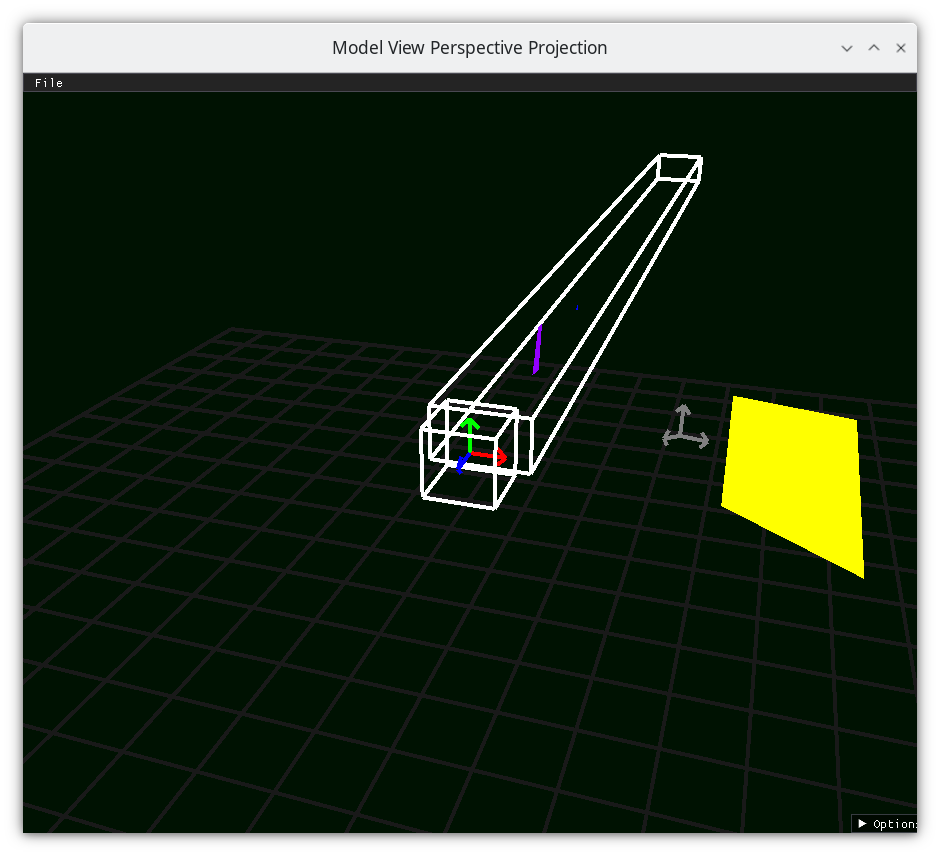

..
   Copyright (c) 2018-2025 William Emerison Six

   Permission is granted to copy, distribute and/or modify this document
   under the terms of the GNU Free Documentation License, Version 1.3
   or any later version published by the Free Software Foundation;
   with no Invariant Sections, no Front-Cover Texts, and no Back-Cover Texts.

   A copy of the license is available at
   https://www.gnu.org/licenses/fdl-1.3.html.

3D Perspective - Demo 18
========================

Purpose
^^^^^^^

Implement a perspective projection so that objects
further away are smaller than the would be
if they were close by

.. figure:: _static/screenshots/demo17.png
    :class: no-scale
    :align: center
    :alt: Demo 17
    :figclass: align-center

    Demo 17

.. figure:: _static/screenshots/frustum1.png
    :class: no-scale
    :align: center
    :alt: Frustum 1
    :figclass: align-center

    Frustum 1

.. figure:: _static/screenshots/frustum2.png
    :class: no-scale
    :align: center
    :alt: Frustum 2
    :figclass: align-center

    Frustum 2

    Frustum 3

    Frustum 4

.. figure:: _static/screenshots/frustum5.png
    :class: no-scale
    :align: center
    :alt: Frustum 5
    :figclass: align-center

    Frustum 5

.. figure:: _static/screenshots/frustum6.png
    :class: no-scale
    :align: center
    :alt: Frustum 6
    :figclass: align-center

    Frustum 6

How to Execute
^^^^^^^^^^^^^^

Load src/demo18.py in Spyder and hit the play button

Move the Paddles using the Keyboard
^^^^^^^^^^^^^^^^^^^^^^^^^^^^^^^^^^^

==============  ==============================================
Keyboard Input  Action
==============  ==============================================
*w*             Move Left Paddle Up
*s*             Move Left Paddle Down
*k*             Move Right Paddle Down
*i*             Move Right Paddle Up

*d*             Increase Left Paddle's Rotation
*a*             Decrease Left Paddle's Rotation
*l*             Increase Right Paddle's Rotation
*j*             Decrease Right Paddle's Rotation

*UP*            Move the camera up, moving the objects down
*DOWN*          Move the camera down, moving the objects up
*LEFT*          Move the camera left, moving the objects right
*RIGHT*         Move the camera right, moving the objects left

*q*             Rotate the square around its center
*e*             Rotate the square around paddle 1's center
==============  ==============================================

Description
^^^^^^^^^^^

::

                     ------------------------------- far z
                     \              |              /
                      \             |             /
                       \ (x,z) *----|(0,z)       /
                        \      |    |           /
                         \     |    |          /
                          \    |    |         /
                           \   |    |        /
                            \  |    |       /
                             \ |    |      /
                              \---*-------- near z
                               |    |    /
                               |\   |   /
                               | \  |  /
                               |  \ | /
                               |   \|/
              -----------------*----*-(0,0)-------------------
                              (x,0)

If we draw a straight line between (x,z) and (0,0), we will have a right triangle
with vertices (0,0), (0,z), and (x,z).

There also will be a similar right triangle with vertices (0,0), (0,nearZ), and
whatever point the line above intersects the line at z=nearZ.  Let's call that point
(projX, nearZ)

.. figure:: _static/math.svg
    :class: no-scale
    :align: center
    :alt: fov
    :figclass: align-center

::

        because right angle and tan(theta) = tan(theta)
        x / z = projX / nearZ
        projX = x / z * nearZ

        So use projX as the transformed x value, and keep the distance z.

                               ----------- far z
                               |          |
                               |          |
                (x / z * nearZ,z) *       |   non-linear -- the transformation of x depends on its z value
                               |          |
                               |          |
                               |          |
                               |          |
                               |          |
                               |          |
                               |          |
                               |          |
                               ------------ near z
                               \    |    /
                                \   |   /
                                 \  |  /
                                  \ | /
                                   \|/
              ----------------------*-(0,0)-------------------

Top calculation based off of vertical field of view

::

                              /* top
                             / |
                            /  |
                           /   |
                          /    |
                         /     |
                        /      |
                       /       |
                      /        |
                     /         |
                    /          |
                   /           |
                  /            |
           origin/             |
                / fov/2        |
          z----*---------------*
               |\              |-nearZ
               | \             |
               |  \            |
               x   \           |
                    \          |
                     \         |
                      \        |
                       \       |
                        \      |
                         \     |
                          \    |
                           \   |
                            \  |
                             \ |
                              \|

Right calculation based off of Top and aspect ration

::

                                   top
           -------------------------------------------------------
           |                                                     |
           |                         y                           |
           |                         |                           |
           |                         |                           |
           |                         *----x                      | right =
           |                            origin                   |   top * aspectRatio
           |                                                     |
           |                                                     |  aspect ratio should be the viewport's
           |                                                     |    width/height, not necessarily the
           -------------------------------------------------------    window's

.. literalinclude:: ../../src/demo18.py
   :language: python
   :start-after: doc-region-begin define vector class
   :end-before: doc-region-end define vector class
   :linenos:
   :lineno-match:
   :caption: src/demo18.py

::

   ...

.. literalinclude:: ../../src/demo18.py
   :language: python
   :start-after: doc-region-begin define perspective
   :end-before: doc-region-end define perspective
   :linenos:
   :lineno-match:
   :caption: src/demo18.py

.. literalinclude:: ../../src/demo18.py
   :language: python
   :start-after: doc-region-begin begin event loop
   :end-before: doc-region-end begin event loop
   :linenos:
   :lineno-match:
   :caption: src/demo18.py

::

   ...

.. literalinclude:: ../../src/demo18.py
   :language: python
   :start-after: doc-region-begin draw paddle 1
   :end-before: doc-region-end draw paddle 1
   :linenos:
   :lineno-match:
   :caption: src/demo18.py
