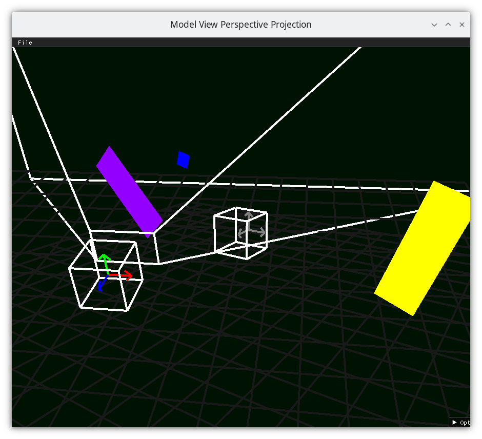

..
   Copyright (c) 2018-2025 William Emerison Six

   Permission is granted to copy, distribute and/or modify this document
   under the terms of the GNU Free Documentation License, Version 1.3
   or any later version published by the Free Software Foundation;
   with no Invariant Sections, no Front-Cover Texts, and no Back-Cover Texts.

   A copy of the license is available at
   https://www.gnu.org/licenses/fdl-1.3.html.

************
Introduction
************

Learn how to program in 3D computer graphics in the Python programming language!

Approach
========

You’ll learn how to place geometric objects in space, draw them relative to
other geometric objects, position a camera in space which moves over time
based on user input, and
transform all those objects into the 2D pixel coordinates of your
screen. By the end, you’ll understand the foundations of creating
first-person and third-person applications or games. The goal? To
empower you to build the graphics programs you want, using math you
mostly already know.

This book intentionally keeps things simple intended for beginners.
In this book, the applications created
won’t be particularly pretty or realistic-looking. After reading this
book, for more advanced
topics, you’ll want to dive into other references, such as

#. Fundamentals of Computer Graphics, Third Edition by Shirley and Marschner :cite:`FCG`
#. Computer Graphics With OpenGL, by Hearn Baker and Carithers :cite:`CGWOGL`
#. LearnOpenGL_
#. OpenGLTutorial_
#. `Computer Graphics From Scratch`_
#. `Learning Modern 3D Graphics Programming (2012)`_
#. `OGLdev`_

.. _LearnOpenGL:  https://learnopengl.com/
.. _OpenGLTutorial:  http://www.opengl-tutorial.org/
.. _Computer Graphics From Scratch: https://gabrielgambetta.com/computer-graphics-from-scratch/
.. _Learning Modern 3D Graphics Programming (2012): https://nicolbolas.github.io/oldtut/index.html
.. _OGLdev: https://ogldev.org/

Things You Should Know
======================

#. Basic programming concepts in Python.

   #. YouTube videos

      #. Learn Python with Socratica_
      #. Microsoft_ Python Tutorials

   #. Books

      #. https://diveintopython3.net/

#. High school Geometry

   #. :cite:`HighSchoolGeometry`

.. _Socratica: https://www.youtube.com/watch?v=bY6m6_IIN94&list=PLi01XoE8jYohWFPpC17Z-wWhPOSuh8Er-&index=2
.. _Microsoft: https://www.youtube.com/watch?v=jFCNu1-Xdsw&list=PLlrxD0HtieHhS8VzuMCfQD4uJ9yne1mE6

Required Software
=================

You will need to install Python, and make a virtual environment.  You can
search how to do this using a search engine, or AI Chatbot, or follow
the instructions below.

Windows
-------

On Windows, install Visual Studio and the Python extension.  Afterwards, to set up
the virtual environment, open the Developer Command Prompt,

.. code-block::

   python -m venv venv
   cd venv\Scripts
   activate.bat
   cd ..\..\
   python -m pip install --upgrade pip setuptools
   python -m pip install -e .

The book assumes that you'll use the Spyder Integrated Development Environment (IDE),
to install Spyder

.. code-block::

   python -m pip install spyder

To run the Spyder Integrated Development Environment (IDE) to execute
the code in the book, open Spyder on the Developer Command
Prompt

.. code-block::

   cd venv\Scripts
   activate.bat
   cd ..\..\
   spyder -p .

Linux
-----

Install Python3, glfw via a package manager.  Use pip and virtualenv to install dependencies

To set up the environment in a terminal, execute

.. code-block:: bash

   python3 -m venv venv
   source venv/bin/activate
   python3 -m pip install --upgrade pip setuptools
   python3 -m pip install -e .

The book assumes that you'll use the Spyder Integrated Development Environment (IDE),
to install Spyder

.. code-block::

   python -m pip install spyder

To run the Spyder IDE to execute the code in the book, open Spyder on the developer command
prompt

.. code-block::

   source venv/bin/activate
   spyder -p .

Mac
---

Install Python3 (via anaconda, homebrew, macports, whatever), and use pip and virtualenv to install dependencies.

On MacOS, to set up the environment in a terminal, execute

.. code-block:: bash

   python3 -m venv venv
   source venv/bin/activate
   python3 -m pip install --upgrade pip setuptools
   python3 -m pip install -e .

The book assumes that you'll use the Spyder Integrated Development Environment (IDE),
to install Spyder

.. code-block::

   python -m pip install spyder

To run the Spyder IDE to execute the code in the book, open Spyder on the developer command
prompt

.. code-block::

   source venv/bin/activate
   spyder -p .

Podman Container
----------------

The code is mainly tested against a container in Podman, specified in the Dockerfile.

Command Line
^^^^^^^^^^^^

To run the code from the command line, run the following to create the podman image

.. code-block::

   make image

Once that is made, you can run the image in a container by running

.. code-block::

   make shell # get a shell into the environment

Spyder
^^^^^^

To create the podman image for running the code in Spyder:

.. code-block::

   make spyderimage # make the OCI image that has the base image and Spyder IDE preinstalled

To run Spyder within the container

.. code-block::

   make spyder # run spyder in the OCI container

Jupyter Notebook
^^^^^^^^^^^^^^^^

To run Python code as jupyter notebooks, the following command will launch
jupyter and a firefox web browser from within the container.

Make the image

.. code-block::

   make image

Run Jupyter notebook

.. code-block::

   make jupyter # run jupyter notebook in a container

Getting the Source code
=======================

This book references source code, which is at `https://github.com/billsix/modelviewprojection <https://github.com/billsix/modelviewprojection>`_

.. include:: ./version.txt
