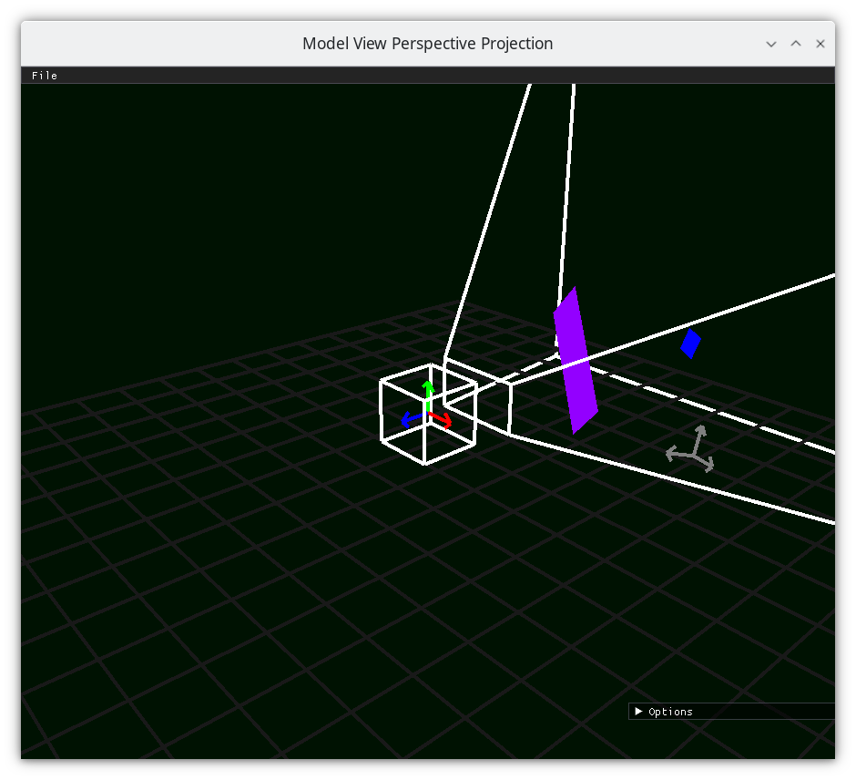

..
   Copyright (c) 2018-2024 William Emerison Six

   Permission is hereby granted, free of charge, to any person obtaining a copy
   of this software and associated documentation files (the "Software"), to deal
   in the Software without restriction, including without limitation the rights
   to use, copy, modify, merge, publish, distribute, sublicense, and/or sell
   copies of the Software, and to permit persons to whom the Software is
   furnished to do so, subject to the following conditions:

   The above copyright notice and this permission notice shall be included in all
   copies or substantial portions of the Software.

   THE SOFTWARE IS PROVIDED "AS IS", WITHOUT WARRANTY OF ANY KIND, EXPRESS OR
   IMPLIED, INCLUDING BUT NOT LIMITED TO THE WARRANTIES OF MERCHANTABILITY,
   FITNESS FOR A PARTICULAR PURPOSE AND NONINFRINGEMENT. IN NO EVENT SHALL THE
   AUTHORS OR COPYRIGHT HOLDERS BE LIABLE FOR ANY CLAIM, DAMAGES OR OTHER
   LIABILITY, WHETHER IN AN ACTION OF CONTRACT, TORT OR OTHERWISE, ARISING FROM,
   OUT OF OR IN CONNECTION WITH THE SOFTWARE OR THE USE OR OTHER DEALINGS IN THE
   SOFTWARE.

Standard Perspective Matrix
===========================

Purpose
^^^^^^^

Derive the standard perspective matrix that OpenGL expects.

Description
^^^^^^^^^^^

.. figure:: _static/perspective.png
    :align: center
    :alt: Demo 11
    :figclass: align-center

    Turn our NDC into Clip Space

Matrix form of perspective projection
&&&&&&&&&&&&&&&&&&&&&&&&&&&&&&&&&&&&&

Scale Camera-space x by Camera-space z
######################################

.. math::
   \vec{f}_{1}(\begin{bmatrix}
                             {x_c} \\
                             {y_c} \\
                             {z_c} \\
                             {w_c=1} \\
                   \end{bmatrix}; nearZ_c)   = \begin{bmatrix}
              {nearZ_c \over \textcolor{red}{z_c}} & 0 & 0 & 0 \\
              0  &               1 & 0 & 0 \\
              0  &               0 & 1 & 0 \\
              0, &               0 & 0 & 1
                   \end{bmatrix}  *
                    \begin{bmatrix}
                             {x_c} \\
                             {y_c} \\
                             {z_c} \\
                             {w_c=1} \\
                   \end{bmatrix}

resulting in

.. figure:: _static/screenshots/frustum3.png
    :align: center
    :alt: Frustum 3
    :figclass: align-center

    Scale the camera space x by the camera space z

Scale Camera-space y by Camera-space z
######################################

.. math::
        (\vec{f}_{2} ; nearZ_c) ( \begin{bmatrix}
                             {x_c} \\
                             {y_c} \\
                             {z_c} \\
                             {w_c=1}
                   \end{bmatrix})  = \begin{bmatrix}
          1 & 0 &                  0 & 0 \\
          0 & {nearZ_c \over \textcolor{red}{z_c}}    &       0 & 0 \\
          0 & 0 &                  1 & 0 \\
          0 & 0 &                  0 & 1
                   \end{bmatrix}  *
                    \begin{bmatrix}
                             {x_c} \\
                             {y_c} \\
                             {z_c} \\
                             {w_c=1} \\
                   \end{bmatrix}

resulting in

.. figure:: _static/screenshots/frustum4.png
    :align: center
    :alt: Frustum 4
    :figclass: align-center

    Scale the camera space y by the cameraspace z

Translate Rectangular Prism's Center to Center
##############################################

:math:`x_{midpoint} = 0`  // centered on x

:math:`y_{midpoint} = 0`  // centered on y

:math:`z_{midpoint} = {{{farZ}_c + {nearZ}_c} \over 2}`;

.. math::
        (\vec{f}_{3} ; nearZ_c) ( \begin{bmatrix}
                             {x_c} \\
                             {y_c} \\
                             {z_c} \\
                             {w_c=1}
                   \end{bmatrix})
  = \begin{bmatrix}
          1 & 0 & 0 & 0 \\
          0 & 1 & 0 & 0 \\
          0 & 0 & 1 & {-{{farZ_c + nearZ_c} \over 2}} \\
          0 & 0 & 0 & 1
                   \end{bmatrix}  *
                    \begin{bmatrix}
                             {x_c} \\
                             {y_c} \\
                             {z_c} \\
                             {w_c=1} \\
                   \end{bmatrix}

.. figure:: _static/screenshots/frustum5.png
    :align: center
    :alt: Frustum 5
    :figclass: align-center

Scale by inverse of the dimensions of the Rectangular Prism
###########################################################

:math:`x_{length} = right * 2`;

:math:`y_{length} = top * 2`;

:math:`z_{length} = {nearZ}_c - {farZ}_c`;

.. math::
        (\vec{f}_{4} ; nearZ_c, farZ_c) ( \begin{bmatrix}
                             {x_c} \\
                             {y_c} \\
                             {z_c} \\
                             {w_c=1}
                   \end{bmatrix})  = \begin{bmatrix}
         {1 \over right} &     0 &           0 &                  0 \\
         0 &           {1 \over top} &       0 &                  0 \\
         0 &           0 &           {2 \over {nearZ_c - farZ_c}} &   0 \\
         0 &           0 &           0 &                  1
                   \end{bmatrix}  *
                    \begin{bmatrix}
                             {x_c} \\
                             {y_c} \\
                             {z_c} \\
                             {w_c=1} \\
                   \end{bmatrix}

Pre-multiply the matricies
#########################

.. math::
    \begin{bmatrix}
      {x_{ndc}} \\
      {y_{ndc}} \\
      {z_{ndc}} \\
      {w_{ndc}=1 } \\
    \end{bmatrix}  = ( \vec{f}_{4} \circ  \vec{f}_{3} \circ \vec{f}_{2} \circ \vec{f}_{1}; farZ_c, nearZ_c, top, right ) \begin{bmatrix}
                             {x_c} \\
                             {y_c} \\
                             {z_c} \\
                             {w_c=1} \\
                   \end{bmatrix}

Multiply them all together to get the following.  The elements of this premultiplied matrix have no geometric
meaning to the author, and that's ok.  The matricies above all of geometric meaning, and we premultiply them
together for computational efficiency, as well as being able to do the next step in clip space, which
we couldn't do without having the premultiplied matrix.

.. math::
    \begin{bmatrix}
      {x_{ndc}} \\
      {y_{ndc}} \\
      {z_{ndc}} \\
      {w_{ndc}=1} \\
    \end{bmatrix}  =          \vec{f}_{c}^{ndc}(\begin{bmatrix}
                             {x_{c}} \\
                             {y_{c}} \\
                             {z_{c}} \\
                             {w_{c}=1} \\
                   \end{bmatrix}; farZ_c, nearZ_c, top, right) = \begin{bmatrix}
                      {nearZ_c \over {right * \textcolor{red}{z_c}}} &             0 &                      0 &                0 \\
                      0 &                           {nearZ_c \over {top*\textcolor{red}{z_c}}} &           0 &                0 \\
                      0 &                           0 &                       {2 \over {nearZ_c - farZ_c}} & {-({farZ_c + nearZ_c}) \over {nearZ_c - farZ_c}} \\
                      0 &                           0 &                       0 &                1
                   \end{bmatrix} *
                    \begin{bmatrix}
                             {x_{c}} \\
                             {y_{c}} \\
                             {z_{c}} \\
                             {w_{c}=1} \\
                   \end{bmatrix}

As a quick smoke test to ensure that the aggregate matrix works correctly, let's
test the bounds of the frustum and make sure that they map to the NDC cube.

Given that :math:`nearZ_c` is negative, assuming :math:`z_c` is equal to
:math:`nearZ_c`, :math:`right` goes to :math:`1`, :math:`left` which is :math:`-right`
goes to :math:`-1`.

Given that :math:`nearZ_c` is negative, assuming :math:`z_c` is equal to
:math:`nearZ_c`, :math:`top` goes to :math:`1`, :math:`bottom` which is :math:`-top`
goes to :math:`-1`.

Given that :math:`w_c` is :math:`1`, if :math:`z_c = nearZ_c`, :math:`z_{ndc} = 1`.
Given that :math:`w_c` is :math:`1`, if :math:`z_c = farZ_c`, :math:`z_{ndc} = -1`.

Clip Space
&&&&&&&&&&

convert the data from NDC to clip-space.

We have never used clip-space in the class, only NDC,
because 4D space is confusing geometrically, nevermind
the fact that (NDCx NDCy NDCz) = (Clipx/Clipw, Clipy/Clipy, Clipz/Clipz)

The purpose of going to clip space is that eventually we will be
able to remove the camera space's z coordinate from the matrix.
This will allow us to use one perspective projection matrix for
all vertices, independent of the z coordinate of each input vertex.

I assume, without any evidence to support me, that this
was done for efficiency reasons when using OpenGL's fixed function pipeline.
(Side note, the standard perspective projection matrix,
which we will get to by demo 25, does not linearly
position the :math:`nearZ_c` to :math:`farZ_c` data into NDC. Everything
we've done so far in the class does.  The standard
perspective matrix ends up having less Z-fighting
close to :math:`nearZ_c`, and more problems with Z-fighting
near farZ_c)

OpenGL will automatically convert from clip space to NDC
such as follows.

.. math::
    \vec{f}_{clip}^{ndc}(\begin{bmatrix}
                             {x_{ndc}} \\
                             {y_{ndc}} \\
                             {z_{ndc}} \\
                             {w_{ndc}} \\
                   \end{bmatrix}) =  \begin{bmatrix}
                      {1 \over {w_{clip}}} &  0 & 0 & 0 \\
                      0 &  {1 \over {w_{clip}}} & 0 & 0 \\
                      0 &  0 & {1 \over {w_{clip}}} & 0 \\
                      0 &  0 & 0 & {1 \over {w_{clip}}}
                   \end{bmatrix} *
                     \begin{bmatrix}
                             {x_{clip}} \\
                             {y_{clip}} \\
                             {z_{clip}} \\
                             {w_{clip}}
                   \end{bmatrix}

So to put our NDC data into clip space, knowing what OpenGL is going to do in
the equation above, we need to decide what we want our clip space value, :math:`w` to be,
and do the inverse of the equation above

.. math::
    \vec{f}_{ndc}^{clip}(\begin{bmatrix}
                             {x_{ndc}} \\
                             {y_{ndc}} \\
                             {z_{ndc}} \\
                             {w_{ndc}} \\
                   \end{bmatrix}; w) =  \begin{bmatrix}
                      w &  0 & 0 & 0 \\
                      0 &  w & 0 & 0 \\
                      0 &  0 & w & 0 \\
                      0 &  0 & 0 & w
                   \end{bmatrix} *
                     \begin{bmatrix}
                             {x_{ndc}} \\
                             {y_{ndc}} \\
                             {z_{ndc}} \\
                             {w_{ndc}}
                   \end{bmatrix}

.. math::
    \vec{f}_{clip}^{clip}(\begin{bmatrix}
                             {x_{clip}} \\
                             {y_{clip}} \\
                             {z_{clip}} \\
                             {w_{clip}} \\
                   \end{bmatrix})
                    = ( \vec{f}_{clip}^{ndc} \circ \vec{f}_{ndc}^{clip}) \begin{bmatrix}
                             {x_{clip}} \\
                             {y_{clip}} \\
                             {z_{clip}} \\
                             {w} \\
                   \end{bmatrix}

Since we want to get the :math:`z_c` relative to camera space out of
the premultiplied matrix above, we choose
the following

.. math::
    \vec{f}_{ndc}^{clip}(\begin{bmatrix}
                             {x_{ndc}} \\
                             {y_{ndc}} \\
                             {z_{ndc}} \\
                             {w_{ndc}=1} \\
                   \end{bmatrix}; z_c) =  \begin{bmatrix}
                      z_c &  0 & 0 & 0 \\
                      0 &  z_c & 0 & 0 \\
                      0 &  0 & z_c & 0 \\
                      0 &  0 & 0 & z_c
                   \end{bmatrix} *
                     \begin{bmatrix}
                             {x_{ndc}} \\
                             {y_{ndc}} \\
                             {z_{ndc}} \\
                             {w_{ndc}}
                   \end{bmatrix}

because multiplying by this matrix will remove the :math:`z_c` out of
the upper left quadrant.

Remove Z of Camera Space from Part of the Matrix
################################################

To get camera z out of the matrix, where it's currently in two denominators, we
can use knowledge of clip space, wherein we put cameraspace's z into W.     because cameraSpace's z coordinate is negative, we want to scale
all dimensions without reflecting over the origin, hence the negative sign in  :math:`-z_c`.

.. math::

   \begin{bmatrix}
               {x_{clip}} \\
               {y_{clip}} \\
               {z_{clip}} \\
               {w_{clip}} \\
     \end{bmatrix}
     & =  \vec{f}_{c}^{clip}(\begin{bmatrix}
               {x_c} \\
               {y_c} \\
               {z_c} \\
               {w_c=1} \\
     \end{bmatrix}; farZ_c, nearZ_c, top, right) \\
     & =  (\vec{f}_{ndc}^{clip} \circ \vec{f}_{c}^{ndc})  *
      \begin{bmatrix}
               {x_c} \\
               {y_c} \\
               {z_c} \\
               {w_c=1} \\
     \end{bmatrix} \\
     & = \begin{bmatrix}
                      \textcolor{red}{z_c} &  0 & 0 & 0 \\
                      0 &  \textcolor{red}{z_c} & 0 & 0 \\
                      0 &  0 & \textcolor{red}{z_c} & 0 \\
                      0 &  0 & 0 & \textcolor{red}{z_c}
                   \end{bmatrix} * \begin{bmatrix}
                      {nearZ_c \over {right * \textcolor{red}{z_c}}} &             0 &                      0 &                0 \\
                      0 &                           {nearZ_c \over {top*\textcolor{red}{z_c}}} &           0 &                0 \\
                      0 &                           0 &                       {2 \over {nearZ_c - farZ_c}} & {-({farZ_c + nearZ_c}) \over {nearZ_c - farZ_c}} \\
                      0 &                           0 &                       0 &                1
                   \end{bmatrix} *
      \begin{bmatrix}
               {x_c} \\
               {y_c} \\
               {z_c} \\
               {w_c=1} \\
     \end{bmatrix} \\
     & = \begin{bmatrix}
               {nearZ_c \over right} &         0 &        0 &                                   0 \\
               0 &                  {nearZ_c \over top} & 0 &                                   0 \\
               0 &                  0 &        { \textcolor{red}{z_c}* {2 \over {nearZ_c - farZ_c}}} &   { \textcolor{red}{z_c}*{-({farZ_c + nearZ_c}) \over {nearZ_c - farZ_c}}} \\
               0 &                  0 &        0 &                                   \textcolor{red}{z_c}
     \end{bmatrix} *
      \begin{bmatrix}
               {x_c} \\
               {y_c} \\
               {z_c} \\
               {w_c=1} \\
     \end{bmatrix}

The result of this is in clip space, where for the first time, our w component is not 1, but :math:`z_c`.

Turning clip space back into NDC

.. math::

   \begin{bmatrix}
                             {x_{ndc}} \\
                             {y_{ndc}} \\
                             {z_{ndc}} \\
                             {w_{ndc}} \\
                   \end{bmatrix}
                   & =     \begin{bmatrix}
                             {x_{clip} / z_{clip}} \\
                             {y_{clip} / z_{clip}} \\
                             {z_{clip} / z_{clip}} \\
                             {w_{clip} / z_{clip}} \\
                   \end{bmatrix} \\
                   & = \begin{bmatrix}
                      \textcolor{red}{{1 \over {z_c}}} &  0 & 0 & 0 \\
                      0 &  \textcolor{red}{{1 \over {z_c}}} & 0 & 0 \\
                      0 &  0 & \textcolor{red}{{1 \over {z_c}}} & 0 \\
                      0 &  0 & 0 & \textcolor{red}{{1 \over {z_c}}}
                   \end{bmatrix} * \begin{bmatrix}
                                {{nearZ_c \over right} * x_{c}}   \\
                                {{nearZ_c \over top} * y_{c}}    \\
                                {\textcolor{red}{z_c}^2 * {2 \over {nearZ_c - farZ_c}} + {\textcolor{red}{z_c}*{-({farZ_c + nearZ_c}) \over {nearZ_c - farZ_c}}}}\\
                                {\textcolor{red}{z_c}} \\
                   \end{bmatrix}

To test a corner of the frustum as a smoke test, say

.. math::

    \begin{bmatrix}
      {x_{ndc}} \\
      {y_{ndc}} \\
      {z_{ndc}} \\
      {w_{ndc}=1} \\
    \end{bmatrix} & =               \vec{f}_{c}^{ndc}(\begin{bmatrix}
                             {x_{c} = right} \\
                             {y_{c} = top} \\
                             {z_{c} = nearZ_c} \\
                             {w_{c}=1} \\
                   \end{bmatrix}; farZ_c, nearZ_c, top, right) \\
                   & = \begin{bmatrix}
                      \textcolor{red}{{1 \over {z_c}}} &  0 & 0 & 0 \\
                      0 &  \textcolor{red}{{1 \over {z_c}}} & 0 & 0 \\
                      0 &  0 & \textcolor{red}{{1 \over {z_c}}} & 0 \\
                      0 &  0 & 0 & \textcolor{red}{{1 \over {z_c}}}
                   \end{bmatrix} * \begin{bmatrix}
                                {{nearZ_c \over right} * x_{c}}   \\
                                {{nearZ_c \over top} * y_{c}}    \\
                                {\textcolor{red}{z_c}^2 * {2 \over {nearZ_c - farZ_c}} + {\textcolor{red}{z_c}*{-({farZ_c + nearZ_c}) \over {nearZ_c - farZ_c}}}}\\
                                {\textcolor{red}{z_c}} \\
                   \end{bmatrix} \\
                   & = \begin{bmatrix}
                                {{nearZ_c \over right} * x_{c}}   \\
                                {{nearZ_c \over top} * y_{c}}    \\
                                {\textcolor{red}{z_c} * {2 \over {nearZ_c - farZ_c}} + {-({farZ_c + nearZ_c}) \over {nearZ_c - farZ_c}}}\\
                                {1} \\
                   \end{bmatrix} \\
                   & = \begin{bmatrix}
                                {1}  \\
                                {1}  \\
                                {1} \\
                                {1} \\
                   \end{bmatrix}

And that's what we'd expect and the top right corner of the near plane of the frustum
should go to the upper right corner with a z value of 1, as -1 is where the back plane must go.

If we had used :math:`x_c = farZ_c`, then :math:`z_{ndc} = -1`, which is what we want, as negative :math:`z` axis
goes into the monitor.

..
   TODO PICK UP FROM HERE

Remove Z of Camera Space from the Rest of the Matrix
####################################################

We successfully moved :math:`z_c` out of the upper left quadrant, but in doing so, we moved it down
to the lower right. Can we get rid of it there too?  Turn out, we can.

Since the vector multiplied by this matrix will provide :math:`z_c` as it's third element,
we can put :math:`-z_c` into the :math:`w` by taking the explicit version of it out of the fourth column,
and put :math:`-1` into the third column's :math:`w`.

.. math::
   \begin{bmatrix}
                             x_{clip} \\
                             y_{clip} \\
                             z_{clip} \\
                             w_{clip} \\
                   \end{bmatrix}
                   & =  \vec{f}_{c}^{clip}(\begin{bmatrix}
                             x_c \\
                             y_c \\
                             z_c \\
                             w_c=1 \\
                   \end{bmatrix}; farZ_c, nearZ_c, top, right) \\
                   & =  (\vec{f}_{ndc}^{clip} \circ \vec{f}_{c}^{ndc})  *
                    \begin{bmatrix}
                             x_c \\
                             y_c \\
                             z_c \\
                             w_c=1 \\
                   \end{bmatrix} \\
                   & = {1 \over {z_c}} * \begin{bmatrix}
                             nearZ_c \over right &         0 &        0 &                                   0 \\
                             0 &                  nearZ_c \over top & 0 &                                   0 \\
                             0 &                  0 &        z_c * {2 \over {nearZ_c - farZ_c}} &   z_c * {-{farZ_c + nearZ_c} \over {nearZ_c - farZ_c}} \\
                             0 &                  0 &        \textcolor{red}{0} &                                   \textcolor{red}{z_c}
                   \end{bmatrix} *
                    \begin{bmatrix}
                             x_c \\
                             y_c \\
                             z_c \\
                             \textcolor{red}{w_c=1} \\
                   \end{bmatrix} \\
                   & = {1 \over {z_c}} *  \begin{bmatrix}
                             nearZ_c \over right &         0 &        0 &                                   0 \\
                             0 &                  nearZ_c \over top & 0 &                                   0 \\
                             0 &                  0 &        z_c * {2 \over {nearZ_c - farZ_c}} &  z_c*{-{farZ_c + nearZ_c} \over {nearZ_c - farZ_c}} \\
                             0 &                  0 &        \textcolor{red}{1} &                                   \textcolor{red}{0}
                   \end{bmatrix} *
                    \begin{bmatrix}
                             x_c \\
                             y_c \\
                             z_c \\
                             w_c=1 \\
                   \end{bmatrix} \\
                   & = {1 \over {z_c}} * \begin{bmatrix}
                                {{nearZ_c \over right} * x_{c}}  \\
                                {{nearZ_c \over top} * y_{c}}    \\
                                {\textcolor{red}{z_c}^2 * {2 \over {nearZ_c - farZ_c}} + z_c * {{-({farZ_c + nearZ_c}) \over {nearZ_c - farZ_c}}}}\\
                                \textcolor{red}{z_c} \\
                   \end{bmatrix}

To remove :math:`z_c` from the matrix, all that to do is remove it from row 3, somehow.  We're about to ride dirty.

If we were to change row three, it would not be the same transformation.  But if we ensure the following two
properties of our changes, everything will be alright

We need the

* :math:`\begin{bmatrix} 0 \\ 0 \\ \textcolor{red}{1} \\ 0 \\ \end{bmatrix} \cdot \vec{f}_{c}^{clip} (\begin{bmatrix} {x_c} \\ {y_c} \\ \textcolor{red}{nearZ_c} \\ {w_c=1} \\ \end{bmatrix}) = \textcolor{red}{-1.0}`
* :math:`\begin{bmatrix} 0 \\ 0 \\ \textcolor{red}{1} \\ 0 \\ \end{bmatrix} \cdot \vec{f}_{c}^{clip} (\begin{bmatrix} {x_c} \\ {y_c} \\ \textcolor{red}{farZ_c} \\ {w_c=1} \\ \end{bmatrix}) = \textcolor{red}{1.0}`
* Ordering is preserved after the function is applied, i.e. monotonicity.  if :math:`z_1 < z_2`,
  then :math:`(\begin{bmatrix} 0 \\ 0 \\ \textcolor{red}{1} \\ 0 \\ \end{bmatrix} \cdot \vec{f}_{c}^{clip}(\begin{bmatrix} 0 \\ 0 \\ \textcolor{red}{z_1} \\ 0 \\ \end{bmatrix} )) < (\begin{bmatrix} 0 \\ 0 \\ \textcolor{red}{1} \\ 0 \\ \end{bmatrix} \cdot  \vec{f}_{c}^{clip}(\begin{bmatrix} 0 \\ 0 \\ \textcolor{red}{z_2} \\ 0 \\ \end{bmatrix} ) )`.

If we can make a function, that like the third row of the matrix, has those properties, we can replace the
third row and remove camera space's z, :math:`z_c`, from the matrix.  This is desirable because, if it were to exist,
would would not need per vertex to create a custom perspective matrix.

Towards that, let's look at these jibronies.

.. math::
    \vec{f}_{c}^{clip}(\begin{bmatrix}
                             {x_c} \\
                             {y_c} \\
                             {z_c} \\
                             {w_c=1} \\
                   \end{bmatrix}; farZ_c, nearZ_c, top, right) & =  (\vec{f}_{ndc}^{clip} \circ \vec{f}_{4})  *
                    \begin{bmatrix}
                             {x_c} \\
                             {y_c} \\
                             {z_c} \\
                             {w_c=1} \\
                   \end{bmatrix} \\
                   & = \begin{bmatrix}
                             {-nearZ_c \over right} &         0 &        0 &                                   0 \\
                             0 &                  {-nearZ_c \over top} & 0 &                                   0 \\
                             0 &                  0 &        {2*(-z_c) \over {nearZ_c - farZ_c}} &   {-z_c*{-{farZ_c + nearZ_c} \over {nearZ_c - farZ_c}}} \\
                             0 &                  0 &        0 &                                   -z_c
                   \end{bmatrix} *
                    \begin{bmatrix}
                             {x_c} \\
                             {y_c} \\
                             {z_c} \\
                             {w_c=1} \\
                   \end{bmatrix} \\
                   & = \begin{bmatrix}
                             {-nearZ_c \over right} &         0 &        0 &                                   0 \\
                             0 &                  {-nearZ_c \over top} & 0 &                                   0 \\
                             0 &                  0 &        \textcolor{red}{{2*(-z_c) \over {nearZ_c - farZ_c}}} &   \textcolor{red}{{-z_c*{-{farZ_c + nearZ_c} \over {nearZ_c - farZ_c}}}} \\
                             0 &                  0 &        -1 &                                   0
                   \end{bmatrix} *
                    \begin{bmatrix}
                             {x_c} \\
                             {y_c} \\
                             {z_c} \\
                             {w_c=1} \\
                   \end{bmatrix}

     ..
        //  clipSpace.z = A* c.z + B * 1.0  (the first column and the second column are zero because z is independent of x and y)
        //  for nearZ, which must map to -1.0,
        //    ndc.z = clipSpace.z / clipSpace.w =   (A * nearZ + B) / nearZ = -1.0
        //  for farZ, which must map to 1.0,
        //    ndc.z = clipSpace.z / clipSpace.w =   (A * farZ + B) / farZ = 1.0
        //
        //   (A * nearZ + B) = -nearZ                                           (1)
        //   (A * farZ + B)  = farZ                                             (2)
        //
        //   B = -nearZ - A * nearZ                                             (3) (from 1)
        //   (A * farZ + -nearZ - A * nearZ)  = farZ                            (4) (from 2 and 3)
        //   (farZ - nearZ)*A  + -nearZ )  = farZ                               (5)
        //   A = (farZ + nearZ)/(farZ-nearZ)                                    (6)
        //
        //   we found A, now substitute that in to get B
        //
        //  (farZ + nearZ)/(farZ-nearZ) * nearZ + B = -nearZ                    (from 1 and 6)
        //  B = -nearZ - (farZ + nearZ)/(farZ-nearZ) * nearZ
        //  B = (-1 - (farZ + nearZ)/(farZ-nearZ)) * nearZ
        //  B = -(1 + (farZ + nearZ)/(farZ-nearZ)) * nearZ
        //  B = -( (farZ-nearZ + (farZ + nearZ))/(farZ-nearZ)) * nearZ
        //  B = -( (2*farZ)/(farZ-nearZ)) * nearZ
        //  B = (-2*farZ*nearZ)/(farZ-nearZ)
        //
        // now that we have A and B, write down the function, and ensure that it is
        // monotonic from (nearZ, farZ), inclusive

        // z_ndc = ((farZ + nearZ)/(farZ-nearZ) * cameraSpace.z +  (-2*farZ*nearZ)/(farZ-nearZ)) / cameraSpace.z
        // TODO -- proof of monotonicity

        // NOW OUR PERSPECTIVE MATRIX IS INDEPENDENT OF cameraSpace.z!!!
        mat4 camera_space_to_clip_space = transpose(mat4(
             -nearZ/right,         0.0,        0.0,                           0.0,
             0.0,                  -nearZ/top, 0.0,                           0.0,
             0.0,                  0.0,        (farZ + nearZ)/(farZ-nearZ),  (-2*farZ*nearZ)/(farZ-nearZ),
             0.0,                  0.0,        -1.0,                          0.0));

        return camera_space_to_clip_space * cameraSpace;

   24

       // mat4 camera_space_to_clip_space = transpose(mat4(
       //      --nearZ/right,         0.0,        0.0,                           0.0,
       //      0.0,                  --nearZ/top, 0.0,                           0.0,
       //      0.0,                  0.0,        (-farZ + -nearZ)/(-farZ--nearZ),  (-2*-farZ*-nearZ)/(-farZ--nearZ),
       //      0.0,                  0.0,        -1.0,                          0.0));
        mat4 camera_space_to_clip_space1 = transpose(mat4(
             nearZ/right,         0.0,       0.0,                           0.0,
             0.0,                 nearZ/top, 0.0,                           0.0,
             0.0,                 0.0,       -(farZ + nearZ)/(-farZ+nearZ), (-2*farZ*nearZ)/(-farZ+nearZ),
             0.0,                 0.0,       -1.0,                          0.0));

       // End (1)
       // For (2)
        mat4 reflect_z = transpose(mat4(
             1.0,  0.0, 0.0,  0.0,
             0.0,  1.0, 0.0,  0.0,
             0.0,  0.0, -1.0, 0.0,
             0.0,  0.0, 0.0,  1.0));

        // camera_space_to_clip_space2 = reflect_z * camera_space_to_clip_space1
        mat4 camera_space_to_clip_space2 = transpose(mat4(
             nearZ/right,         0.0,       0.0,                           0.0,
             0.0,                 nearZ/top, 0.0,                           0.0,
             0.0,                 0.0,       -(farZ + nearZ)/(farZ-nearZ), (-2*farZ*nearZ)/(farZ-nearZ),
             0.0,                 0.0,       -1.0,                          0.0));
       // End (2)

        return camera_space_to_clip_space2 * cameraSpace;
