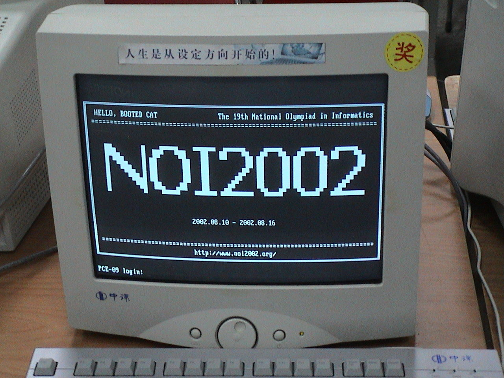
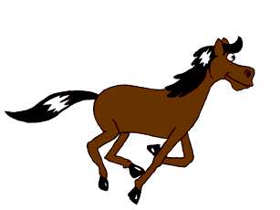
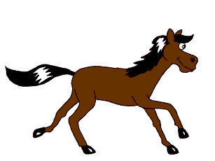
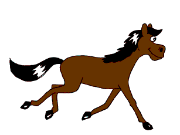

Opening a Window - Demo 01
==========================

Purpose
^^^^^^^

Learn how to open a window, make a black screen, and close
the window.

.. figure:: _static/screenshots/demo01.png
    :align: center
    :alt: Demo 01
    :figclass: align-center

    Demo 01

How to Execute
^^^^^^^^^^^^^^

On Linux or on MacOS, in a command prompt, type "python src/demo01/demo.py".
On Windows, in a command prompt, type "python src\\demo01\\demo.py".

Terminology
^^^^^^^^^^^

The device attached to a computer which displays information to the user is called a *monitor*.

    Computer Monitor

The monitor is composed of a two-dimensional array of light-emitting elements, each called a *pixel*, typically
composed of 3 components, red, green, and blue.

.. figure:: _static/ccbysa3.0/wikipedia-Kprateek88/Closeup_of_pixels.JPG
    :align: center
    :alt: Picture of Pixel
    :figclass: align-center

    Pixels

At a given time, each individual pixel is instructed by the computer to display
one specific color, represented within the computer as a number.
The aggregate of the colors at each pixel at one moment in time, called a *frame*,
provides a picture that has some meaning to the human user.
In OpenGL, the bottom left pixel of a window is coordinate (0,0).  The top right is (window_width,window_height)

.. figure:: _static/monitor.png
    :align: center
    :alt: 1024x768 monitor
    :figclass: align-center

    1024x768 monitor

.. figure:: _static/monitor2.png
    :align: center
    :alt: 1920x1200 monitor
    :figclass: align-center

    1920x1200 monitor

Frames are created within the computer and sent to the monitor
at a rate over time, called the *framerate*,
measured in *Hertz*.  By updating frames quickly and at a constant rate, the computer
provides the end-user with the illusion of motion.

.. figure:: _static/ccbysa2.5/wikipedia-Janke/Animhorse.gif
    :align: center
    :alt: Motion
    :figclass: align-center

    14 Hertz Motion

.. figure:: _static/ccbysa2.5/wikipedia-Janke/GIF_Frame-1.png
    :align: center
    :alt: Motion
    :figclass: align-center

.. figure:: _static/ccbysa2.5/wikipedia-Janke/GIF_Frame-2.png
    :align: center
    :alt: Motion
    :figclass: align-center

.. figure:: _static/ccbysa2.5/wikipedia-Janke/GIF_Frame-3.png
    :align: center
    :alt: Motion
    :figclass: align-center

.. figure:: _static/ccbysa2.5/wikipedia-Janke/GIF_Frame-5.png
    :align: center
    :alt: Motion
    :figclass: align-center

Code
^^^^

That's enough terms for now, let's get on to a working program!

Importing Libraries
~~~~~~~~~~~~~~~~~~~

Import Python modules, which are Python programmer's main form of libraries.

.. literalinclude:: ../src/demo01/demo.py
   :language: python
   :linenos:
   :lineno-start: 21
   :lines: 21

*  sys is imported, all function calls will be written as sys.function

.. literalinclude:: ../src/demo01/demo.py
   :language: python
   :linenos:
   :lineno-start: 22
   :lines: 22

*  basic operating system functions

.. literalinclude:: ../src/demo01/demo.py
   :language: python
   :linenos:
   :lineno-start: 23
   :lines: 23

*  numpy is a fast math/matrix library.

.. literalinclude:: ../src/demo01/demo.py
   :language: python
   :linenos:
   :lineno-start: 24
   :lines: 24

*  basic math utilities

.. literalinclude:: ../src/demo01/demo.py
   :language: python
   :linenos:
   :lineno-start: 25
   :lines: 25

* here, we are importing OpenGL's submodule GL
  into the current namespace, and we can call its functions
  without the OpenGL.GL prefix

.. literalinclude:: ../src/demo01/demo.py
   :language: python
   :linenos:
   :lineno-start: 26
   :lines: 26

* GLFW is a library which allows us to create windows, get keyboard and
  mouse input, on Linux, Windows, and MacOS

On a Python prompt, you can use tab-complete to see which functions
are defined on a module.  you can also type help(modulename) (q is
used to quit out of the pager).  help works on any object, including modules.

Opening A Window
~~~~~~~~~~~~~~~~

Desktop operating systems allow the user to run more than one
program at a time, where each program draws into a subsection of
the monitor called a window.

.. figure:: _static/ccbysa3.0/wikipedia-Shmuel\ Csaba\ Otto\ Traian/1920px-Window_(windowing_system).svg.png
    :align: center
    :alt: Window
    :figclass: align-center

    Window

To create and to open a window in a cross-platform manner, this
book will call procedures provided by the widely-ported GLFW library (supporting Windows, macOS, Linux).
GLFW also provides procedures for receiving
keyboard input and for controller.

GLFW/OpenGL Initialization
~~~~~~~~~~~~~~~~~~~~~~~~~~

Initialize GLFW.
&&&&&&&&&&&&&&&&

.. literalinclude:: ../src/demo01/demo.py
   :language: python
   :linenos:
   :lineno-start: 29
   :lines: 29-30

Set the version of OpenGL
&&&&&&&&&&&&&&&&&&&&&&&&&

OpenGL has been around a long time, and has multiple, possibly incompatible versions.
For this demo, we use OpenGL 1.4.  By the end of this book, we will be using OpenGL 3.3.

.. literalinclude:: ../src/demo01/demo.py
   :language: python
   :linenos:
   :lineno-start: 32
   :lines: 32-33

Create a Window
&&&&&&&&&&&&&&&

.. literalinclude:: ../src/demo01/demo.py
   :language: python
   :linenos:
   :lineno-start: 35
   :lines: 35

.. literalinclude:: ../src/demo01/demo.py
   :language: python
   :linenos:
   :lineno-start: 37
   :lines: 37-39

*  If GLFW cannot open the window, quit.  Unlike MC Hammer, we are quite legit, yet still
   able to quit.

.. literalinclude:: ../src/demo01/demo.py
   :language: python
   :linenos:
   :lineno-start: 41
   :lines: 41

* Make the window's context current.  The details of this do not matter
  for this book.

.. literalinclude:: ../src/demo01/demo.py
   :language: python
   :linenos:
   :lineno-start: 44
   :lines: 44-49

* Define an register a key handler.

Functions are first class values in Python, and are objects just
like anything else.  The can be passed as arguments, stored in argument,
and evaluated later zero, 1, or more times.

.. code:: Python

      >>> def doubler(x):
      ...     return x * 2
      ...
      >>> def add_five_to_result_of(f, x):
      ...     return 5 + f(x)
      ...
      >>> add_five_to_result_of(doubler, 3)
      11

.. literalinclude:: ../src/demo01/demo.py
   :language: python
   :linenos:
   :lineno-start: 51
   :lines: 51

* Before a frame is drawn, it is first turned into a blank slate,
  where the color of each pixel is set to some value representing a
  color.  Calling "glClearColor" "0,0,0,1", means black "0,0,0", without
  transparency (the "1").

.. literalinclude:: ../src/demo01/demo.py
   :language: python
   :linenos:
   :lineno-start: 53
   :lines: 53-56

* Don't worry about the 4 lines here.  Although they are necessary,
  we will cover them in depth later.  After all, this
  book is called ModelViewProjection. :-)

The Event Loop
~~~~~~~~~~~~~~

When you pause a movie, motion stops and you see one picture.
Movies are composed of sequence of pictures, when
rendered in quick succession, provide the illusion of motion.
Interactive computer graphics are rendered the same way,
one "frame" at a time.

Render a frame, flush the complete frame to the monitor.
Until the user closes the window, or the program needs
to terminate, repeat indefinitely.

.. literalinclude:: ../src/demo01/demo.py
   :language: python
   :linenos:
   :lineno-start: 59
   :lines: 59-67

* On line 60, poll the operating system for any events, such as mouse movements,
  keyboard input, etc.  This does not handle them, just registers
  them as having happened.

* On line 62, get the size of the framebuffer.  The *framebuffer*
  contains data representing all the pixels in a complete video frame.
  Python
  allows the returning of multiple values
  in the form of a tuple.  Assigning
  to the variables this way is a form of "destructuring"

* On line 63, tell OpenGL that we wish to draw in the entire
  framebuffer, from the bottom left corner to the upper
  right corner.

* On line 64, since the frame is about to be drawn, make it a blank slate.
  The color of each pixel will be the clear color, which we had set on line 51.
  Programming in OpenGL is a bit different than normal programming in
  a normal language,
  in that individual function calls do not complete self-contained tasks,
  as subroutines typically do.
  Instead, the procedure calls to OpenGL functions only make sense based off of the context
  in which they are evaluated, and the sequence of OpenGL calls
  to complete a task.

* On Line 65, we are done with the frame, flush the frame to
  the monitor, and swap the back and front buffers.

One frame is created incrementally at a time on the CPU, but the frame
is sent to the monitor
only when frame is completely drawn, and each pixel has a color.
The act of sending the frame to the monitor is called *flushing*
the frame.

OpenGL has two *framebuffers* (regions of memory which will eventually
contain the full data for a frame),
only one of which is "active", or writable, at a given time.
"glfwSwapBuffers" initiates the flushing
the current buffer, and which switches the current writable framebuffer to the
other one.

Black Screen
^^^^^^^^^^^^

Type "python src/demo01/demo.py", or "python3 src/demo01/demo.py" to run.

The first demo is the least interesting graphical program possible.

#. Sets the color at every pixel black.  (A constant color is better than whatever
   color happened to be the previous time it was drawn.)

#. If the user resized the window, reset OpenGL's mappings from *normalized-device-coordinates*
   to *screen-coordinates*.

#. Cleared the depth buffer (don't worry about this for now).

When this code returns, the event loop flushes (i.e) sends the frame to the monitor.  Since
no geometry was drawn, the color value for each pixel is still black.

Each color is represented by a number, so the frame is something like this, where 'b' represents black ::

    bbbbbbbbbbbbbbbbbbbbbbbbbbbbbbbbbbbbb
    bbbbbbbbbbbbbbbbbbbbbbbbbbbbbbbbbbbbb
    bbbbbbbbbbbbbbbbbbbbbbbbbbbbbbbbbbbbb
    bbbbbbbbbbbbbbbbbbbbbbbbbbbbbbbbbbbbb
    bbbbbbbbbbbbbbbbbbbbbbbbbbbbbbbbbbbbb
    bbbbbbbbbbbbbbbbbbbbbbbbbbbbbbbbbbbbb
    bbbbbbbbbbbbbbbbbbbbbbbbbbbbbbbbbbbbb
    bbbbbbbbbbbbbbbbbbbbbbbbbbbbbbbbbbbbb
    bbbbbbbbbbbbbbbbbbbbbbbbbbbbbbbbbbbbb
    bbbbbbbbbbbbbbbbbbbbbbbbbbbbbbbbbbbbb
    bbbbbbbbbbbbbbbbbbbbbbbbbbbbbbbbbbbbb
    bbbbbbbbbbbbbbbbbbbbbbbbbbbbbbbbbbbbb

The event loop then calls this code over and over again, and since we retain no state and
we draw nothing, a black screen will be displayed every frame until the user
closes the window, and says to himself, "why did I buy Doom 3"?
