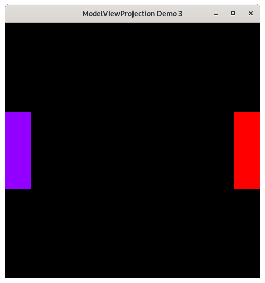

..
   Copyright (c) 2018-2021 William Emerison Six

   Permission is hereby granted, free of charge, to any person obtaining a copy
   of this software and associated documentation files (the "Software"), to deal
   in the Software without restriction, including without limitation the rights
   to use, copy, modify, merge, publish, distribute, sublicense, and/or sell
   copies of the Software, and to permit persons to whom the Software is
   furnished to do so, subject to the following conditions:

   The above copyright notice and this permission notice shall be included in all
   copies or substantial portions of the Software.

   THE SOFTWARE IS PROVIDED "AS IS", WITHOUT WARRANTY OF ANY KIND, EXPRESS OR
   IMPLIED, INCLUDING BUT NOT LIMITED TO THE WARRANTIES OF MERCHANTABILITY,
   FITNESS FOR A PARTICULAR PURPOSE AND NONINFRINGEMENT. IN NO EVENT SHALL THE
   AUTHORS OR COPYRIGHT HOLDERS BE LIABLE FOR ANY CLAIM, DAMAGES OR OTHER
   LIABILITY, WHETHER IN AN ACTION OF CONTRACT, TORT OR OTHERWISE, ARISING FROM,
   OUT OF OR IN CONNECTION WITH THE SOFTWARE OR THE USE OR OTHER DEALINGS IN THE
   SOFTWARE.

Window Resizing and Proportionality - Demo 03
=============================================

Problem With Previous Demo
^^^^^^^^^^^^^^^^^^^^^^^^^^

Run Demo 2 again, but resize the window; first make it skinny,
and then wide.  Look at what happens to the rectangles.

    Demo 03

How to Execute
^^^^^^^^^^^^^^

On Linux or on MacOS, in a shell, type "python src/demo03/demo.py".
On Windows, in a command prompt, type "python src\\demo03\\demo.py".

Purpose
^^^^^^^

Modify the previous demo, so that if the user resizes the window
of the OpenGL program, that the picture does not become distorted.

Create procedure to ensure proportionality.

Keeping the Paddles Proportional
^^^^^^^^^^^^^^^^^^^^^^^^^^^^^^^^

In the previous demo, if the user resized the window, the paddles appear distorted,
as they were shrunk in one direction if the window became too thin or too fat.

.. figure:: _static/disproportionate1.png
    :align: center
    :alt: Yuck
    :figclass: align-center

    Yuck

.. figure:: _static/disproportionate2.png
    :align: center
    :alt: Yuck
    :figclass: align-center

    Yuck

Assume that this is a problem for the application we are making, how could
we solve it and keep proportionality regardless of the dimensions of the window?
Ideally, we would like to draw our paddles with
a black background within a square region in the center of the window, regardless of the dimensions
of the window.

OpenGL has a solution for us.  The *viewport* is a rectangular region contained
within the window into which OpenGL will render.  By specifing a viewport, OpenGL
will convert the normalized-device-coordinates
to the sub-window space of the viewport, instead of the whole
window.

.. figure:: _static/viewport.png
    :align: center
    :alt: Nice
    :figclass: align-center

    Nice

.. figure:: _static/demo03.png
    :align: center
    :alt: Demo 03
    :figclass: align-center

    Demo 03

Because we will only draw in a subset of the window, and because all subsequent
chapters will use this functionality, I have created a procedure for use
in all chapters. "draw_in_square_viewport" is a function.

Code
^^^^

GLFW/OpenGL Initialization
~~~~~~~~~~~~~~~~~~~~~~~~~~

The setup code is the same as the previous demo's setup.  Initialize GLFW.  Set the OpenGL version.
Create the window.  Set a key handler for closing.
Execute the event/drawing loop.  The only code showed in this book will be the relevant parts.
Consult the python source for the full, working code.

Set to Draw in Square Subsection Of Window
&&&&&&&&&&&&&&&&&&&&&&&&&&&&&&&&&&&&&&&&&&

.. literalinclude:: ../src/demo03/demo.py
   :language: python
   :linenos:
   :lineno-start: 57
   :lines: 57

* declare a function to configure OpenGL to draw only in a square subset of the monitor, i.e. the viewport

.. literalinclude:: ../src/demo03/demo.py
   :language: python
   :linenos:
   :lineno-start: 59
   :lines: 59-60

* set the clear color to be gray.  clear the color of every pixel in the whole frame buffer, not just the viewport

.. literalinclude:: ../src/demo03/demo.py
   :language: python
   :linenos:
   :lineno-start: 62
   :lines: 62-64

* figure out the minimum dimension of the window

.. literalinclude:: ../src/demo03/demo.py
   :language: python
   :linenos:
   :lineno-start: 66
   :lines: 66-72

* Enable the scissor test
* the scissor test allows us to specify a region
  of the framebuffer into which the opengl operations
  will apply.  In this case, the color in every pixel in the framebuffer is gray.
  By calling glScissor, we are setting a value in each fragment (i.e., pixel) on a square
  region of pixels to be true (and false everywhere else) which means "only do the opengl call on these fragments,
  ignore the others".
  As we will learn later, OpenGL stores much more information
  per fragment (i.e. pixel) than just it's current color.

* Look at the image above of NDC superimposed on Screen Space.  From this,
  the arguments sent to glScissor should be clear.

.. literalinclude:: ../src/demo03/demo.py
   :language: python
   :linenos:
   :lineno-start: 74
   :lines: 74-75

*  glClear will only update the square to black values.

.. literalinclude:: ../src/demo03/demo.py
   :language: python
   :linenos:
   :lineno-start: 76
   :lines: 76

* disable the scissor test, so now any opengl calls will
  happen as usual.

So we've drawn gray into a square, but any subsequent OpenGL calls
will still be drawn into the full framebuffer, as the viewport is
still set to the whole framebuffer.  But, we only want to draw within the black square.
We set the viewport again, so that the NDC coordinates
will be mapped the the region of screen coordinates
that we care about, which is the black square.

.. literalinclude:: ../src/demo03/demo.py
   :language: python
   :linenos:
   :lineno-start: 78
   :lines: 78-83

The Event Loop
&&&&&&&&&&&&&&

The event loop is just like the previous demo,
but this time we call the procedure to
ensure that we only draw in a square subset of
the window.

.. literalinclude:: ../src/demo03/demo.py
   :language: python
   :linenos:
   :lineno-start: 86
   :lines: 86-91

.. literalinclude:: ../src/demo03/demo.py
   :language: python
   :linenos:
   :lineno-start: 93
   :lines: 93

* The event loop is the same as the previous demo, except
  that we call draw_in_square_viewport every frame at the beginning.

.. literalinclude:: ../src/demo03/demo.py
   :language: python
   :linenos:
   :lineno-start: 95
   :lines: 95-112
