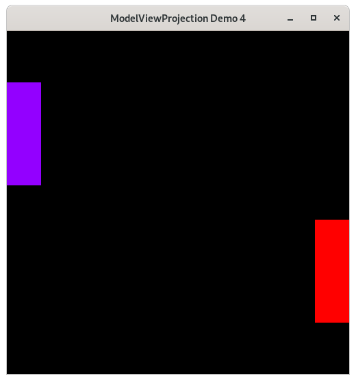

..
   Copyright (c) 2018-2021 William Emerison Six

   Permission is hereby granted, free of charge, to any person obtaining a copy
   of this software and associated documentation files (the "Software"), to deal
   in the Software without restriction, including without limitation the rights
   to use, copy, modify, merge, publish, distribute, sublicense, and/or sell
   copies of the Software, and to permit persons to whom the Software is
   furnished to do so, subject to the following conditions:

   The above copyright notice and this permission notice shall be included in all
   copies or substantial portions of the Software.

   THE SOFTWARE IS PROVIDED "AS IS", WITHOUT WARRANTY OF ANY KIND, EXPRESS OR
   IMPLIED, INCLUDING BUT NOT LIMITED TO THE WARRANTIES OF MERCHANTABILITY,
   FITNESS FOR A PARTICULAR PURPOSE AND NONINFRINGEMENT. IN NO EVENT SHALL THE
   AUTHORS OR COPYRIGHT HOLDERS BE LIABLE FOR ANY CLAIM, DAMAGES OR OTHER
   LIABILITY, WHETHER IN AN ACTION OF CONTRACT, TORT OR OTHERWISE, ARISING FROM,
   OUT OF OR IN CONNECTION WITH THE SOFTWARE OR THE USE OR OTHER DEALINGS IN THE
   SOFTWARE.

Moving the Paddles - Keyboard Input - Demo 04
=============================================

Purpose
^^^^^^^

Add movement to the paddles using keyboard input.

    Demo 04

How to Execute
^^^^^^^^^^^^^^

On Linux or on MacOS, in a command prompt, type "python src/demo04/demo.py".
On Windows, in a command prompt, type "python src\\demo04\\demo.py".

Move the Paddles using the Keyboard
^^^^^^^^^^^^^^^^^^^^^^^^^^^^^^^^^^^

==============  ======================
Keyboard Input  Action
==============  ======================
*w*             Move Left Paddle Up
*s*             Move Left Paddle Down
*k*             Move Right Paddle Down
*i*             Move Right Paddle Up
==============  ======================

Paddles which don't move are quite boring.  Let's make them move up or down
by getting keyboard input.

And while we are at it, let's go ahead and create data structures for a Vertex,
and for the collection of verticies that make up a Paddle.

Code
^^^^

Data Structures
~~~~~~~~~~~~~~~

Here we use dataclasses_, which allow use to have the constructor, getters and setters, and pretty-printer,
auto-generated for us.

.. _dataclasses: https://www.youtube.com/watch?v=vRVVyl9uaZc

.. literalinclude:: ../src/demo04/demo.py
   :language: python
   :linenos:
   :lineno-start: 87
   :lines: 87-90

.. literalinclude:: ../src/demo04/demo.py
   :language: python
   :linenos:
   :lineno-start: 93
   :lines: 93-98

Although Python is a dynamically-typed language, we can add type information as helpful hints to the reader,
and for use with static type-checking tools for Python, such as `mypy`_.

.. _mypy: http://mypy-lang.org/

.. literalinclude:: ../src/demo04/demo.py
   :language: python
   :linenos:
   :lineno-start: 101
   :lines: 101-118

* Create two instances of a Paddle.

I make heavy use of `keyword arguments`_ in Python.

.. _keyword arguments: https://www.pythontutorial.net/python-basics/python-keyword-arguments/

Apply User Input
~~~~~~~~~~~~~~~~

.. literalinclude:: ../src/demo04/demo.py
   :language: python
   :linenos:
   :lineno-start: 121
   :lines: 121-134

- If 's' is pressed this frame, subtract 0.1 from the y component of each of
  the vertices in the paddle. If the
  key continues to be held down over time, this value will continue to decrease.
- If 'w' is pressed this frame, add 0.1 more to the y component of each of
  the vertices in the paddle
- If 'k' is pressed this frame, subtract 0.1.
- If 'i' is pressed this frame, add 0.1 more.

* when writing to global variables within a nested scope,
  you need to declare their scope as global at the top of the nested scope.

The Event Loop
~~~~~~~~~~~~~~

Monitors can have variable framerates, and in order to ensure
that movement is consistent across different monitors, we choose
to only flush the screen at 60 hertz (frames per second).

.. literalinclude:: ../src/demo04/demo.py
   :language: python
   :linenos:
   :lineno-start: 137
   :lines: 137-139

.. literalinclude:: ../src/demo04/demo.py
   :language: python
   :linenos:
   :lineno-start: 142
   :lines: 142-149

.. literalinclude:: ../src/demo04/demo.py
   :language: python
   :linenos:
   :lineno-start: 151
   :lines: 151-155

.. literalinclude:: ../src/demo04/demo.py
   :language: python
   :linenos:
   :lineno-start: 157
   :lines: 157-172

* on line 163, while rendering, we now loop over the verticies of the paddle.
  The paddles may be displaced from their original position that was hardcoded,
  as the callback may have updated the values based off of the user input.

.. literalinclude:: ../src/demo04/demo.py
   :language: python
   :linenos:
   :lineno-start: 174
   :lines: 174

* When glVertex is now called, we are not directly
  passing numbers into it, but instead we are getting
  the numbers from the data structures of Paddle and its
  associated vertcies.

.. figure:: _static/plot3.png
    :align: center
    :alt: Adding input offset
    :figclass: align-center

    Adding input offset to Paddle 1

.. figure:: _static/plot4.png
    :align: center
    :alt: Adding input offset to Paddle 1
    :figclass: align-center

    Adding input offset to Paddle 2
