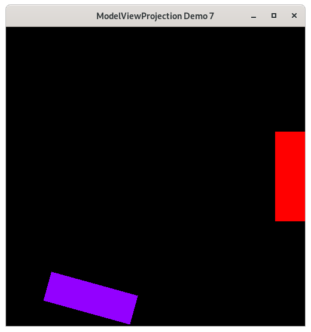
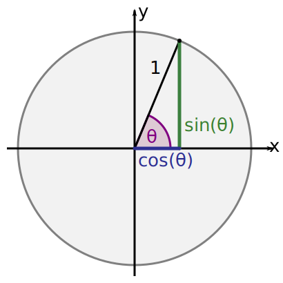

..
   Copyright (c) 2018-2023 William Emerison Six

   Permission is hereby granted, free of charge, to any person obtaining a copy
   of this software and associated documentation files (the "Software"), to deal
   in the Software without restriction, including without limitation the rights
   to use, copy, modify, merge, publish, distribute, sublicense, and/or sell
   copies of the Software, and to permit persons to whom the Software is
   furnished to do so, subject to the following conditions:

   The above copyright notice and this permission notice shall be included in all
   copies or substantial portions of the Software.

   THE SOFTWARE IS PROVIDED "AS IS", WITHOUT WARRANTY OF ANY KIND, EXPRESS OR
   IMPLIED, INCLUDING BUT NOT LIMITED TO THE WARRANTIES OF MERCHANTABILITY,
   FITNESS FOR A PARTICULAR PURPOSE AND NONINFRINGEMENT. IN NO EVENT SHALL THE
   AUTHORS OR COPYRIGHT HOLDERS BE LIABLE FOR ANY CLAIM, DAMAGES OR OTHER
   LIABILITY, WHETHER IN AN ACTION OF CONTRACT, TORT OR OTHERWISE, ARISING FROM,
   OUT OF OR IN CONNECTION WITH THE SOFTWARE OR THE USE OR OTHER DEALINGS IN THE
   SOFTWARE.

Rotations - Demo 07
===================

Purpose
^^^^^^^

Attempt to rotate the paddles around their center.
Learn about rotations.  This demo does not
work correctly, because of a misunderstanding
of how to interprete a sequence of transformations.

    Demo 07

How to Execute
^^^^^^^^^^^^^^

On Linux or on MacOS, in a shell, type "python src/demo07/demo.py".
On Windows, in a command prompt, type "python src\\demo07\\demo.py".

Move the Paddles using the Keyboard
^^^^^^^^^^^^^^^^^^^^^^^^^^^^^^^^^^^

==============  ================================
Keyboard Input  Action
==============  ================================
*w*             Move Left Paddle Up
*s*             Move Left Paddle Down
*k*             Move Right Paddle Down
*i*             Move Right Paddle Up

*d*             Increase Left Paddle's Rotation
*a*             Decrease Left Paddle's Rotation
*l*             Increase Right Paddle's Rotation
*j*             Decrease Right Paddle's Rotation
==============  ================================

..
   TODO -- discuss method chaining

For another person's explanation of the trigonometry_ of rotating in 2D,
see

.. _trigonometry: https://www.alanzucconi.com/2016/02/03/2d-rotations/

Rotate the Paddles About their Center
^^^^^^^^^^^^^^^^^^^^^^^^^^^^^^^^^^^^^

Besides translate and scale, the third main operation in computer
graphics is to rotate an object.

Rotation Around Origin (0,0)
^^^^^^^^^^^^^^^^^^^^^^^^^^^^

We can rotate an object around (0,0) by rotating
all of the object's vertices around (0,0).

.. figure:: _static/rotate0.gif
    :align: center
    :alt: Rotate
    :figclass: align-center

    Rotate

In high school math, you will have learned about sin, cos, and tangent.
Typically the angles are described on the unit circle, where a rotation
starts from the positive x axis.

.. figure:: _static/cc0/Stephan_Kulla/Sinus_und_Kosinus_am_Einheitskreis_1.svg
    :align: center
    :alt: Demo 07
    :figclass: align-center

We can expand on this knowledge, allowing
us to rotate a given vertex, wherever it is, around the origin (0,0).  This is done
by separating the x and y value, rotating each component seperately,
and then adding the results together.

That might not have been fully clear.  Let me try again.
The vertex (0.5,0.4) can be separated into two vertices, (0.5,0) and (0,0.4).

.. figure:: _static/rotate3.png
    :align: center
    :alt: Rotate
    :figclass: align-center

    Rotate

.. figure:: _static/rotate4.png
    :align: center
    :alt: Rotate
    :figclass: align-center

    Rotate

These vertices can be added together to create the original vertex.
But, before we do that, let's rotate each of the vertices.

(0.5,0) is on the x-axis, so rotating it by "angle" degrees, results
in vertex (0.5*cos(angle), 0.5*sin(angle)).  This is high school
geometry, and won't be explained here in detail.

.. figure:: _static/rotate.png
    :align: center
    :alt: Rotate
    :figclass: align-center

    Rotate the x component.

But what may not be obvious, is what happens to the y component?
Turns out, it's easy.  Just rotate your point of view, and it's
the same thing, with one minor difference, in that the x value
is negated.

.. figure:: _static/rotate2.png
    :align: center
    :alt: Rotate
    :figclass: align-center

    Rotate the y component

.. figure:: _static/cc0/Stephan_Kulla/Sinus_und_Kosinus_am_Einheitskreis_3.svg
    :align: center
    :alt: Demo 07
    :figclass: align-center

(0,0.4) is on the y-axis, so rotating it by "angle" degrees, results
in vertex (0.4*-sin(angle), 0.4*cos(angle)).

Wait.  Why is negative sin applied to the angle to make the x value,
and cos applied to angle to make the y value?  It's because positive
1 unit on the x axis goes downwards.  The top of the plot is in
units of -1.

After the rotations have been applied, sum the results to
get your vertex rotated around the origin!

(0.5*cos(angle), 0.5*sin(angle)) + (0.4*-sin(angle), 0.4*cos(angle)) =
(0.5*cos(angle) + 0.4*-sin(angle), 0.5*sin(angle) + 0.4*cos(angle))

.. LINENOS ../src/demo07/demo.py 0650dc123c5604096222ab7f34523251869be0e3

* Note the definition of rotate, from the description above.
  cos and sin are defined in the math module.

.. LINENOS ../src/demo07/demo.py cf32927e5bb15098767fad214706f03ddfe49a1c

* a rotation instance variable is defined, with a default value of 0

.. LINENOS ../src/demo07/demo.py 1cf68248b869564df5f3133b98adb2e06601ed3b

Cayley Graph
^^^^^^^^^^^^

.. figure:: _static/demo06.png
    :align: center
    :alt: Demo 06
    :figclass: align-center

Code
^^^^

The Event Loop
~~~~~~~~~~~~~~

.. LINENOS ../src/demo07/demo.py 67ffd7b7adc42d01ca93bacdef858c0d4b678e38

So to rotate paddle 1 about its center,
we should translate to its position, and then rotate
around the paddle's center.

.. LINENOS ../src/demo07/demo.py 4ae8b0ebe66cd4de6b0150ac5cd4fa92abdd9985

.. math::

    \vec{f}_{p1}^{w}

.. LINENOS ../src/demo07/demo.py 1699ece7b62ace3842c391a972f2d27c5e022993

.. math::

    \vec{f}_{w}^{ndc}

.. LINENOS ../src/demo07/demo.py ff2784cf4a98bfbaa9a63073ec0b915197f34c5d

.. LINENOS ../src/demo07/demo.py 46159451e06ea71fbb3fc270b01f3b755a06040c

::

    ...

Likewise, to rotate paddle 2 about its center,
we should translate to its position, and then rotate
around the paddle's center.

.. LINENOS ../src/demo07/demo.py dd17b8cf2992da4f0752dd3f54dba416a5f04d64

.. math::

    \vec{f}_{p2}^{w}

.. LINENOS ../src/demo07/demo.py 2bfcc6ef8f40e5cd45e7f921e9978db7184b860c

.. math::

    \vec{f}_{w}^{ndc}

.. LINENOS ../src/demo07/demo.py 0ae0fb2528f9b972bdb4901b83e93f63266e2ed7

.. LINENOS ../src/demo07/demo.py 696e8248badabab740bf65566030cf31d8bae2f2

Why it's Wrong
^^^^^^^^^^^^^^

Turns out, our program doesn't work as predicted, even though
translate, scale, and rotate are all defined correctly.  The paddles
are not rotating around their center.

Let's take a look in detail about what our paddlespace to
world space transformations are doing.

.. LINENOS ../src/demo07/demo.py 1699ece7b62ace3842c391a972f2d27c5e022993

.. figure:: _static/incorrectrotate-forwards.gif
    :align: center
    :alt:
    :figclass: align-center

    Not what we wanted

* Modelspace vertices

.. figure:: _static/incorrectrotate-forwards-1.png
    :align: center
    :alt:
    :figclass: align-center

* Translate

.. figure:: _static/incorrectrotate-forwards-2.png
    :align: center
    :alt:
    :figclass: align-center

* Reset the coordinate system

.. figure:: _static/incorrectrotate-forwards-3.png
    :align: center
    :alt:
    :figclass: align-center

    Modelspace

* Rotate around World Spaces's origin

.. figure:: _static/incorrectrotate-forwards-4.png
    :align: center
    :alt:
    :figclass: align-center

    Modelspace

* Reset the coordinate system

.. figure:: _static/incorrectrotate-forwards-5.png
    :align: center
    :alt:
    :figclass: align-center

    Modelspace

* Final world space coordinates

.. figure:: _static/incorrectrotate-forwards-6.png
    :align: center
    :alt:
    :figclass: align-center

    Modelspace

So then what the heck are we supposed to do in order to
rotate around an object's center?  The next section
provides a solution.
