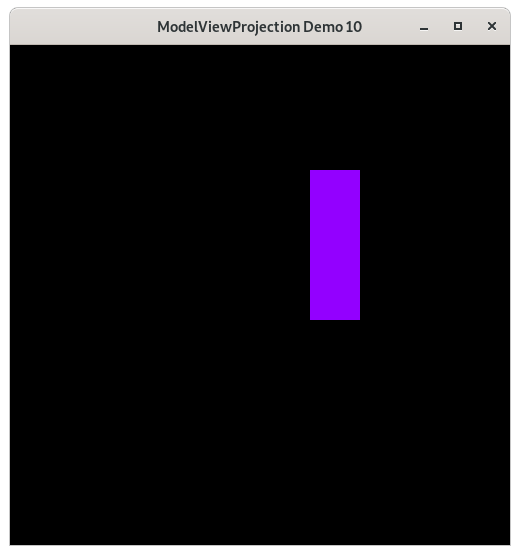

Camera Space - Demo 10
======================

Purpose
^^^^^^^

Demonstrate having a camera space, and how to think about the transformations
differently.

    Demo 10

How to Execute
^^^^^^^^^^^^^^

On Linux or on MacOS, in a command prompt, type "python src/demo10/demo.py".
On Windows, in a command prompt, type "python src\\demo10\\demo.py".

Move the Paddles using the Keyboard
^^^^^^^^^^^^^^^^^^^^^^^^^^^^^^^^^^^

==============  ==============================================
Keyboard Input  Action
==============  ==============================================
*w*             Move Left Paddle Up
*s*             Move Left Paddle Down
*k*             Move Right Paddle Down
*i*             Move Right Paddle Up

*d*             Increase Left Paddle's Rotation
*a*             Decrease Left Paddle's Rotation
*l*             Increase Right Paddle's Rotation
*j*             Decrease Right Paddle's Rotation

*UP*            Move the camera up, moving the objects down
*DOWN*          Move the camera down, moving the objects up
*LEFT*          Move the camera left, moving the objects right
*RIGHT*         Move the camera right, moving the objects left

==============  ==============================================

Description
^^^^^^^^^^^

..
   TODO -- add in a DFA of the camera space, add in decent description

camera space.  The coordinates of the object relative to
the camera.  Notice that the translation from world space
to camera space is the negative value of the camera's x and
y position.

If you view the camera as fixed, where NDC is relative to it,
the world has moved in the opposite direction of the camera.
If you view the camera space as being defined relative to
world space, then we need to put the origin of the camera
space at the origin of the world space, and as such,
the transformations needed to be applied to the data
are the inverse of the tranforamiotns from world
space to camera space.

Cayley Graph
^^^^^^^^^^^^

.. figure:: _static/demo10.png
    :align: center
    :alt: Demo 10
    :figclass: align-center

    Demo 10

.. figure:: _static/demo10-2.png
    :align: center
    :alt: Demo 10
    :figclass: align-center

    Demo 10

Code
^^^^

.. literalinclude:: ../src/demo10/demo.py
   :language: python
   :linenos:
   :lineno-start: 144
   :lines: 144-154

.. literalinclude:: ../src/demo10/demo.py
   :language: python
   :linenos:
   :lineno-start: 156
   :lines: 156-167

::

    ...

The Event Loop
~~~~~~~~~~~~~~

.. literalinclude:: ../src/demo10/demo.py
   :language: python
   :linenos:
   :lineno-start: 213
   :lines: 213-222

::

    ...

.. literalinclude:: ../src/demo10/demo.py
   :language: python
   :linenos:
   :lineno-start: 224
   :lines: 224-233
