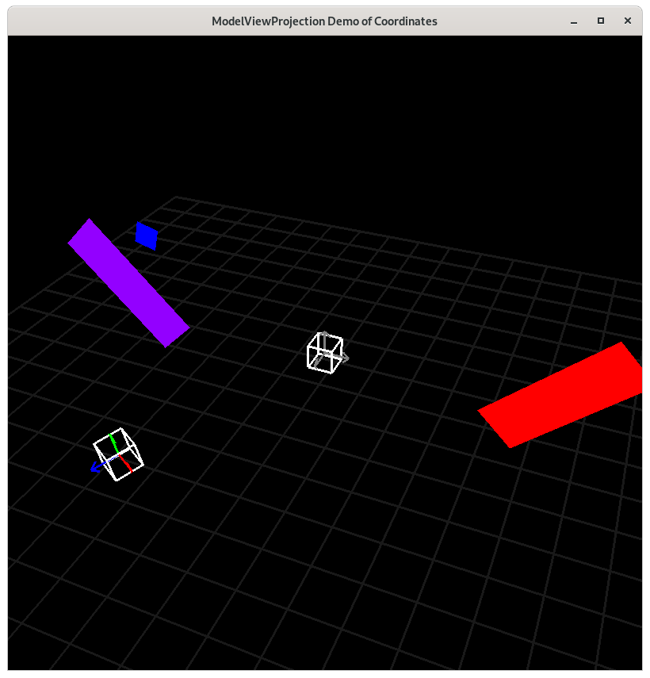

Camera Space - Demo 10
======================

Purpose
^^^^^^^

Graphical programs in which the viewer never "moves" are boring.
Model a virtual "camera", and let the user move the camera around
in the scene.  In this picture, notice that the purple paddle
is no longer on the left side of the screen, but towards the right,
horizontally.

.. figure:: _static/screenshots/demo10.png
    :align: center
    :alt: Demo 10
    :figclass: align-center

    Demo 10

How to Execute
^^^^^^^^^^^^^^

On Linux or on MacOS, in a command prompt, type "python src/demo10/demo.py".
On Windows, in a command prompt, type "python src\\demo10\\demo.py".

Move the Paddles using the Keyboard
^^^^^^^^^^^^^^^^^^^^^^^^^^^^^^^^^^^

==============  ==============================================
Keyboard Input  Action
==============  ==============================================
*w*             Move Left Paddle Up
*s*             Move Left Paddle Down
*k*             Move Right Paddle Down
*i*             Move Right Paddle Up

*d*             Increase Left Paddle's Rotation
*a*             Decrease Left Paddle's Rotation
*l*             Increase Right Paddle's Rotation
*j*             Decrease Right Paddle's Rotation

*UP*            Move the camera up, moving the objects down
*DOWN*          Move the camera down, moving the objects up
*LEFT*          Move the camera left, moving the objects right
*RIGHT*         Move the camera right, moving the objects left

==============  ==============================================

Description
^^^^^^^^^^^

"Camera space" means the coordinates of everything relative
to a camera, not relative to world space.

Camera space will be between world space and NDC, but
which way should the direction of the edge be?

It could be

* From world space to camera space.

.. figure:: _static/demo10.png
    :align: center
    :alt: Demo 10
    :figclass: align-center

    Demo 10

* From camera space to world space.

.. figure:: _static/demo10-2.png
    :align: center
    :alt: Demo 10
    :figclass: align-center

    Demo 10

Since the camera will be described relative to world space,
it makes more sense to use the latter, in which the directed edge
goes from camera space to world space.

Think about it this way.  Imagine you a driving.  Are you staying
in a constant position, and the wheels of your car rotate the entire
earth and solar system around yourself?  That's one way to look at
it, and the earth revolves around me too, but the math of it
is messy.
The math is easier if you describe your position as moving relative
to earth.

But this introduces a new problem.  Follow from the paddle's modelspace
to screen space.  Up until this demo, we've always been
following the directed edges.  This time, when going from world
space to camera space, we're moving in the opposite direction
of the edge.

Going against the direction
of an edge in a Cayley Graph means that we don't apply the function,
but instead we apply the inverse of the function.  This concept
comes from Group Theory in Abstract Algebra, the details of which won't
be discussed here.

Inverses
~~~~~~~~

Inverse Of Translate
&&&&&&&&&&&&&&&&&&&&

The inverse of

.. code:: Python

      >>> v.translate(x,y)

is

.. code:: Python

      >>> v.translate(-x,-y)

Inverse Of Rotate
&&&&&&&&&&&&&&&&&

The inverse of

.. code:: Python

      >>> v.rotate(theta)

is

.. code:: Python

      >>> v.rotate(-theta)

Inverse Of Scale
&&&&&&&&&&&&&&&&

The inverse of

.. code:: Python

      >>> v.scale(x,y)

is

.. code:: Python

      >>> v.scale(1.0/x,1.0/y)

Inverse Of Sequence Of Functions
&&&&&&&&&&&&&&&&&&&&&&&&&&&&&&&&

The inverse of a sequence of functions is the inverse of each function, applied in reverse order.

For the linear-algebra inclined reader,

.. math::
    \begin{equation}
    {(A * B)}^{-1}     = {B}^{-1}*{A}^{-1}
     \end{equation}

The inverse of

.. code:: Python

      >>> v.scale(x,y).translate(tx,tx)

is

.. code:: Python

      >>> v.translate(-tx,-tx).scale(1.0/x,1.0/y)

Think of it this way.  Find a little space, and look forward.
Keeping your eyes straight ahead, sidestep a few steps to the
left.  From your perspective, the objects in your room all moved
to the right.  Now, rotate your head to the right, keeping your eyes
looking directly in front of your head.  Which way did the room move?
Towards the left.

Unfortunately, the author doesn't have visualizations for this in 2D space.

    Camera is 3D space

Looking at the graph paper on the ground there, that's world space.
The camera gets placed in world space just like any other modelspace data.
In order to render from the camera's point of view, we need to get -1.0 to 1.0
box in all three dimensions to match the -1.0 to 1.0 box in world space.

Run "python mvpVisualization/demo3.py", and follow along with the Cayley
graph.  The camera will be placed like any other modelspace data, but then
the inverse of the transformations will be applied to all of the verticies.

Code
^^^^

.. literalinclude:: ../src/demo10/demo.py
   :language: python
   :linenos:
   :lineno-start: 144
   :lines: 144-154

.. literalinclude:: ../src/demo10/demo.py
   :language: python
   :linenos:
   :lineno-start: 156
   :lines: 156-167

::

    ...

The Event Loop
~~~~~~~~~~~~~~

.. literalinclude:: ../src/demo10/demo.py
   :language: python
   :linenos:
   :lineno-start: 213
   :lines: 213-218

The camera's position is at camera.x, camera.y.  So
apply the inverse of the camera's transformations
to paddle 1's vertices, i.e. translate with the negative
values.

.. literalinclude:: ../src/demo10/demo.py
   :language: python
   :linenos:
   :lineno-start: 219
   :lines: 219

.. literalinclude:: ../src/demo10/demo.py
   :language: python
   :linenos:
   :lineno-start: 220
   :lines: 220-222

::

    ...

.. literalinclude:: ../src/demo10/demo.py
   :language: python
   :linenos:
   :lineno-start: 224
   :lines: 224-229

The camera's position is at camera.x, camera.y.  So
apply the inverse of the camera's  transformations
to paddle 2's vertices, i.e. translate with the negative
values.

.. literalinclude:: ../src/demo10/demo.py
   :language: python
   :linenos:
   :lineno-start: 230
   :lines: 230

.. literalinclude:: ../src/demo10/demo.py
   :language: python
   :linenos:
   :lineno-start: 231
   :lines: 231-233
