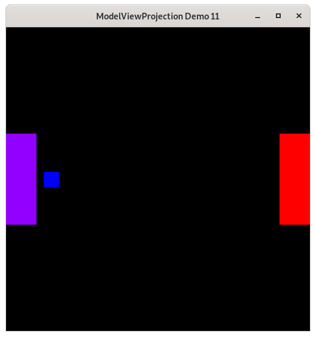
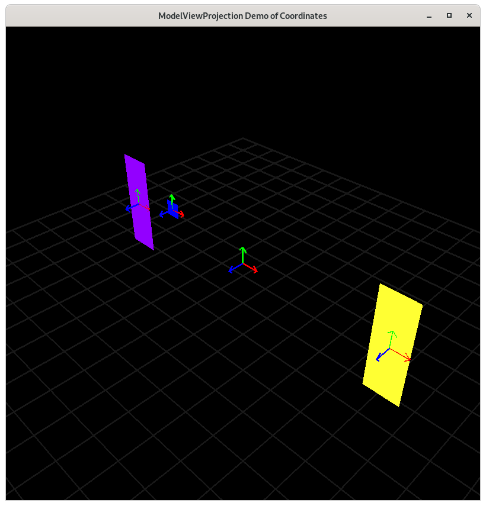

..
   Copyright (c) 2018-2021 William Emerison Six

   Permission is hereby granted, free of charge, to any person obtaining a copy
   of this software and associated documentation files (the "Software"), to deal
   in the Software without restriction, including without limitation the rights
   to use, copy, modify, merge, publish, distribute, sublicense, and/or sell
   copies of the Software, and to permit persons to whom the Software is
   furnished to do so, subject to the following conditions:

   The above copyright notice and this permission notice shall be included in all
   copies or substantial portions of the Software.

   THE SOFTWARE IS PROVIDED "AS IS", WITHOUT WARRANTY OF ANY KIND, EXPRESS OR
   IMPLIED, INCLUDING BUT NOT LIMITED TO THE WARRANTIES OF MERCHANTABILITY,
   FITNESS FOR A PARTICULAR PURPOSE AND NONINFRINGEMENT. IN NO EVENT SHALL THE
   AUTHORS OR COPYRIGHT HOLDERS BE LIABLE FOR ANY CLAIM, DAMAGES OR OTHER
   LIABILITY, WHETHER IN AN ACTION OF CONTRACT, TORT OR OTHERWISE, ARISING FROM,
   OUT OF OR IN CONNECTION WITH THE SOFTWARE OR THE USE OR OTHER DEALINGS IN THE
   SOFTWARE.

Relative Objects - Demo 11
==========================

Purpose
^^^^^^^

Introduce relative objects, by making a small blue square
that is defined relative to the left paddle, but offset
some in the x direction.
When the paddle on the left moves or rotates, the blue square
moves with it, because it is defined relative to it.

    Demo 11

How to Execute
^^^^^^^^^^^^^^

On Linux or on MacOS, in a command prompt, type "python src/demo11/demo.py".
On Windows, in a command prompt, type "python src\\demo11\\demo.py".

Move the Paddles using the Keyboard
^^^^^^^^^^^^^^^^^^^^^^^^^^^^^^^^^^^

==============  ==============================================
Keyboard Input  Action
==============  ==============================================
*w*             Move Left Paddle Up
*s*             Move Left Paddle Down
*k*             Move Right Paddle Down
*i*             Move Right Paddle Up

*d*             Increase Left Paddle's Rotation
*a*             Decrease Left Paddle's Rotation
*l*             Increase Right Paddle's Rotation
*j*             Decrease Right Paddle's Rotation

*UP*            Move the camera up, moving the objects down
*DOWN*          Move the camera down, moving the objects up
*LEFT*          Move the camera left, moving the objects right
*RIGHT*         Move the camera right, moving the objects left

==============  ==============================================

Description
^^^^^^^^^^^

Cayley Graph
^^^^^^^^^^^^

.. figure:: _static/demo11.png
    :align: center
    :alt: Demo 11
    :figclass: align-center

    Demo 11

    Coordinate Frames

Things to note.

#. When dealing with any object space to world space,
I recommend reading the order of transformations backwards,
imagining a moving origin, x and y axis.

#. Reading the code from world space to camera space requires
a different interpretation.  You can think of the camera
as being defined relative to world space, and you can develop
a mental model of the transformations in the same manner that
you would do for any object.  But, because NDC is going to
be defined relative to camera space, the transformations
that you need to apply to an object (paddle1, square 1, etc)
are the inverse of what you would do to the "camera".

#. We in looking at the code for the three objects we are drawing
you might notice that we are duplicating a lot of code, and
that if we decide to change paddle1's transformations, that
we would need to change the code in multiple places.
Later demos will show how to handle this problem more gracefully.

Code
^^^^

.. literalinclude:: ../src/demo11/demo.py
   :language: python
   :linenos:
   :lineno-start: 154
   :lines: 154-159

Event Loop
~~~~~~~~~~

.. code:: Python
   :number-lines:

     while not glfw.window_should_close(window):

         while (
             glfw.get_time() < time_at_beginning_of_previous_frame + 1.0 / TARGET_FRAMERATE
         ):
             pass

         time_at_beginning_of_previous_frame = glfw.get_time()

         glfw.poll_events()

         width, height = glfw.get_framebuffer_size(window)
         glViewport(0, 0, width, height)
         glClear(GL_COLOR_BUFFER_BIT | GL_DEPTH_BUFFER_BIT)

         draw_in_square_viewport()
         handle_inputs()

         glColor3f(paddle1.r, paddle1.g, paddle1.b)

         glBegin(GL_QUADS)
         for model_space in paddle1.vertices:
             world_space = (
                 model_space.rotate(paddle1.rotation)
                 .translate(tx=paddle1.initial_position.x, ty=paddle1.initial_position.y)
                 .translate(tx=paddle1.input_offset_x, ty=paddle1.input_offset_y)
             )

             camera_space = world_space.translate(tx=-camera_x, ty=-camera_y)
             ndc_space = camera_space.scale(scale_x=1.0 / 100.0, scale_y=1.0 / 100.0)
             glVertex2f(ndc_space.x, ndc_space.y)
         glEnd()

         # NEW - draw the square relative to paddle 1
         glColor3f(0.0, 0.0, 1.0)  # r  # g  # b
         glBegin(GL_QUADS)
         for model_space in square:
             # Translate the square to the right by 20 units.
             # We are dealing with a -100 to 100 world space, which
             # later gets scaled down to NDC.
             paddle1space = model_space.translate(tx=20.0, ty=0.0)
             # Since the square is defined relative to the first paddle,
             # do all of the transformations that happen to paddle1
             # I recommend reading the square's transformations bacwards,
             # translate, translate, rotate, rotate, as this allows
             # us to envision a moving origin and x a y axis relative to
             # world space
             world_space = (
                 paddle1space.rotate(paddle1.rotation)
                 .translate(tx=paddle1.initial_position.x, ty=paddle1.initial_position.y)
                 .translate(tx=paddle1.input_offset_x, ty=paddle1.input_offset_y)
             )
             # Do the inverse of the transformations from world space to camera space
             camera_space = world_space.translate(tx=-camera_x, ty=-camera_y)
             # shrink the world space of -100, 100, down to NDC (-1 to 1)
             # Technically, I've been misleading you guys, because OpenGL actually
             # reduces down to "clip-space", a 4D coordinate, but we'll get to that later,
             # and thinking of everything in terms of NDC is more clear.
             # The reason that I am misleading you is I'd rather give a simple but incorrect
             # explanation that makes sense now, and add complexity in later when
             # we have solid fundamentals under our belt.
             ndc_space = camera_space.scale(scale_x=1.0 / 100.0, scale_y=1.0 / 100.0)
             glVertex2f(ndc_space.x, ndc_space.y)
         glEnd()

         # draw paddle2
         glColor3f(paddle2.r, paddle2.g, paddle2.b)

         glBegin(GL_QUADS)
         for model_space in paddle2.vertices:
             world_space = (
                 model_space.rotate(paddle2.rotation)
                 .translate(tx=paddle2.initial_position.x, ty=paddle2.initial_position.y)
                 .translate(tx=paddle2.input_offset_x, ty=paddle2.input_offset_y)
             )

             camera_space = world_space.translate(tx=-camera_x, ty=-camera_y)
             ndc_space = camera_space.scale(scale_x=1.0 / 100.0, scale_y=1.0 / 100.0)
             glVertex2f(ndc_space.x, ndc_space.y)
         glEnd()

         # done with frame, flush and swap buffers
         # Swap front and back buffers
         glfw.swap_buffers(window)

     glfw.terminate()
