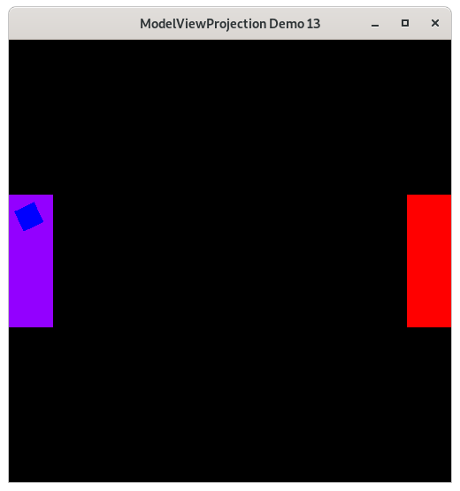

Rotate the Square Around Paddle 1 - Demo 13
===========================================

Purpose
^^^^^^^
Rotate the square around paddle1's center.  Reading the modelspace to
world space transformations should make this straightforward.
Try reading them from the top down.  Does in make sense that way?

    Demo 13

Move the Paddles using the Keyboard
^^^^^^^^^^^^^^^^^^^^^^^^^^^^^^^^^^^

==============  ==============================================
Keyboard Input  Action
==============  ==============================================
*w*             Move Left Paddle Up
*s*             Move Left Paddle Down
*k*             Move Right Paddle Down
*i*             Move Right Paddle Up

*d*             Increase Left Paddle's Rotation
*a*             Decrease Left Paddle's Rotation
*l*             Increase Right Paddle's Rotation
*j*             Decrease Right Paddle's Rotation

*UP*            Move the camera up, moving the objects down
*DOWN*          Move the camera down, moving the objects up
*LEFT*          Move the camera left, moving the objects right
*RIGHT*         Move the camera right, moving the objects left

*q*             Rotate the square around it's center
*e*             Rotate the square around paddle 1's center
==============  ==============================================

Description
^^^^^^^^^^^

Cayley Graph
^^^^^^^^^^^^

.. figure:: _static/demo11.png
    :align: center
    :alt: Demo 13
    :figclass: align-center

    Demo 13

.. literalinclude:: ../src/demo13/demo.py
   :language: python
   :linenos:
   :lineno-start: 163
   :lines: 163

Event Loop
^^^^^^^^^^

.. literalinclude:: ../src/demo13/demo.py
   :language: python
   :linenos:
   :lineno-start: 213
   :lines: 213

::

    ...

.. literalinclude:: ../src/demo13/demo.py
   :language: python
   :linenos:
   :lineno-start: 231
   :lines: 231-240

.. literalinclude:: ../src/demo13/demo.py
   :language: python
   :linenos:
   :lineno-start: 242
   :lines: 242-253

.. literalinclude:: ../src/demo13/demo.py
   :language: python
   :linenos:
   :lineno-start: 255
   :lines: 255-264
