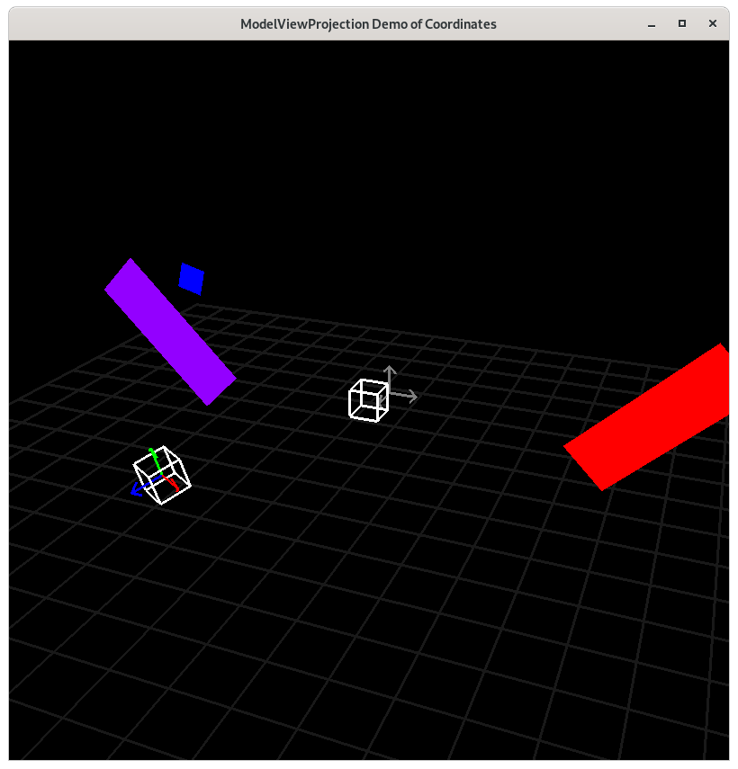

..
   Copyright (c) 2018-2021 William Emerison Six

   Permission is hereby granted, free of charge, to any person obtaining a copy
   of this software and associated documentation files (the "Software"), to deal
   in the Software without restriction, including without limitation the rights
   to use, copy, modify, merge, publish, distribute, sublicense, and/or sell
   copies of the Software, and to permit persons to whom the Software is
   furnished to do so, subject to the following conditions:

   The above copyright notice and this permission notice shall be included in all
   copies or substantial portions of the Software.

   THE SOFTWARE IS PROVIDED "AS IS", WITHOUT WARRANTY OF ANY KIND, EXPRESS OR
   IMPLIED, INCLUDING BUT NOT LIMITED TO THE WARRANTIES OF MERCHANTABILITY,
   FITNESS FOR A PARTICULAR PURPOSE AND NONINFRINGEMENT. IN NO EVENT SHALL THE
   AUTHORS OR COPYRIGHT HOLDERS BE LIABLE FOR ANY CLAIM, DAMAGES OR OTHER
   LIABILITY, WHETHER IN AN ACTION OF CONTRACT, TORT OR OTHERWISE, ARISING FROM,
   OUT OF OR IN CONNECTION WITH THE SOFTWARE OR THE USE OR OTHER DEALINGS IN THE
   SOFTWARE.

Adding Depth - Z axis Demo 14
=============================

Purpose
^^^^^^^
Do the same stuff as the previous demo, but use 3D coordinates,
where the negative z axis goes into the screen (because
of the right hand rule).  Positive z comes out of the monitor
towards your face.

Things that this demo purposefully does poorly.  Show the demo and
it's failures.

1) The blue square is always drawn, even
when it's behind the purple paddle.  The solution will be
zbuffering https://en.wikipedia.org/wiki/Z-buffering#Mathematics,
and it is implemented in the next demo.

.. figure:: _static/screenshots/demo14.png
    :align: center
    :alt: Demo 14
    :figclass: align-center

    Demo 14

    Camera Space

.. figure:: _static/screenshots/camera2.png
    :align: center
    :alt: Camera Space
    :figclass: align-center

    Camera Space

How to Execute
^^^^^^^^^^^^^^

On Linux or on MacOS, in a command prompt, type "python src/demo14/demo.py".
On Windows, in a command prompt, type "python src\\demo14\\demo.py".

Move the Paddles using the Keyboard
^^^^^^^^^^^^^^^^^^^^^^^^^^^^^^^^^^^

==============  ==============================================
Keyboard Input  Action
==============  ==============================================
*w*             Move Left Paddle Up
*s*             Move Left Paddle Down
*k*             Move Right Paddle Down
*i*             Move Right Paddle Up

*d*             Increase Left Paddle's Rotation
*a*             Decrease Left Paddle's Rotation
*l*             Increase Right Paddle's Rotation
*j*             Decrease Right Paddle's Rotation

*UP*            Move the camera up, moving the objects down
*DOWN*          Move the camera down, moving the objects up
*LEFT*          Move the camera left, moving the objects right
*RIGHT*         Move the camera right, moving the objects left

*q*             Rotate the square around it's center
*e*             Rotate the square around paddle 1's center
==============  ==============================================

Description
^^^^^^^^^^^

This demo introduces the z axis, which is a third spacial dimension
for our geometry.  This demo does not working correctly,
which demo 15 solves.

#. The blue square is always drawn, even
when it's behind the purple paddle.  The solution will be
zbuffering https://en.wikipedia.org/wiki/Z-buffering#Mathematics,
and it is implemented in the next demo.

..
   TODO -- see if this text can fit.
   Other things added
   Added rotations around the x axis, y axis, and z axis.
   https://en.wikipedia.org/wiki/Rotation_matrix

   Added translate in 3D.  Added scale in 3D.  These are just like
   the 2D versions, just with the same process applied to the z axis.

   They direction of the rotation is defined by the right hand rule.

   https://en.wikipedia.org/wiki/Right-hand_rule

NEW - Rotations around an angle in 3D space follow the right hand rule

With open palm, fingers on the x axis, rotating the fingers to y axis,
means that the positive z axis is in the direction of the thumb.  Positive Theta
moves in the direction that your fingers did.

starting on the y axis, rotating to z axis, thumb is on the positive x axis.

starting on the z axis, rotating to x axis, thumb is on the positive y axis.

NEW - ortho takes an arbitrary rectangular prism, moves the center of it to NDC,
and scales the dimensions down to NDC, so that any objects within the rectangular
prism are visible within NDC.  Since this is a transformation that happens
from camera space to NDC, we can read them from top down.

.. literalinclude:: ../src/demo14/demo.py
   :language: python
   :linenos:
   :lineno-start: 90
   :lines: 90-121

.. literalinclude:: ../src/demo14/demo.py
   :language: python
   :linenos:
   :lineno-start: 134
   :lines: 134-158

.. literalinclude:: ../src/demo14/demo.py
   :language: python
   :linenos:
   :lineno-start: 172
   :lines: 172-177

Event Loop
^^^^^^^^^^

.. literalinclude:: ../src/demo14/demo.py
   :language: python
   :linenos:
   :lineno-start: 230
   :lines: 230

::

    ...

.. literalinclude:: ../src/demo14/demo.py
   :language: python
   :linenos:
   :lineno-start: 248
   :lines: 248-258

the square should not be visible when hidden behind the paddle1,
as we did a translate by -10.
this is because without depth buffering, the object drawn last
clobbers the color of any previously drawn object at the pixel.
Try moving the square drawing code to the beginning, and you will
see that the square can be hidden behind the paddle.

.. literalinclude:: ../src/demo14/demo.py
   :language: python
   :linenos:
   :lineno-start: 260
   :lines: 260-275

.. literalinclude:: ../src/demo14/demo.py
   :language: python
   :linenos:
   :lineno-start: 277
   :lines: 277-288

Added translate in 3D.  Added scale in 3D.  These are just like
the 2D versions, just with the same process applied to the z axis.

They direction of the rotation is defined by the right hand rule.

https://en.wikipedia.org/wiki/Right-hand_rule
