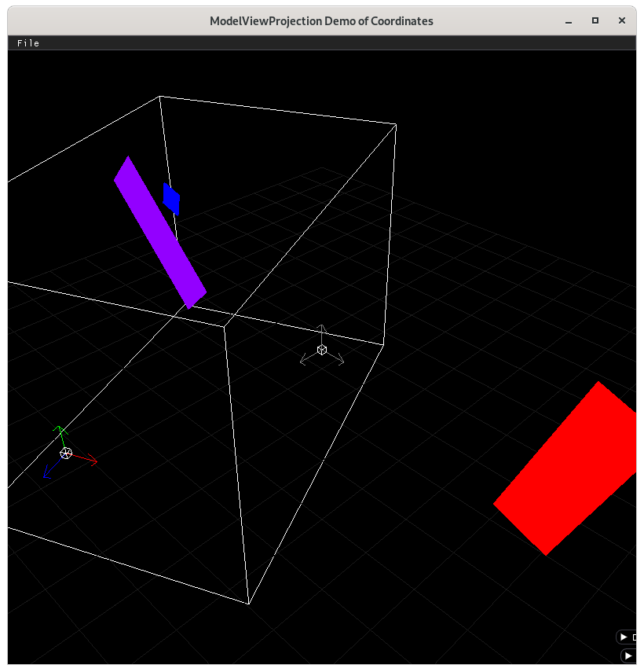

..
   Copyright (c) 2018-2022 William Emerison Six

   Permission is hereby granted, free of charge, to any person obtaining a copy
   of this software and associated documentation files (the "Software"), to deal
   in the Software without restriction, including without limitation the rights
   to use, copy, modify, merge, publish, distribute, sublicense, and/or sell
   copies of the Software, and to permit persons to whom the Software is
   furnished to do so, subject to the following conditions:

   The above copyright notice and this permission notice shall be included in all
   copies or substantial portions of the Software.

   THE SOFTWARE IS PROVIDED "AS IS", WITHOUT WARRANTY OF ANY KIND, EXPRESS OR
   IMPLIED, INCLUDING BUT NOT LIMITED TO THE WARRANTIES OF MERCHANTABILITY,
   FITNESS FOR A PARTICULAR PURPOSE AND NONINFRINGEMENT. IN NO EVENT SHALL THE
   AUTHORS OR COPYRIGHT HOLDERS BE LIABLE FOR ANY CLAIM, DAMAGES OR OTHER
   LIABILITY, WHETHER IN AN ACTION OF CONTRACT, TORT OR OTHERWISE, ARISING FROM,
   OUT OF OR IN CONNECTION WITH THE SOFTWARE OR THE USE OR OTHER DEALINGS IN THE
   SOFTWARE.

Moving Camera in 3D Space - Demo 16
===================================

Purpose
^^^^^^^

Make a moving camera in 3D space.  Use Ortho to transform a rectangular prism, defined relative to camera space,
into NDC.

    Camera space with ortho volume

Problem purposefully put in
~~~~~~~~~~~~~~~~~~~~~~~~~~~

When running this demo and moving the viewer, parts of the geometry will disappear.
This is because it gets "clipped out", as the geometry will be outside
of NDC, (-1 to 1 on all three axis).  We could fix this by making
a bigger ortho rectangular prism, but that won't solve the fundamental
problem.

This doesn't look like a 3D application should, where objects further away
from the viewer would appear smaller.  This will be fixed in demo17.

.. figure:: _static/screenshots/demo16.png
    :align: center
    :alt: Demo 16
    :figclass: align-center

    Demo 16, which looks like trash

How to Execute
^^^^^^^^^^^^^^

On Linux or on MacOS, in a shell, type "python src/demo16/demo.py".
On Windows, in a command prompt, type "python src\\demo16\\demo.py".

Move the Paddles using the Keyboard
^^^^^^^^^^^^^^^^^^^^^^^^^^^^^^^^^^^

==============  ==============================================
Keyboard Input  Action
==============  ==============================================
*w*             Move Left Paddle Up
*s*             Move Left Paddle Down
*k*             Move Right Paddle Down
*i*             Move Right Paddle Up

*d*             Increase Left Paddle's Rotation
*a*             Decrease Left Paddle's Rotation
*l*             Increase Right Paddle's Rotation
*j*             Decrease Right Paddle's Rotation

*UP*            Move the camera up, moving the objects down
*DOWN*          Move the camera down, moving the objects up
*LEFT*          Move the camera left, moving the objects right
*RIGHT*         Move the camera right, moving the objects left

*q*             Rotate the square around it's center
*e*             Rotate the square around paddle 1's center
==============  ==============================================

Description
^^^^^^^^^^^

Before starting this demo, run mvpVisualization/7/demo7.py, as
it will show graphically all of the steps in this demo.  In the GUI,
take a look at the camera options buttons, and once the camera
is placed and oriented in world space, use the buttons to change the camera's position
and orientation.  This will demonstrate what we have to do for moving the
camera in a 3D scene.

There are new keyboard inputs to control the moving camera.
As you would expect to see
in a first person game, up moves the camera forward (-z),
down moves the camera backwards (z), left rotates the camera
as would happen if you rotated your body to the left, and likewise
for right. Page UP and Page DOWN rotate the camera to look up
or to look down.

To enable this, the camera is modeled with a data structure,
having a position in x,y,z relative to world space, and two rotations (one around
the camera's x axis, and one around the camera's y axis).

To position the camera
you would

#. translate to the camera's position, using the actual position values
   of camera position in world space coordinates.
#. rotate around the local y axis
#. rotate around the local x axis

To visualize this, run "python mvpVisualization/7/demo7.py"

The ordering of 1) before 2) and 3) should be clear, as
we are imagining a coordinate system that moves, just
like we do for the modelspace to world space transformations.
The ordering of 2) before 3) is very important, as two rotations
around different axes are not commutative, meaning that you can't
change the order and still expect the same results
https://en.wikipedia.org/wiki/Commutative_property.

Try this.  Rotate your head to the right a little more that
45 degrees.  Now rotate your head back a little more than 45 degrees.

Now, reset your head (glPopMatrix, which we have not yet covered).
Try rotating your head back 45 degrees.  Once it's there,
rotate your head (not your neck), 45 degrees.  It's different, and quite uncomfortable!

We rotate the camera by the y axis first, then by the relative x axis,
for the same reason.

.. literalinclude:: ../src/demo16/demo.py
   :language: python
   :linenos:
   :lineno-start: 305
   :lines: 305-309

(Remember, read bottom up, just like the previous demos
for modelspace to worldspace data)

Back to the point, we are envisioning the camera relative to the world
space by making a moving coordinate system (composed of an origin, 1 unit
in the "x" axis, 1 unit in the "y" axis, and 1 unit in the "z" axis), where
each subsequent transformation is relative to the previous coordinate system.
(This system is beneficial btw because it allows us to think of only one coordinate
system at a time, and allows us to forget how we got there, (similar to a Markov process,
https://en.wikipedia.org/wiki/Markov_chain))

But this system of thinking works only when we are placing the camera into
it's position/orientation relative to world space, which is not what we need
to actually do.  We don't need to place the camera.
We need to move every already-plotted object in world space towards the origin and
orientation of NDC.  Looking at the following graph,

.. figure:: _static/demo10-2.png
    :align: center
    :alt: Demo 10
    :figclass: align-center

    Demo 10

We want to take the modelspace geometry from,
say Paddle1 space, to world space,
and then to camera space (which is going in the opposite direction of the arrow, therefore requires
an inverse operation, because to plot data we go from modelspace to screen space on the graph.

Given that the inverse of a sequence of transformations is the sequence backwards,
with each transformations inverted, we must do that to get from world space
to camera space.

The inverted form is

.. literalinclude:: ../src/demo16/demo.py
   :language: python
   :linenos:
   :lineno-start: 310
   :lines: 310-314

..
   Trying to reason about the camera's position and orientation is difficult.
   As such, in this demo, I have added the non-inverted transformations for camera
   placement in world space
   in the comments (listed first), and then the inverted form after, but will not do so in subsequent demos.

..
   To count in the modelspace, look at a given axis (which I've drawn in units
   of 10 for ease of viewing, although it should normally be in units of 1)
   On the red axis, it's 2*10 units wide, and 6*10 units tall, which matches
   the modelspace data in the constructor for the Paddles.

   Take a look at ../mvpVisualization/demoAnimation.py to see an animated
   version of the axis being moved from into their world space positions,
   relative to which the modelspace data is drawn.

   The gray axis in the middle happens when we hold onto the original
   axes, as we first draw paddle 1 relative to it, the square relative
   to paddle1, but we need to later get back to world space so that we
   can draw paddle2.  In later code, we will use glPushMatrix to
   save onto a copy of the current axes, and glPopMatrix to discard
   our "current at the time" axis, returning back to the saved axis.  Like a quicksave
   in a video game.

   To follow along with the code, read the transformations from modelspace
   to worldspace backwards, and you will see how the axes are moving and
   why.

   Take a look at ../mvpVisualization/demoViewWorldTopLevel.py to see an
   animated version that shows the objects being placed in world space,
   the camera being put into it's space using the normal way of thinking
   of a coordinate system being moved, but then the transformations
   are inverted, brining the objects in world space with it,
   in backwards order, to put the NDC cube defined in camera
   space to the NDC defined in world space.  One way to think of it,
   is that NDC is defined at the top level of the tree of transformations,
   so in world space.  We need to get the -1 to 1 space in x,y,z relative
   to camera space to match the -1 to 1 space in world space.

   eog ../images/demo10.png

   Why do we do this?  Because it doesn't matter how we think about
   the coordinate transformations, the computer will always execute
   the code from top down, take the resulting coordinates, and clip
   out anything outside of -1 to 1. So, world space. The computer has no notion
   of camera space, it's our own invention, so we need to get the coordinates
   that we care about into that space.

   After looking at the demos and explaining the code, now cover the camera movement code.

Other things added
Added rotations around the x axis, y axis, and z axis.
https://en.wikipedia.org/wiki/Rotation_matrix

Code
^^^^

The camera now has two angles as instance variables.

.. literalinclude:: ../src/demo16/demo.py
   :language: python
   :linenos:
   :lineno-start: 195
   :lines: 195-199

Since we want the user to be able to control the camera, we need
to read the input.

.. literalinclude:: ../src/demo16/demo.py
   :language: python
   :linenos:
   :lineno-start: 217
   :lines: 217

::

    ...

Left and right rotate the viewer's horizontal
angle, page up and page down the vertical angle.

.. literalinclude:: ../src/demo16/demo.py
   :language: python
   :linenos:
   :lineno-start: 228
   :lines: 228-235

The up arrow and down arrow make the user move forwards
and backwards.  Unlike the camera space to world space
transformation on line 305-309, here for movement code,
we don't do the rotate around the x axis.  This is because
users expect to simulate walking on the ground, not flying
through the sky.  I.e, we want forward/backwards movement to happen relative
to the XZ plane at the camera's position, not forward/backwards
movement relative to camera space.

.. literalinclude:: ../src/demo16/demo.py
   :language: python
   :linenos:
   :lineno-start: 236
   :lines: 236-253

Ortho is the function call that shrinks the viewable region
relative to camera space down to NDC, by moving the center of the rectangular
prism to the origin, and scaling by the inverse of the width, height, and depth
of the viewable region.

.. literalinclude:: ../src/demo16/demo.py
   :language: python
   :linenos:
   :lineno-start: 127
   :lines: 127-151

We will make a wrapper function camera_space_to_ndc_space_fn which
calls ortho, setting the size of the rectangular prism.

.. literalinclude:: ../src/demo16/demo.py
   :language: python
   :linenos:
   :lineno-start: 152
   :lines: 152-155

Event Loop
~~~~~~~~~~

The amount of repetition in the code below in starting to get brutal,
as there's too much detail to think about and retype out for every object
being drawn, and we're only dealing with 3 objects.  The author
put this repetition into the book on purpose, so that when we
start using matricies later, the reader will fully appreciate what
matricies solve for us.

.. literalinclude:: ../src/demo16/demo.py
   :language: python
   :linenos:
   :lineno-start: 282
   :lines: 282

::

    ...

Paddle 1

.. literalinclude:: ../src/demo16/demo.py
   :language: python
   :linenos:
   :lineno-start: 298
   :lines: 298-317

Square

the square should not be visible when hidden behind the paddle1,
as we did a translate by -10 in the z direction.

.. literalinclude:: ../src/demo16/demo.py
   :language: python
   :linenos:
   :lineno-start: 319
   :lines: 319-346

Paddle 2

.. literalinclude:: ../src/demo16/demo.py
   :language: python
   :linenos:
   :lineno-start: 348
   :lines: 348-367
