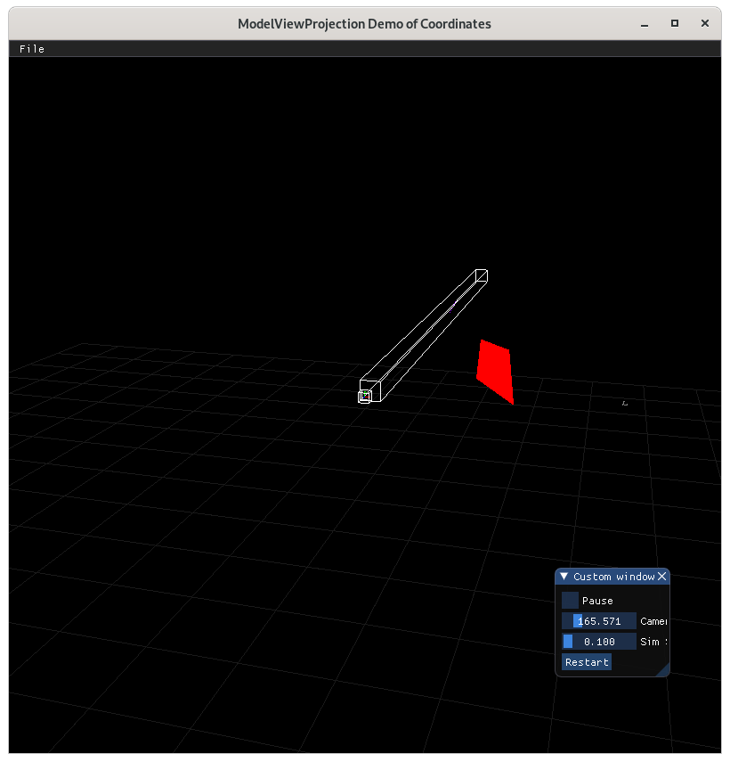

..
   Copyright (c) 2018-2023 William Emerison Six

   Permission is hereby granted, free of charge, to any person obtaining a copy
   of this software and associated documentation files (the "Software"), to deal
   in the Software without restriction, including without limitation the rights
   to use, copy, modify, merge, publish, distribute, sublicense, and/or sell
   copies of the Software, and to permit persons to whom the Software is
   furnished to do so, subject to the following conditions:

   The above copyright notice and this permission notice shall be included in all
   copies or substantial portions of the Software.

   THE SOFTWARE IS PROVIDED "AS IS", WITHOUT WARRANTY OF ANY KIND, EXPRESS OR
   IMPLIED, INCLUDING BUT NOT LIMITED TO THE WARRANTIES OF MERCHANTABILITY,
   FITNESS FOR A PARTICULAR PURPOSE AND NONINFRINGEMENT. IN NO EVENT SHALL THE
   AUTHORS OR COPYRIGHT HOLDERS BE LIABLE FOR ANY CLAIM, DAMAGES OR OTHER
   LIABILITY, WHETHER IN AN ACTION OF CONTRACT, TORT OR OTHERWISE, ARISING FROM,
   OUT OF OR IN CONNECTION WITH THE SOFTWARE OR THE USE OR OTHER DEALINGS IN THE
   SOFTWARE.

3D Perspective - Demo 17
========================

Purpose
^^^^^^^

Implement a perspective projection so that objects
further away are smaller than the would be
if they were close by

.. figure:: _static/screenshots/demo17.png
    :align: center
    :alt: Demo 17
    :figclass: align-center

    Demo 17

.. figure:: _static/screenshots/frustum1.png
    :align: center
    :alt: Frustum 1
    :figclass: align-center

    Frustum 1

.. figure:: _static/screenshots/frustum2.png
    :align: center
    :alt: Frustum 2
    :figclass: align-center

    Frustum 2

.. figure:: _static/screenshots/frustum3.png
    :align: center
    :alt: Frustum 3
    :figclass: align-center

    Frustum 3

    Frustum 4

.. figure:: _static/screenshots/frustum5.png
    :align: center
    :alt: Frustum 5
    :figclass: align-center

    Frustum 5

.. figure:: _static/screenshots/frustum6.png
    :align: center
    :alt: Frustum 6
    :figclass: align-center

    Frustum 6

How to Execute
^^^^^^^^^^^^^^

On Linux or on MacOS, in a shell, type "python src/demo17/demo.py".
On Windows, in a command prompt, type "python src\\demo17\\demo.py".

Move the Paddles using the Keyboard
^^^^^^^^^^^^^^^^^^^^^^^^^^^^^^^^^^^

==============  ==============================================
Keyboard Input  Action
==============  ==============================================
*w*             Move Left Paddle Up
*s*             Move Left Paddle Down
*k*             Move Right Paddle Down
*i*             Move Right Paddle Up

*d*             Increase Left Paddle's Rotation
*a*             Decrease Left Paddle's Rotation
*l*             Increase Right Paddle's Rotation
*j*             Decrease Right Paddle's Rotation

*UP*            Move the camera up, moving the objects down
*DOWN*          Move the camera down, moving the objects up
*LEFT*          Move the camera left, moving the objects right
*RIGHT*         Move the camera right, moving the objects left

*q*             Rotate the square around it's center
*e*             Rotate the square around paddle 1's center
==============  ==============================================

Description
^^^^^^^^^^^

::

                     ------------------------------- far z
                     \              |              /
                      \             |             /
                       \ (x,z) *----|(0,z)       /
                        \      |    |           /
                         \     |    |          /
                          \    |    |         /
                           \   |    |        /
                            \  |    |       /
                             \ |    |      /
                              \---*-------- near z
                               |    |    /
                               |\   |   /
                               | \  |  /
                               |  \ | /
                               |   \|/
              -----------------*----*-(0,0)-------------------
                              (x,0)

If we draw a straight line between (x,z) and (0,0), we will have a right triangle
with vertices (0,0), (0,z), and (x,z).

There also will be a similar right triangle with verticies (0,0), (0,nearZ), and
whatever point the line above intersects the line at z=nearZ.  Let's call that point
(projX, nearZ)

::

        because right angle and tan(theta) = tan(theta)
        x / z = projX / nearZ
        projX = x / z * nearZ

        So use projX as the transformed x value, and keep the distance z.

                               ----------- far z
                               |          |
                               |          |
                (x / z * nearZ,z) *       |   non-linear -- the transformation of x depends on its z value
                               |          |
                               |          |
                               |          |
                               |          |
                               |          |
                               |          |
                               |          |
                               |          |
                               ------------ near z
                               \    |    /
                                \   |   /
                                 \  |  /
                                  \ | /
                                   \|/
              ----------------------*-(0,0)-------------------

Top calculation based off of vertical field of view

::

                              /* top
                             / |
                            /  |
                           /   |
                          /    |
                         /     |
                        /      |
                       /       |
                      /        |
                     /         |
                    /          |
                   /           |
                  /            |
           origin/             |
                / fov/2        |
          z----*---------------*
               |\              |-nearZ
               | \             |
               |  \            |
               x   \           |
                    \          |
                     \         |
                      \        |
                       \       |
                        \      |
                         \     |
                          \    |
                           \   |
                            \  |
                             \ |
                              \|

Right calculation based off of Top and aspect ration

::

                                   top
           -------------------------------------------------------
           |                                                     |
           |                         y                           |
           |                         |                           |
           |                         |                           |
           |                         *----x                      | right =
           |                            origin                   |   top * aspectRatio
           |                                                     |
           |                                                     |  aspect ratio should be the viewport's
           |                                                     |    width/height, not necessarily the
           -------------------------------------------------------    window's

.. LINENOS ../src/demo17/demo.py 24b2f9fc341605b61f191425ea7a8e7a2ac42873

::

   ...

.. LINENOS ../src/demo17/demo.py 7f3ac095c4dfe0c0162e607a871f4e12e6fd633c

.. LINENOS ../src/demo17/demo.py 67ffd7b7adc42d01ca93bacdef858c0d4b678e38

::

   ...

.. LINENOS ../src/demo17/demo.py 2ced82a1c3de464adbfe5d303faffdd2314c17c2
