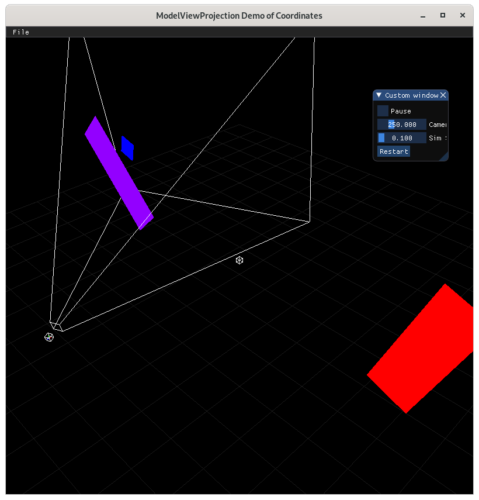

..
   Copyright (c) 2018-2024 William Emerison Six

   Permission is hereby granted, free of charge, to any person obtaining a copy
   of this software and associated documentation files (the "Software"), to deal
   in the Software without restriction, including without limitation the rights
   to use, copy, modify, merge, publish, distribute, sublicense, and/or sell
   copies of the Software, and to permit persons to whom the Software is
   furnished to do so, subject to the following conditions:

   The above copyright notice and this permission notice shall be included in all
   copies or substantial portions of the Software.

   THE SOFTWARE IS PROVIDED "AS IS", WITHOUT WARRANTY OF ANY KIND, EXPRESS OR
   IMPLIED, INCLUDING BUT NOT LIMITED TO THE WARRANTIES OF MERCHANTABILITY,
   FITNESS FOR A PARTICULAR PURPOSE AND NONINFRINGEMENT. IN NO EVENT SHALL THE
   AUTHORS OR COPYRIGHT HOLDERS BE LIABLE FOR ANY CLAIM, DAMAGES OR OTHER
   LIABILITY, WHETHER IN AN ACTION OF CONTRACT, TORT OR OTHERWISE, ARISING FROM,
   OUT OF OR IN CONNECTION WITH THE SOFTWARE OR THE USE OR OTHER DEALINGS IN THE
   SOFTWARE.

Introduction
============

Learn how to program in 3D computer graphics in Python!

Source code
^^^^^^^^^^^

This book references source code, which is at `here <https://github.com/billsix/modelviewprojection>`_

Approach
^^^^^^^^

This book uses "mistake-driven-development"; instead of listing math formulae
in their final form, this book incrementally shows, via working
code, how to build complex graphics applications, making mistakes along
the way, and then fixing the mistakes.

Thoughout the book, you will learn how to place objects in space,
how to draw objects relative to other objects, how to add a
camera which moves over time based on user input, and how to transform all
the objects into the 2D pixel coordinates of the computer screen.
By the end of this book, you will understand the basics of
how to create first-person and third-person applications/games.
I made this book to show programmers how to make the kind
of graphics programs which they want to make, using
math they mostly aleady know.

This book is purposely limited in scope, and
the applications produced are not particurly pretty nor realistic-looking.
For advanced graphics topics, you'll need to consult other references,
such as the OpenGL "red book" and "blue book".
Although this book fills a huge gap that other books do not address,
those other books are excellent reference books for advanced topics.

Pre-requisities
^^^^^^^^^^^^^^^

#. Basic programming concepts in Python.

   #. YouTube videos

      #. Learn Python with Socratica_
      #. Microsoft_ Python Tutorials

   #. Books

      #. https://en.wikibooks.org/wiki/A_Beginner%27s_Python_Tutorial
      #. https://learnbyexample.github.io/100_page_python_intro/preface.html
      #. https://diveintopython3.problemsolving.io/

#. High school trigonometry

#. Linear Algebra (optional)

   #. 3Blue1Brown - Linear Transformations_
   #. 3Blue1Brown - Matrix Multiplication as Composition_

.. _Socratica: https://www.youtube.com/watch?v=bY6m6_IIN94&list=PLi01XoE8jYohWFPpC17Z-wWhPOSuh8Er-&index=2
.. _Microsoft: https://www.youtube.com/watch?v=jFCNu1-Xdsw&list=PLlrxD0HtieHhS8VzuMCfQD4uJ9yne1mE6
.. _Transformations: https://www.youtube.com/watch?v=kYB8IZa5AuE
.. _Composition: https://www.youtube.com/watch?v=XkY2DOUCWMU

Required Software
^^^^^^^^^^^^^^^^^

You will need to install Python.  https://en.wikibooks.org/wiki/A_Beginner%27s_Python_Tutorial/Installing_Python

Before running this code, you need a virtual environment,
with dependencies installed. https://docs.python.org/3/tutorial/venv.html

On Windows, if you use the Developer command prompt, run

.. code-block::

   python -m venv venv
   cd venv\Scripts
   activate.bat
   cd ..\..\
   python -m pip install --upgrade pip setuptools
   python -m pip install -r requirements.txt

If you use Visual Studio on Windows, it takes care of this for you.

On a Mac or on Linux, run

.. code-block:: bash

   python3 -m venv venv
   source venv/bin/activate
   python3 -m pip install --upgrade pip setuptools
   python3 -m pip install -r requirements.txt

Windows
~~~~~~~

Use Visual Studio 2019 (Tested on community, but I'm sure it will work on others).

Linux
~~~~~

Install Python3, glfw via a package manager.  Use pip and virtualenv to install dependencies

Mac
~~~

Python Python3 (via anaconda, homebrew, macports, whatever), and use pip and virtualenv to install dependencies.
