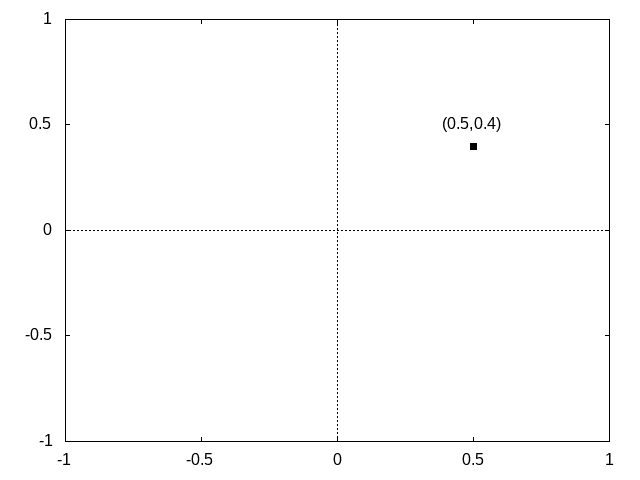
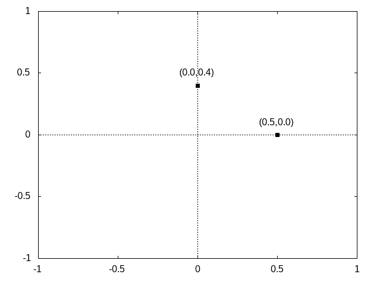
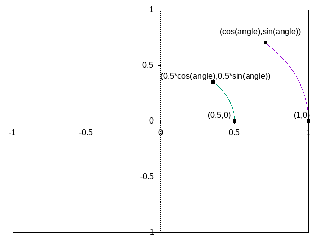
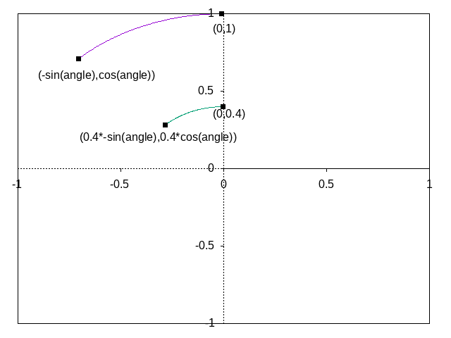
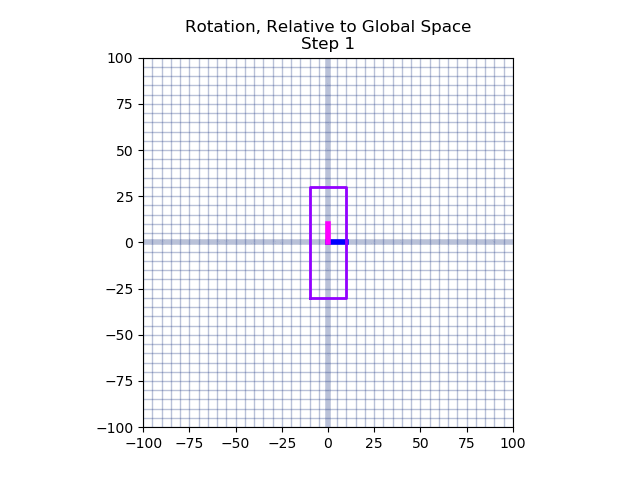
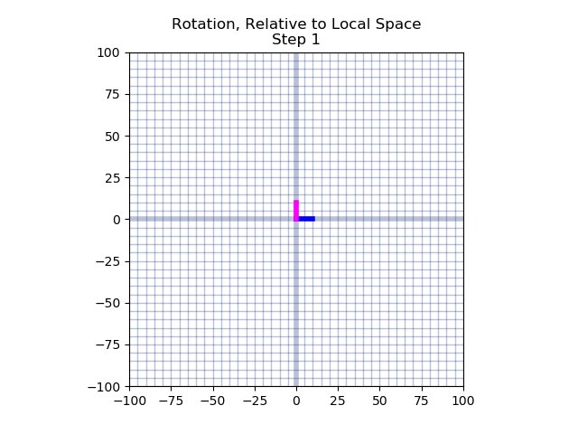
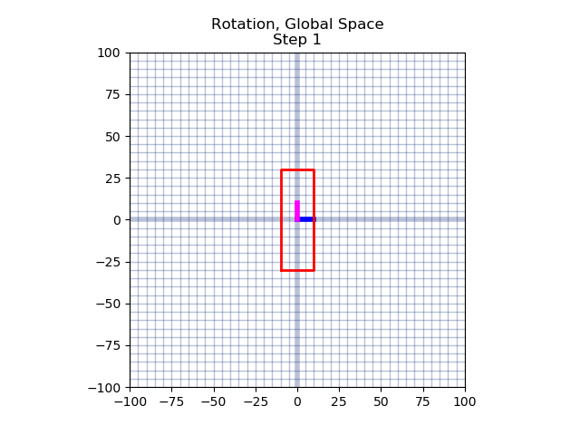

=== Rotation Around Origin (0,0)

We can also rotate an object around (0,0) by rotating
all of the object's vertices around (0,0).  Although defined now,
this won't
be used until later.

In high school math, you will have learned about sin, cos, and tangent.
Typically the angles are described on the unit circle, where a rotation
starts from the positive x axis.  We can expand on this knowledge, allowing
us to rotate a given vertex around the origin (0,0).  This is done
by separating the x and y value, rotating each of them seperately,
and then adding the results together.

That might not have been fully clear.  Let me try again.
The vertex (0.5,0.4) can be separated into two vertices, (0.5,0) and (0,0.4).

These vertices can be added together to create the original vertex.
But, before we do that, let's rotate each of the vertices.

(0.5,0) is on the x-axis, so rotating it by "angle" degrees, results
in vertex (0.5*cos(angle), 0.5*sin(angle)).  Notice that both the x and
y values are multiplied by 0.5.  This is because rotations should not affect
the distance of the point from the origin (0,0).  (0.5,0) has length 0.5.
(cos(angle), sin(angle) has length 1. By multipling both the x and y
component by 0.5, we are scaling the vertex back to its original distance
from the origin.

(0,0.4) is on the y-axis, so rotating it by "angle" degrees, results
in vertex (0.4*-sin(angle), 0.4*cos(angle)).

Wait.  Why is negative
sin applied to the angle to make the x value, and cos applied to angle to make the y value?
Trigonometric operations such as sin, cos, and tangent assume that the rotation is happening on
the unit circle, starting from (1,0) on the x axis.  Since we want
to rotate an angle starting from (0,1) on the y axis, we sin and
cos must be swapped.  Sin is positive from 0 to 90 degrees, but
we want a negative value for our rotation of the y axis since the rotation is happening counter-clockwise,
hence the negative sin.

After the rotations have been applied, sum the results to
get your vertex rotated around the origin!

(0.5*cos(angle), 0.5*sin(angle)) + (0.4*-sin(angle), 0.4*cos(angle)) =
(0.5*cos(angle) + 0.4*-sin(angle), 0.5*sin(angle) + 0.4*cos(angle))

== Rotate the Paddles About their Center

[width="75%",options="header,footer"]
|=======================================
|Keyboard Input |Action
|w              |Move Left Paddle Up
|s              |Move Left Paddle Down
|k              |Move Right Paddle Up
|i              |Move Right Paddle Down
|               |
|*d*              |*Increase Left Paddle's Rotation*
|*a*              |*Decrease Left Paddle's Rotation*
|*l*              |*Increase Right Paddle's Rotation*
|*j*              |*Decrease Right Paddle's Rotation*
|=======================================

# TODO - describe angle as radians
# TODO - show unit circle
# TODO - show orthonormal basis
# TODO - show basic proof of rotate

TODO - Explain how this does not do what we want.  Show example graphs.

 TODO - explain that translate each points and the origin.  We then rotate around the new origin
 by translating back to the global origin, doing the rotation, and then redoing the translation.
 Regardless of the inefficiency of this calculation, it should be clear to the reader
 that we are not thinking about this correctly.  The initial translate is effectively canceled out,
 leaving a rotation and then a translation.

== Camera Management

[width="75%",options="header,footer"]
|=======================================
|Keyboard Input |Action
|w              |Move Left Paddle Up
|s              |Move Left Paddle Down
|k              |Move Right Paddle Up
|i              |Move Right Paddle Down
|               |
|d              |Increase Left Paddle's Rotation
|a              |Decrease Left Paddle's Rotation
|l              |Increase Right Paddle's Rotation
|j              |Decrease Right Paddle's Rotation
|               |
|*UP*             |*Move the Camera Up*
|*DOWN*           |*Move the Camera Down*
|*LEFT*           |*Move the Camera Left*
|*RIGHT*          |*Move the Camera Right*
|=======================================

# TODO - describe implicit camera at origin, and making it's location explicit
# TODO - descriibe desire for moving camera

== Relative Objects

[width="75%",options="header,footer"]
|=======================================
|Keyboard Input |Action
|w              |Move Left Paddle Up
|s              |Move Left Paddle Down
|k              |Move Right Paddle Up
|i              |Move Right Paddle Down
|               |
|d              |Increase Left Paddle's Rotation
|a              |Decrease Left Paddle's Rotation
|l              |Increase Right Paddle's Rotation
|j              |Decrease Right Paddle's Rotation
|               |
|UP             |Move the Camera Up
|DOWN           |Move the Camera Down
|LEFT           |Move the Camera Left
|RIGHT          |Move the Camera Right
|               |
|=======================================

== Rotate the Square About Its Origin

[width="75%",options="header,footer"]
|=======================================
|Keyboard Input |Action
|w              |Move Left Paddle Up
|s              |Move Left Paddle Down
|k              |Move Right Paddle Up
|i              |Move Right Paddle Down
|               |
|d              |Increase Left Paddle's Rotation
|a              |Decrease Left Paddle's Rotation
|l              |Increase Right Paddle's Rotation
|j              |Decrease Right Paddle's Rotation
|               |
|UP             |Move the Camera Up
|DOWN           |Move the Camera Down
|LEFT           |Move the Camera Left
|RIGHT          |Move the Camera Right
|               |
|*q*              |*Rotate the square around its center.*
|=======================================

== Relative Rotation
[width="75%",options="header,footer"]
|=======================================
|Keyboard Input |Action
|w              |Move Left Paddle Up
|s              |Move Left Paddle Down
|k              |Move Right Paddle Up
|i              |Move Right Paddle Down
|               |
|d              |Increase Left Paddle's Rotation
|a              |Decrease Left Paddle's Rotation
|l              |Increase Right Paddle's Rotation
|j              |Decrease Right Paddle's Rotation
|               |
|UP             |Move the Camera Up
|DOWN           |Move the Camera Down
|LEFT           |Move the Camera Left
|RIGHT          |Move the Camera Right
|               |
|q              |Rotate the square around its center
|*e*              |*Rotate the square around the left paddle*
|=======================================

== Adding Depth
//TODO - discuss what the z component is, show graphs.
//TODO - show X, Y, and Z rotations graphically with gnuplot.
//TODO - make appendix for rotation around arbitrary axis

== Moving the Camera in 3D

// TODO -- draw_paddle_1 is still using only 2D, explain implicit 3D of z have 0 for a value
Draw square, relative to paddle 1.

TODO - discuss the framebuffer, and how it allows us to draw in
       a depth-independent manner.  we could force the programmer
       to sort objects by depth before drawing, but that's why mario64
       looked good and crash bandicoot had limited perspectives.
       also reference the section in the beginning which clears the
       depth buffer.

Set the default depth for all fragments
Set the depth test for all fragments.

TODO - write something about how "now that depth testing is enabled for all subequent demos, rerun the//vious demo to show that the square becomes hidden as the user navigates
